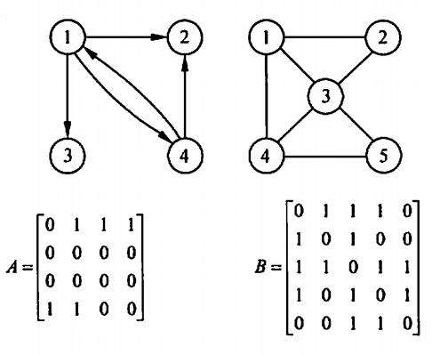
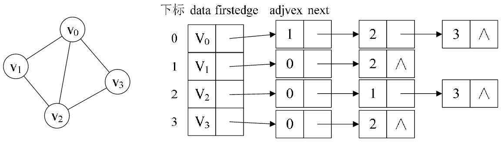
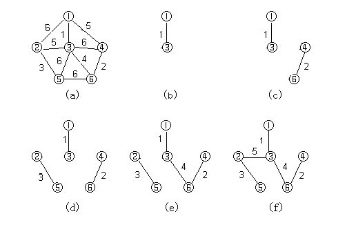
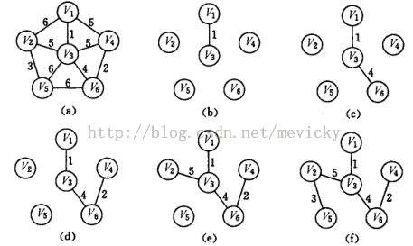
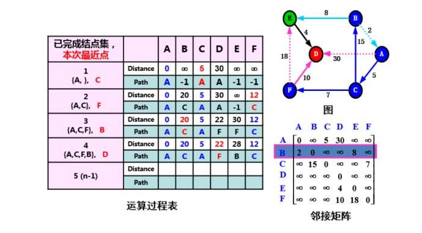
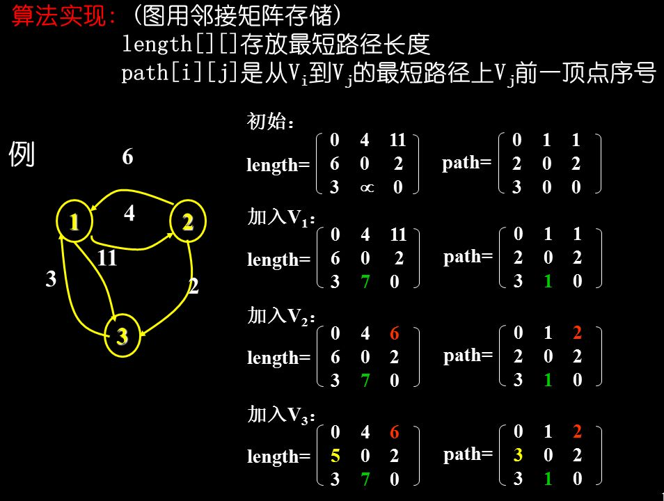
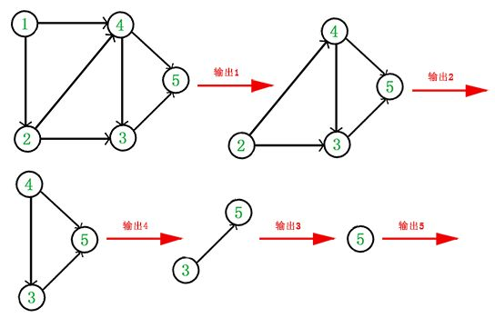

## 图

### 1.存储方式

#### 1.1邻接矩阵



```c
//顶点定义
typedef struct{
    int no;
    char info;
}VertexType;

//图的定义
typedef struct{
    int edges[maxSize][maxSize];
    int n,e;    //顶点数和边数
    VertexType vex[maxSize];
}MGraph;
```

#### 1.2邻接表



```c
//边结构
typedef struct ArcNode{
    int adjvex;		//该边指向的的结点位置
    struct ArcNode *nextarc;		//下一条边的指针
    int info;		//可能的权值
}ArcNode;

//顶点信息
typedef struct VNode{
    char data;
    ArcNode *firstarc;		//该顶点第一条边
}VNode;

//图定义
typedef struct{
    VNode adjlist[maxSize];		//邻接表
    int n,e;
}AGraph;
```

### 2.图的遍历

#### 2.1深度优先遍历

类似二叉树的先序遍历

```c
void DFS(AGraph *G,int v){  	//v是起点编号
    ArcNode *p;
    visit[v]=1;		//设置访问标记
    visit(v);
    p=G->adjlist[v].firstarc;	//该顶点的第一条边
    while(p!=null){
        //如果边的终点没有被访问
        if(visit[p->adjvex]==0)
            DFS(G,p->adjvex);
        p=p->nextarc;
    }
}
```

#### 2.2广度优先

类似层次遍历算法

```c
void BFS(AGraph *G,int v,int visit[maxSize]){
    //初始化v[n]为0
    ArcNode *p;
    int que[maxSize],front=0,rear=0;
    int j;
    Visit(v);
    visit[v]=1;
    rear=(rear+1)%maxSize;		//v进队
    while(front!=rear){
        front=(front+1)%maxSize;		//顶点出队
        j=que[front];
        p=G->adjlist[j].firstarc;		//取得边
        while(p!){
            if(visit[p->adjvex]==0){
                Visit(p->adjvex);
                visit[p->adjvex]=1;
                rear=(rear+1)%maxSize;		//进队
                que[rear]=p->adjvex;
            }
            p=p->nextarc;		//循环下一条边
        }
    }
}
```

#### 2.3非连通图遍历

通过循环每个顶点来实现遍历。

```c
void dfs/bfs(AGraph *g,int visit[]){
    int i;
    for(i=1;i<=g->n;++i){
        if(visit[i]==0)
            DFS/BFS(g,i);
    }
}
```

### 3.判断无向图是否是树

一个无向图是树的条件是n-1条边的连通图

故两个条件n-1条边和连通图，使用任一遍历算法，只要访问结点数=所有结点数即可。

### 4.最小(代价)生成树

#### 4.1(针对点)普里姆算法n^2

任取一点，不断找已选择点集最小权值边且终点为是未被选择的点。



注意：生成树不唯一。

**生成树唯一的条件：权值相同的边都被包括或每条边权值不唯一**

#### 4.2(针对边)克鲁斯卡尔算法O(eloge)

不断选择最小权值边



### 5.最短路径算法

#### 5.1迪杰斯特拉算法

不断将点加入已搜索点集，并修改已知的最短路径。

算法复杂度O(n^2)



#### 5.2弗洛伊德算法

时间复杂度O(n^3)

使用双矩阵，一个记录路径长度的矩阵，一个记录中间结点的矩阵。

初始状态：邻接矩阵和都是-1的矩阵

然后不断以某一结点为中间点，比较（i,j）和（i,中间点）+（中间点，j）的大小。



```c
void Floyd(MGraph g,int A[][maxSize],int Path[][maxSize]){
    int i,j,k;
    //两矩阵初始化
    //算法
    for(k=0,k<g.n;++k){
        for(i=0;i<g.n;++i){
            for(j=0;j<g.n;++j){
                if(A[i][j]>A[i][k]+A[k][j]){
                    A[i][j]=A[i][k]+A[k][j];
                    Path[i][j]=k;
                }
            }
        }
    }
}
```

### 6.拓扑排序

不断将入度为0的点删除，并提取出来。



### 7.AOE网和关键路径算法

#### 7.1定义

AOE网，有向无环图，且有入度为0点作为结尾。

其中顶点表示事件，而边表示活动。

#### 7.2事件算法

##### 7.2.1最早发生时间

①拓扑排序

②按照排序结果，不断更新时间。每个结点只需要知道指向自己的结点的最早发生时间+权值中的最小值。

例如：3和4指向6，那么ve(6)=max{ve(3)+6,ve(4)+7}

##### 7.2.2最晚发生时间

指的是在不影响整个工程进度的条件下，事件最晚发生的时间。

①逆拓扑排序

②逆推回去。

③vl(终点)=ve(终点)，代表不影响整体工程时间。

例如：4指向6,7。vl(4)=min{vl(6)-8,vl(7)-4}

### 7.3活动算法

##### 7.3.1活动最早发生时间

就是起点的最早发生时间

##### 7.3.2活动最晚发生时间

结尾点最迟发生时间减去边的权值

#### 7.4关键路径

最早发生时间=最短发生时间

### 8.错题集

(1)用有向无环图表示(A+B)*(A+B)/A需要几个顶点？5个

联系编译原理，只需要A、B、+、×、/

(2)如何判断一个有向图是否有环？深度遍历、拓扑排序

(3)一个有向图的邻接矩阵中，主对角线以下全是0，那么一定存在拓扑排序。

因为一定不存在环。

(4)任何一个关键活动提前完成，那么整个工程将会提前完成。（F）

关键活动不唯一

(5)一个有向图，不能形成拓扑排序。则该图含有顶点数大于1的强连通分量。

强连通图本身定义就是包含了环，所以除了只有一个结点的，都是有环图。

(6)无向连通图中边数**大于**顶点树-1（F）

大于等于

(7)压缩的上三角的邻接矩阵为（4,6,∞,∞,∞,5,∞,∞,∞,4,3,∞,∞,3,3)

关键：对角线上全为0，则有第一行：0,4,6,∞,∞,∞。第二行：5,∞,∞,∞以此类推。