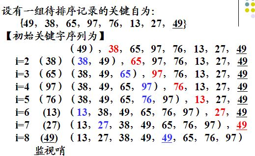
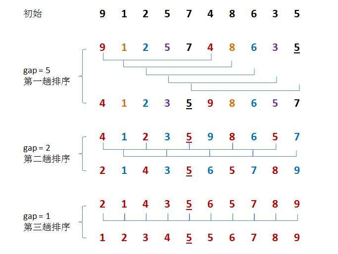
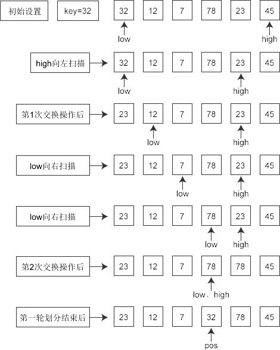
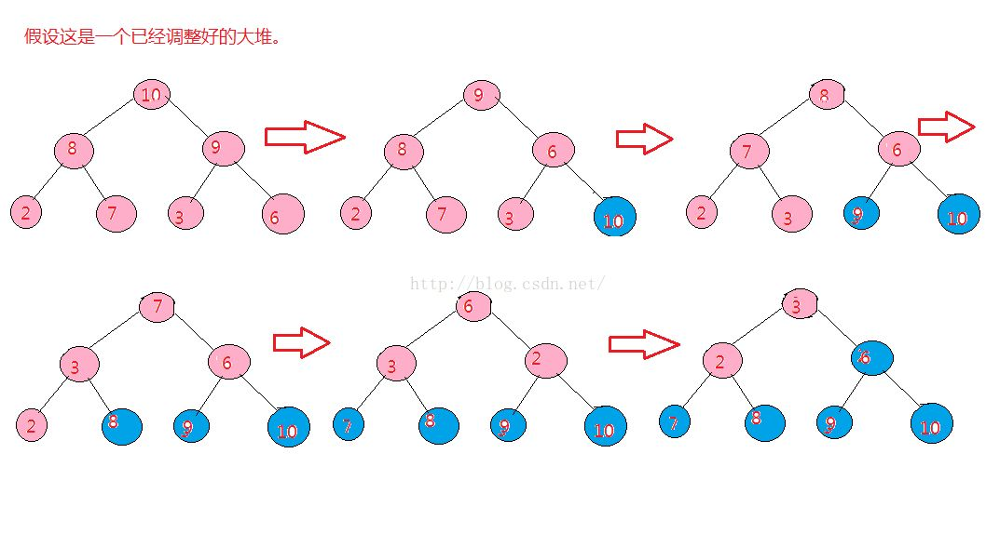
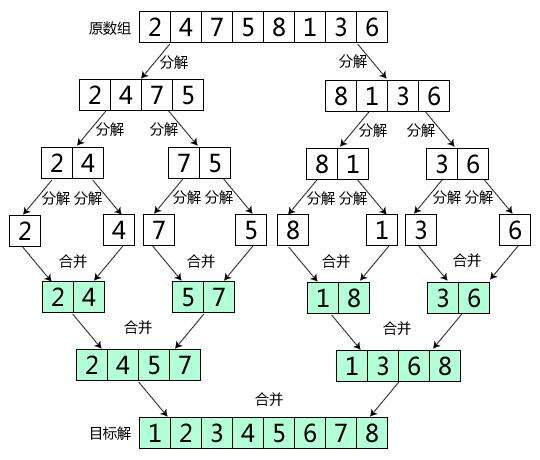
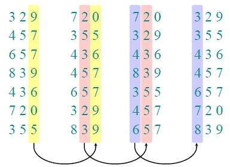

## 排序

### 1.稳定性

序列中相同项在排序前后是否位置变化。

### 2.插入类排序

#### 2.1直接插入

从前到后，不断插入使前面的序列有序。

时间复杂度：O(n^2)		空间：O(1)



#### 2.2折半插入

主要用于在已经有序的序列中插入一些新的记录。

相当于利用折半查找然后插入。

时间复杂度：O(n^2)		空间复杂度：O(1)

#### 2.3希尔排序(最小增量排序)



时间复杂度：O(nlog2n)		空间复杂度：O(1)

注意：①最后一次gap=1	②增量序列之间互质

### 3.交换类排序

#### 3.1起泡排序(冒泡)

不断循环让大的沉底。

时间复杂度：O(n^2)		空间复杂度：O(1)

#### 3.2快速排序

不断左右扫描，然后交换。

时间复杂度：O(nlog2n)~O(n^2)			空间复杂度：O(log2n)



### 4.选择排序类

#### 4.1简单选择

不断选择最大或最小的

时间：O(n^2)			空间：O(1)

#### 4.2堆排序

将序列变为完全二叉树，调整后根顶点为最大最小值，然后删除根结点继续排序。

##### 4.2.1步骤：

①建堆，并调整为最大最小在根结点

②删除根结点

③最后一个点，结束

##### 4.2.2插入

先放在最底层的最右边，再调整

##### 4.2.3删除

将最底层最右边的结点代替原来结点位置，再调整



时间复杂度：O(nlog2n)		空间：O(1)

### 5.二路归并排序

不断归并元素组合

时间复杂度：n个元素需要log2n趟排序，每次n的循环=O(nlog2n)

空间复杂度：转存整个矩阵O(n)



### 6.基数排序

利用不同特征进行排序

例如：一组三位数，个位、十位、百位排序

时间：O(d(n+rd))，d为关键字个数，rd为关键字取值范围

空间：O(rd)



### 7.外部排序法

当内存不足时，利用外存来排序

两个阶段：初始归并段生成、最佳归并树生成

#### 7.1初始归并段

不断输出当前内存中大于之前输出值的最小值。

对于15,19,04,83,12,27,11,25,16,34,26...

假设缓存区4个记录，那么生成输出为：04,12,15,19,25,27,34,83

#### 7.2最佳归并树

利用哈夫曼树方法，以归并段长度(记录数)为权值，进行生成。

IO次数=2×路径长度

#### 7.3时间复杂度

O(nlog2m)

### 8.总结(不含基数排序)

(1)时间复杂度

快(快速排序)些(希尔排序)归(归并排序)队(堆排序)的复杂度是O(nlog2n)

其余是O(n^2)

(2)空间复杂度

快速O(log2n)，归并O(n)，其他O(1)

(3)特殊

容易插O(n)，起泡快O(n)。在原序列已经有序的情况下。

但是快速排序到了最差情况O(n^2)

(4)稳定性

快(快速排序)些(希尔排序)选(简单选择)队(堆排序)不稳定

(5)其他

一趟排序保证一个元素到达位置：起泡、快速、简单选择、堆

排序趟数与原式序列有关：交换类

### 9.错题集

(1)一个初始状态为递增的序列，用直接插入最省时，用快速排序最费时。

(2)最后一趟前，所有元素不在最终位置上：折半排序。

(3)执行一次排序后，序列特点是有一个元素左右小大。

(4)使用快速排序，每次划分分区后，处理顺序和递归次数无关。

```c
void quicksort(int R[],int l,int r){
    ...;
    quicksort(R,l,i-1);
    quicksort(R,i+1,r);
}
```

显然先处理和后处理没有区别。

(5)已知序列25,13,10,12,9大根堆，插入18，比较几次？2次

18>10和18<25。