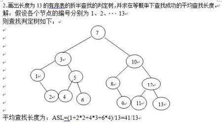
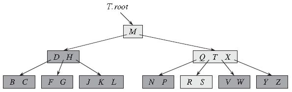
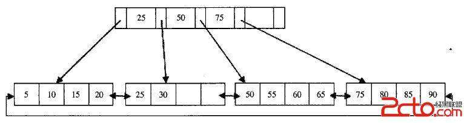

## 查找

### 1.平均比较次数(平均查找长度)

$$
ASL=\sum_{i=1}^np_ic_i\\
n是表中记录个数;p_i是查找到第i个的概率，一般为\frac1n;c_i时第i个点时的比较次数
$$

也就是期望。

### 2.顺序查找

平均查找长度：
$$
成功：ASL_1=\sum_{i=1}^n\frac1n×i=\frac{n+1}2\\
不成功：n
$$

### 3.折半查找法

#### 3.1折半查找树

不断运算(最左边下标+最右边下标)/2的向下取整值。

例如：(0~12)中，第一次：6。（2,2）（3,9）不断以此类推。

#### 3.2平均查找长度

类似哈夫曼树，长度+1的总和。

### 4.分块查找

利用索引表，然后再顺序查找。类似查英文字典，先查找b在目录地方，然后顺序查找。

### 5.二叉排序树(中序树)

只需要左边小于中间，中间小于右边即可。

插入就是直接查找然后插入。

#### 5.1删除

①叶子结点直接删除

②单子树直接接到父结点上

③双子树则找直接前驱和直接后继替代原来结点位置

### 6.平衡二叉树

#### 6.1平衡因子

左子树高度-右子树高度

#### 6.2平衡调整

寻找最小子树，即距离插入点最近且平衡因子绝对值大于1的结点为根的子树。

#### 6.3平衡条件

所有平衡因子绝对值小于等于1

### 7.B-树

#### 7.1条件

①根结点分支大于等于2，非根m/2的向上取整数

#### 7.2操作

①多了拆分

②少了合并或者借

### 8.B+树

与B-树不同在于，叶子结点包含一切信息。

### 9.散列表

#### 9.1建立

主要是Hash函数和冲突处理函数

#### 9.2平均查找长度

成功：对每个关键字进行分析，求出所有比较次数，然后求和并除以个数

不成功：从每个地址开始数几次到达空位置。

例如(0,空)，(1,1)，(2,14)，(3,空)

对于0，一次即可，本身。

对于1,1,2,3，共三次。

对于2，共2次。

对于3，共1次。

总和除以个数即可。

#### 9.3装填因子

关键字个数/表长度

可能用于提示散列表长度选择

#### 9.4常用hash函数

①直接定址法

②数字分析法

③平方取中法

④余数法

#### 9.5冲突处理函数

①线性探查法

②平方...

③链表存储法

### 10.错题

(1)关于m阶B-树。

每个结点至少有两棵非空子树（F）

所有叶子在同一层（T）

(2)B+和B-树支持顺序查找？

B+支持，B-不支持

(3)线性探查时，本身就算一次探查。例如k个关键字为同义词，那么探测次数为？

1+2+3+...+k