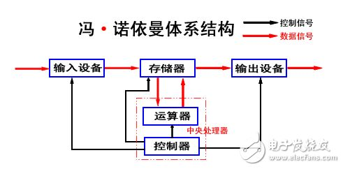
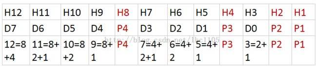
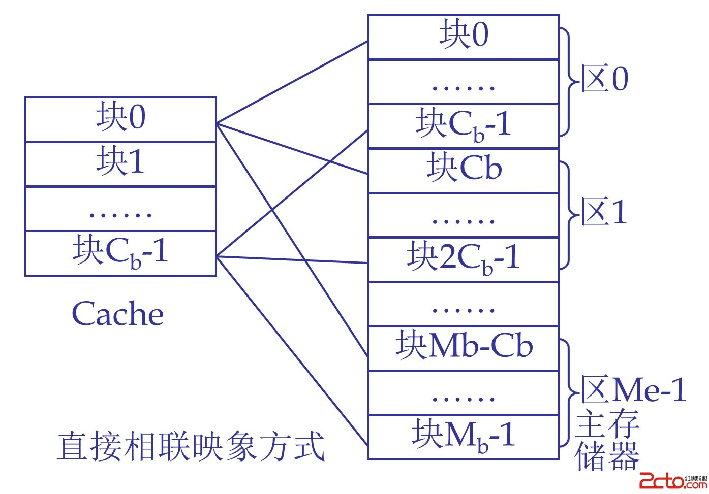
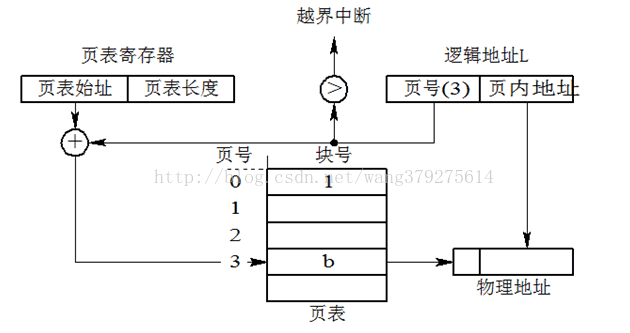
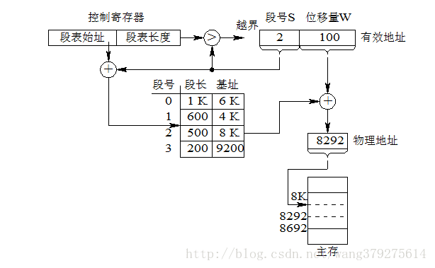
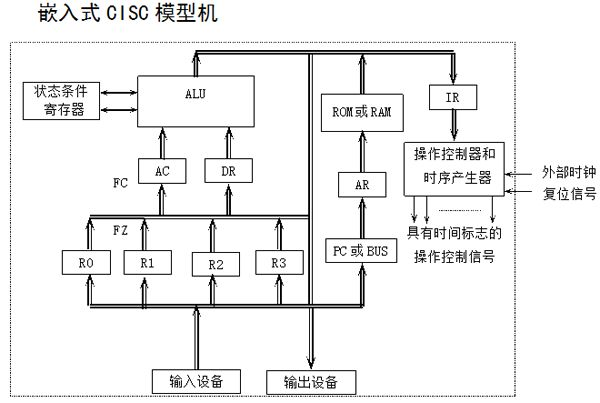
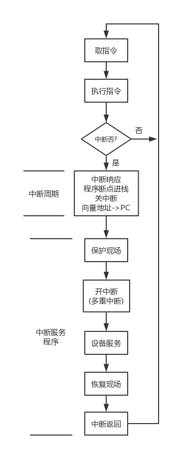

## 计算机组成原理

[TOC]

### 一.概述

#### 1.冯洛伊曼体系

①所有的指令都是由操作码和地址码组成

②指令在其存储过程中按照执行的顺序

③以运算器和控制器作为中心

#### 2.运算速度

1MHZ=1000KHZ=1×10^6 HZ

平均运行时钟周期数CPI

CPU执行时间=CPU时钟周期数×时钟周期长度

#### 3.用户态和内核态

##### 3.1 方式

①系统调用		②异常		③中断

##### 3.2 系统调用过程

### 二.运算

#### 1.进制转换(略)

#### 2.机械数

|          | 原码   | 反码         | 补码               | 移码             |
| -------- | ------ | ------------ | ------------------ | ---------------- |
| 获取     | 无     | 除符号位取反 | 反码+1             | 补码符号位取反   |
| 小数例子 | 1.1101 | 1.0010       | 1.0011             |                  |
| 加减运算 | 无     | 循环进位     | 直接加减然后模运算 | 加减后符号位取反 |
| 关于0    | 无     | 0两种表示    | 0一种表示          | 同补码           |
| 移位运算 | 正常   | 正常         | 左0右1             | 正常             |

#### 3.运算溢出判断

| 双进位法                         | 双符号位法(补码)                       |
| -------------------------------- | -------------------------------------- |
| C(计算进位)=Cf(符号进位)则不溢出 | 正数的符号位变为00，负数11，记为Fs2Fs1 |
| C=1,Cf=0正溢出                   | 运算后，如果不相等则溢出。             |
| C=0,Cf=1负溢出                   | 01正溢出，反之负溢出。                 |

#### 4.机械数乘除

| 运算方式               | 具体操作                                                |
| ---------------------- | ------------------------------------------------------- |
| 原码一位乘             | 加之后逻辑右移                                          |
| 补码一位乘校正法       | 先原码一位乘法，如果乘数(Y)是负数那么加上[-X]补码来校正 |
| 补码一位乘比较法       | 最后面补0，然后不断当前位-后一位决定加减，不断右移      |
| 补码一位除之恢复余数法 | 先减，如果负数那么恢复再左移，否则直接左移              |
| 补码一位除之加减交替法 | 遇到负数，先左移再加[Ri+1=2(Ri+Y)-Y=2Ri+Y]              |

#### 5.定点数

| 数符 | 小数点位置 | 数值         |
| ---- | ---------- | ------------ |
| 一位 | 隐藏       | 位数决定范围 |

#### 6.浮点数

N=M(尾数)×R(基数)^E(阶码)

|          | 符号位 | *阶码(阶码偏移量)*  | 尾数  |
| -------- | ------ | ------------------- | ----- |
| 通用格式 | 1位    | n+1位(含一位符号位) | m位   |
| IEEE754  | 1      | 8/11                | 23/52 |

#### 7.浮点数运算

①对阶(小对大)

②尾数相加减

③规格化 a.符号位与数值最高位不相同 b.双符号位不相等时需要左移将进位移出

④舍入(根据下划线部分)

⑤判溢出(看阶码)

#### 8.校验码

##### 8.1奇偶校验码(看1个数)

##### 8.2海明码

关键在于校验码处于2^x位置，对于H3使用P1和P2联合校验

##### 8.3CRC码

设生成多项式1011，数据1100，求CRC码

数据+多项式数字个数-1的0=1100000

然后摸2除多项式1011，余数即为CRC码，010

### 三.存储系统

#### 1.概述

SRAM与DRAM	刷新周期

#### 2.扩展

字扩展和位扩展

#### 3.多体交叉存储器

按照最后几位来加快存取

#### 4.CASHE

##### 4.1 cashe映象方式

直接映象方式

组相连就是将上图中**块作为组**，再分割并对其使用全相联映象

##### 4.2 cashe替换算法

先进先出和最近最久未使用

##### 4.3 cashe性能

T=H(命中率)×Tc(访问缓存时间周期)+(1-H)×Tm(访问主存时间周期)

#### 4.4 多体cache

也就是多个cache快用于一组以供全相联映射

#### 5.段页存储法

##### 5.1 页表式存储

页表存储只为了保持逻辑地址的顺序性，页表基本功能只是为了将逻辑地址转化成物理地址。

页表中可能含有标志位，例如装入位和修改位

快表也仅仅是利用cache，快速读取罢了

##### 5.2 段表式存储

##### 5.3 段页式存储

### 四.指令系统

#### 1.寻址方式

| 方式           | 例子             | 特点                           |
| -------------- | ---------------- | ------------------------------ |
| 立即数寻址     | MOV AX,12345     | 数据就在指令中                 |
| 寄存器寻址方式 | MOV AX,BX        | 数据在寄存器中                 |
| 直接寻址       | MOV AX,[2000]    | 直接给出数据地址               |
| 间接寻址       | MOV AX,[BX]      | 寄存器中内容为物理地址         |
| 基址寻址       | MOV AX,50[BX]    | 物理地址为寄存器值+偏移量      |
| 变址寻址       | MOV AX,table[SI] | table作为数组首地址+SI中偏移量 |
| 相对寻址方式   | JMP L1           | (PC)+偏移量，进行指令跳转      |

#### 2.编码方式

三种编码方式：①固定长编码	②哈夫曼编码		③扩展编码(2-4两种指令长度2,4)(3/7两种指令个数3,7)

#### 3.CISC与RISC

RISC固定指令长度，使用硬布线控制器

### 五.CPU

#### 1.内部结构

A:DR数据缓存寄存器

B:AR地址寄存器

PSW条件状态寄存器

IR指令寄存器

#### 2.微程序设计

| 编译设计方式                        | 微地址形成方式                                          |
| ----------------------------------- | ------------------------------------------------------- |
| 直接控制法(一位一操作)              | 计数器方式(在当前地址上增量)                            |
| 字段直接编译法(互斥操作共享几位)    | 断定方式(当前地址自带下地址)                            |
| 字段间接编译(在2基础上那个多位控制) | 组合方式[条件BCF(转移控制字段)+下地址BAF(转移地址字段)] |

### 六.IO

#### 1.中断

注意：保护现场由中断服务程序完成

#### 2.DMA

DMA传送过程分为三个阶段：DMA预处理、数据交换、后处理

一般能够计算时间周期即可

#### 3.总线

##### 3.1 常见总线类型

| PCI      | IEEE488并行总线 | USB      |
| -------- | --------------- | -------- |
| 串行总线 | 并行总线        | 串行总线 |

##### 3.2 总线仲裁方式

①集中式仲裁		②计时器定时查询方式		③独立请求方式

##### 3.3 总线速率

①总线宽度		②总线工作频率		③支持突发传输

##### 3.4 总线上的传输类型

| 数据总线   | 通信总线 | 地址总线 |
| ---------- | -------- | -------- |
| 指令       | 应答信号 | 地址指令 |
| 操作数     |          |          |
| 中断类型号 |          |          |

### 七.计算机系统结构

#### 1.流水线

#### 2.流水线性能

k段流水线处理n个任务：Tk=(k+n-1)△t(每段时间)

k是第一个指令时间，没有一点节省k△t，但是之后每条指令理想情况下相等于原来一段n-1△t

| 吞吐量  | 加速比                | 效率                            |
| ------- | --------------------- | ------------------------------- |
| TP=n/Tk | S=T0(串行处理nk△t)/Tk | 串行时空区/流水线时空区=T0/k×Tk |

### 八.补充

#### 8.1 cache地址结构

假定主存地址为32位，按字节编址，主存和cache之间采用直接映射方式，主存快大小为4个字，每个字32位。采用回写方式，则能存放4K字节数据的cache的总容量位数至少是？148K

| 主存字块标记                   | Cache字块标记 | 字块内地址        |
| ------------------------------ | ------------- | ----------------- |
| 32-10-4=18+1(有效位)+1(写回位) | 2^10行，10位  | 按字节编址，故4位 |

#### 8.2 单总线CPU结构

2015卷43题。

①暂存器用于保存另一个数据，单总线会使A,B寄存器中数据同时改变。

②使用类似三态门来控制切换控制和数据信息。

#### 8.3 DRAM的访问方式

某容量256MB的存储器由若干4M×8的DRAM芯片组成，那么地址引脚和数据引脚总数是？

数据引脚：8		地址引脚：256M=2^28

但是分两次传送，故（28+8)/2

#### 8.4 八体存储的读写

(2013卷43(3))主存采用8体交叉存储方式，每个体存储字长为32位，存储周期为40ns，存储总线宽度为32位，总线时钟频率为200MHz，每次突发传输需要一个总线周期。

40/8=5ns(启动第一个存储体工作)+40ns(之后存储体时间重叠)+8×5ns(八个传输周期)=85ns

