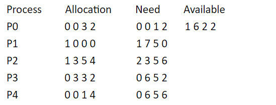

## 进程

### 1.进程状态变化

### 2.PCB

①作为独立运行基本单位的标志

②能实现间断性运行方式

③提供进程管理、调度所需要的信息

④实现与其他进程的同步与通信

### 3.同步机制

| 同步类型     | 方式                     | 特点                                                         |
| ------------ | ------------------------ | ------------------------------------------------------------ |
| 硬件同步机制 | 关中断                   | 缺点大,影响效率不适合多CPU系统                               |
|              | Test-and-set指令实现互斥 | 程序一直处以执行状态,忙等消耗资源                            |
|              | swap(交换)               | 类似上面,忙等消耗资源                                        |
| 软件同步机制 | 整型信号量               | 无让权等待                                                   |
|              | 记录型信号量             | 使用队列能够让权等待                                         |
|              | AND信号量                | 适用于多种资源                                               |
|              | 信号量集                 | 资源数量分配限制                                             |
|              | 管程                     | 类似与类,定义了一组操作。一次只允许一个进程进入管程,使用信号量实现。并且为防止阻塞进程和挂起进程过长占用管程,设置条件变量及其队列来实现继续执行. |

### 4.调度算法

| 作业调度                                    | 进程调度       | 实时调度                                              |
| ------------------------------------------- | -------------- | ----------------------------------------------------- |
| FCFS                                        | 时间片轮转算法 | 最早截至时间优先                                      |
| SJF                                         | 优先级调度     | 最低松弛度优先(松弛度=截止时间-需要运行时间-当前时间) |
| 优先级调度                                  | 多队列调度算法 |                                                       |
| 高响应比 等待时间+需要服务时间/需要服务时间 | 多级反馈队列   |                                                       |

周转时间：任务从提交到完成的时间

### 5.死锁

| 条件           | 处理     |
| -------------- | -------- |
| 互斥条件       | 预防死锁 |
| 请求和保持条件 | 避免死锁 |
| 不可抢占时间   | 检测死锁 |
| 循环等待时间   | 解除死锁 |

### 6.银行家算法

寻找安全序列

**当前状态**

**安全序列**

