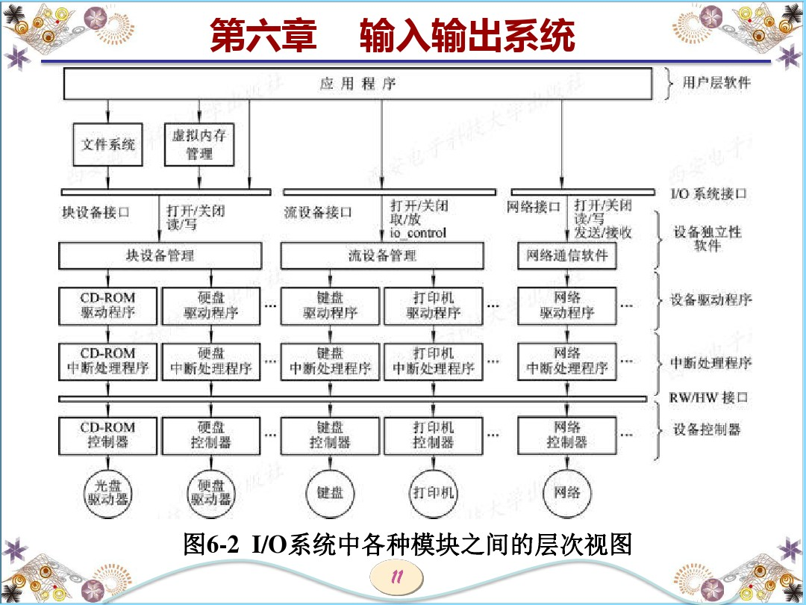
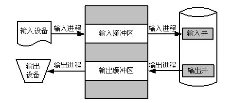
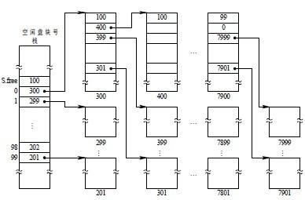

## IO系统

### 1.IO系统中各模块层次图

### 2.假脱机技术

关键在于使用模拟外围机，让外围机取处理低速IO。类似饭店，客户(低速IO)通过服务员(外围机)和厨师进行沟通。

#### 2.1 改进方案(守护进程)

类似打印店的员工,将任务发给员工,员工自行缓存后执行。

### 3.缓存作用

缓存的作用：①解决CPU与IO速度不匹配		②减少CPU中断频率,放宽中断响应时间		③解决数据粒度不匹配

### 4.磁盘调度

| 先来先服务调度 | 最短寻道时间优先 | 扫描算法 | 循环扫描算法                 |
| -------------- | ---------------- | -------- | ---------------------------- |
| 不解释         | 不解释           | 类似电梯 | 从内到外结束后直接回到最里面 |

### 5.硬link与软link

硬链接只在超级块上为文件增加了一个别名，而软链接则是重新建立了一个数据块。

### 6.文件管理之文件保护

利用访问矩阵实现用户对文件权限控制

### 7.微软文件系统

| FAT16                         | FAT32                    |
| ----------------------------- | ------------------------ |
| 表项数16位                    | 表项数32位               |
| 最大支持一簇64扇区            | 一簇4KB                  |
| 最大支持:2^16×64*512B=2048MB  | 2^32×4KB=2TB             |
| 受限于寻址能力,最大文件:2^16b | 同样受限于寻址:2^32b=4GB |

### 8.空闲盘块的管理

成组链接法

最后一组中的S.free(0)位需要置0表示最后一组，故最后一组可用空闲盘块为99个。