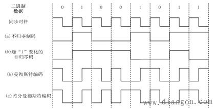

## 物理层

### 1.常见编码方式

曼彻斯特编码：中间跳变,上跳1,下跳0
差分曼彻斯特编码：中间始终跳变,开头跳变表示1

### 2.码分复用技术

计算方法：正交计算/8
0代表不接收

### 3.香农定理

$$
信噪比(dB)=10log_{10}(S/N)(dB),例如当S/N=10,信噪比=10dB\\
S为信号的平均功率，N的噪声的平均功率\\
C=Wlog_2(1+S/N)(b/s),W为信道带宽(以Hz为单位)\\
C=\frac{W}{10}×信噪比(b/s)
$$

