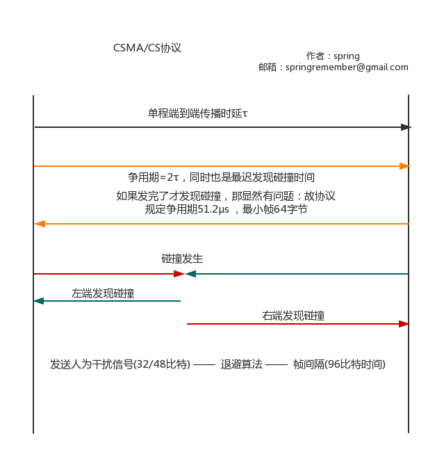

## CSMA/CD协议

#### 1.要点
多点接入：总线型网络
载波监听：不断检测信道
碰撞检测：检测是否发生碰撞

#### 2.传播时延
τ单程端到端传播时延
争用期：2τ 即**最迟发现碰撞时间**

那有一种情况，在**发现碰撞之前发送完了数据**，那么显然该次发送是无用功。所以规定：
最短帧长 = 争用期*发送速度(规定64字节)

#### 3.碰撞处理
①强化碰撞
在发现碰撞后，为了通知所有接入设备总线中存在碰撞，需要人为发送**32比特或48比特的人为干扰信号**。
②截断二进制退避
整数集合[0....(2^k-1)] 其中k是重传次数
选取一个整数后再乘以**争用期**

#### 4.帧间隔
9.6 μs = 9.6 比特时间
其中μs = 10^(-6)

#### 5.特点
显然该协议中一个时刻中有且仅有一个设备能够发送消息，故为**双向交替通信(半双工)**

