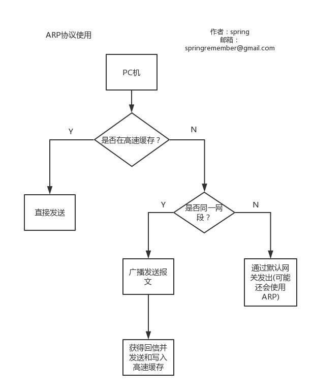
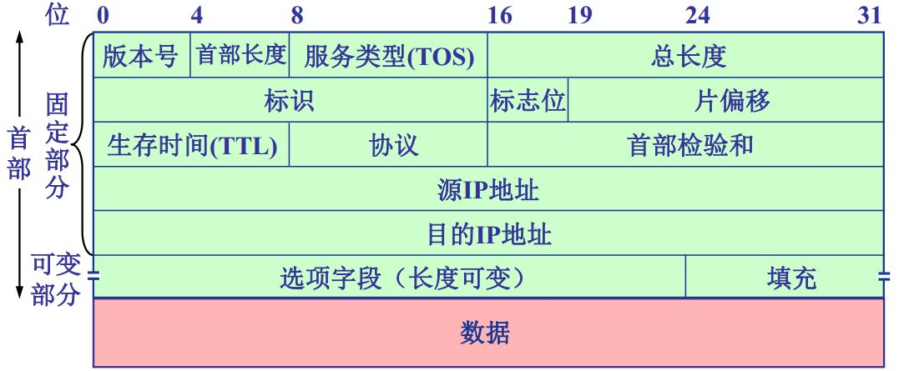

## 网络层协议

#### 1.ARP协议
**ARP缓存**：保存近期查询的地址
**同一网段**是使用ARP的限制

#### 2.IP数据报格式

**首部长度**
单位为4个字节，故首部为4字节整数倍

 **标识**
 用于将分片后的数据组装起来

 **片偏移**
单位为8个字节，故**每个分片长度为8字节的整数倍**

#### 3.网际控制报文协议ICMP
| ICMP报文种类 | 类型的值  | ICMP报文的类型 |
| -------- | ----- | --------- |
| 差错报告报文   | 3     | 终点不可达     |
|          | 4     | 源点抑制      |
|          | 11    | 时间超过      |
|          | 12    | 参数问题      |
|          | 5     | 改变路由      |
| 询问报文     | 8或0   | 回送请求或回答   |
|          | 13或14 | 时间戳请求或回答  |