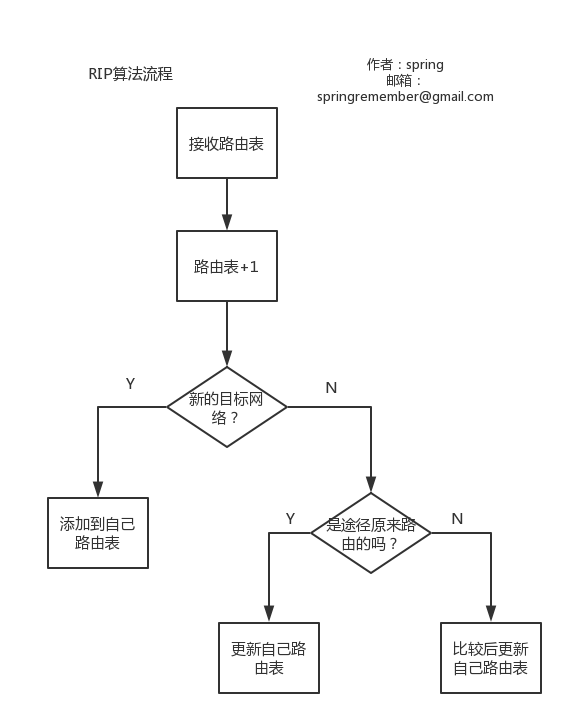

## 网络层中的路由器

#### 1.标准路由表
| 地址掩码 | 目的网络地址      | 下一跳地址      | 路由器接口 |
| ---- | ----------- | ---------- | ----- |
| /26  | 140.5.12.64 | 180.15.2.5 | m2    |
| /24  | 130.5.8.0   | 190.16.6.2 | m1    |
| ...  | ....        | .....      | ...   |
| 默认   | 默认          | 110.71.4.5 | m0    |

#### 2.最长前缀匹配
使用**二叉线索树**快速查找

#### 3.内路由选择算法RIP
**固定时间**与**相邻路由**之间**交换路由表**

报文格式(略)

#### 3.内路由算法OSPF
**三点不同**
1. 同时向所有相邻路由器发送信息
2. 发送链路状态
3. 只有链路状态变化才发送数据

报文格式(略)

#### 4.外路由算法BGP
**BGP发言者**即BGP边界路由器
通过**TCP**交换消息

报文格式(略)