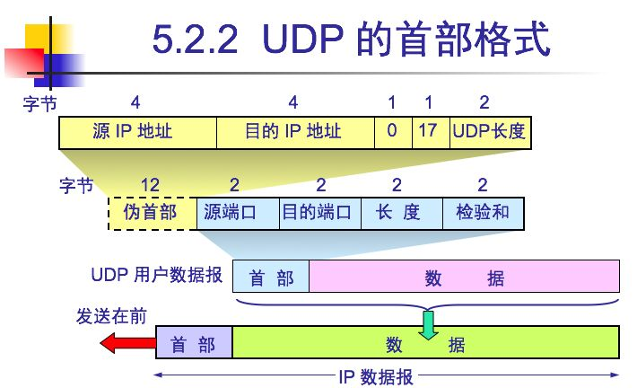
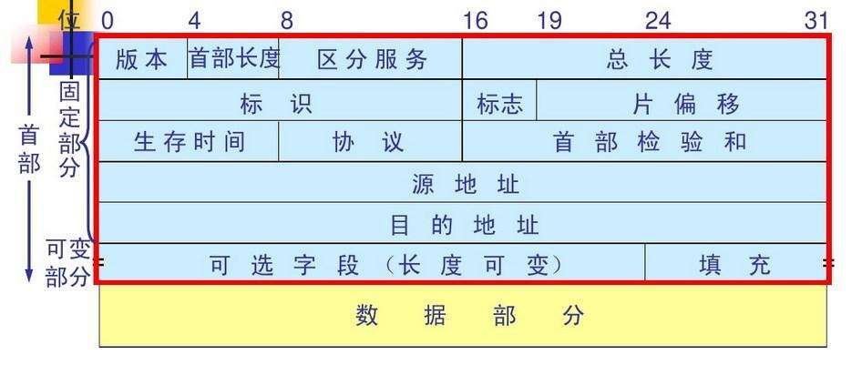
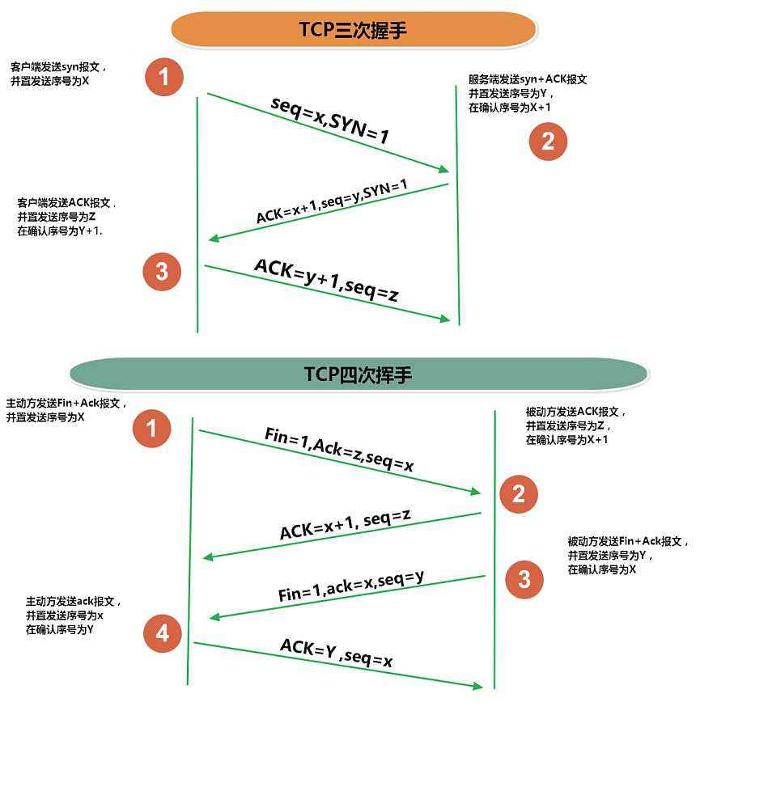

## 运输层

#### 1.用户数据报协议UDP

**校验和**
1. 首部和数据部一同参与
2. 以2字节为单位，可能需要补一个字节的0

#### 2.TCP概念和格式
TCP**面向连接**，使用两个SOCKET来建立连接。

**序号**
序号对**数据段字节**进行编号。
其中，建立连接和结束连接时每个报文编号1个。

**数据偏移**
以4个字节为单位，4位表示。故首部最大60字节。

#### 3.可靠传输
①停止等待协议
也就是不断通过确认(喊话)来确保可靠传输。
分为四种情况：
| 情况名称          | 动作             |
| ------------- | -------------- |
| 无差错情况         | 什么也不做          |
| 出现差错(接收端没有收到) | 超时重传           |
| 确认(名词)丢失      | 接收端丢弃重传的，并重发确认 |
| 确认迟到          | 发送端收下确认，但什么也不做 |

②连续确认协议和滑动窗口
**累积确认**，对最后一个顺序到达包进行确认。

窗口：代表能够发送的字节，按照顺序标号。

③超时重传时间选择
RTT一个往返时间
RTTs加权往返时间
第一次：RTTS = RTT
之后：新的RTTs = （1 - α) * (旧的RTTs) + α * 新的RTT
其中推荐**α = 1/8**

RTTd偏差的加权平均值
第一次：RTTd = RTT * 0.5
之后：新的RTTd = (1 - β) * (旧的RTTd) + β * |RTTs - 新的RTT样本 |
其中推荐**β = 1/4**

RTO(超时重传时间) = RTTS + 4 * RTTd

#### 4.流量控制
发送方的**发送窗口**不能超过接收方的**接收窗口**

发送窗口 + 接收窗口 <= 2^(比特数)

△如果接收窗口为0一段时间之后，增大rwnd的报文丢失导致继续等待情况。
TCP设有**持续计时器**，时间到了就会发送**零窗口探测报文段**

#### 5.拥塞控制
发送方维持一个拥塞窗口(cwnd)

①慢开始和拥塞避免
慢开始：从1开始每轮2指数增长，直到ssthresh(慢开始门限)。
拥塞避免：过门限后，每轮+1增长。

②乘法减小
一旦网络拥塞，门限值为当前cwnd一半

③快重传和快恢复
快重传：接收方获取失序报文后，发送三个重复确认报文，以避免无意义的开销。
快恢复：收到三个重复确认报文后，门限值改为当前cwnd一半，并且cwnd也从这一半开始。然后+1增加。

④路由器的RED(随机早期检测)
| 动作   | 限制        | 动作     | 限制        | 动作   |
| ---- | --------- | ------ | --------- | ---- |
| 丢弃   | 最大门限THmax | 以概率P丢弃 | 最小门限THmin | 排队   |

**算法实现**
1. 使用平均队列长度
2. THmax = 2 THmin
3. P从THmin的0 到THmax的1 是一个线性关系。

#### 6.连接的开始和结束
**连接控制**

