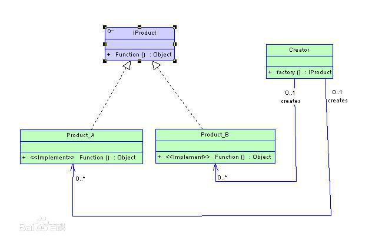
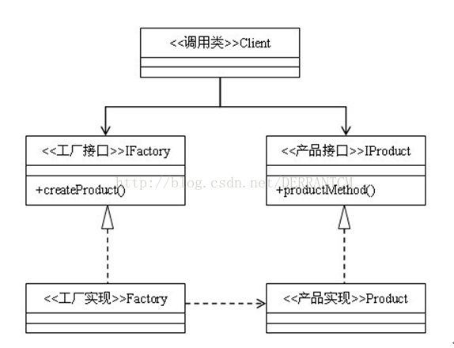
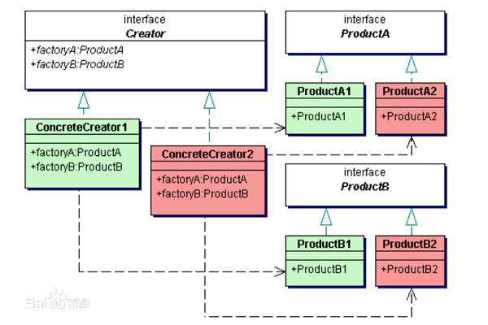

##  工厂方法总结

### *简单工厂*


1. 将实例对象的判断放在工厂类中，在客户端中只需要传递想要的参数值。
2. 使用单一工厂，违反了**开放和封闭原则**，新增和修改都需要修改工厂类中的判断语句。

```java
public class Test {
    public static void main(String[] args){
        IProduct hmc = Creator.factory("A");
        hmc.Function();
    }
}

interface IProduct{
    void Function();
}

class Product_A implements IProduct{
    @Override
    public void Function() {
        System.out.println("A");
    }
}

class Product_B implements IProduct{
    @Override
    public void Function() {
        System.out.println("B");
    }
}

// 关键，使用if或者switch来生成对象
class Creator{
    public static IProduct factory(String type){
        if (type == "A"){
            return new Product_A();
        }
        else {
            return new Product_B();
        }
    }
}
```
-------

### *工厂方法*

#### 目的

调用者只需要知道抽象类，具体的生成交给工厂类来完成。一般的，工厂类附加单件模式或使用类静态方法，可以简化调用。



#### 特点

1. 工厂方法更近一步，在总工厂的基础上新增了一批子工厂，由客户端选择调用的工厂来生成对象。
2. 显然增加了客户端的复杂度。

#### 实现

```java
public class Test {
    public static void main(String[] args){
        IFactory factory = new Factory_A();
        IProduct hmc = factory.createProduct();
        hmc.Function();
    }
}

interface IProduct{
    void Function();
}

class Product_A implements IProduct{
    @Override
    public void Function() {
        System.out.println("A");
    }
}

class Product_B implements IProduct{
    @Override
    public void Function() {
        System.out.println("B");
    }
}

// 相较于简单工厂，分离了工厂类，并在客户端进行类型选择
interface IFactory{
    IProduct createProduct();
}

class Factory_A implements IFactory{
    @Override
    public IProduct createProduct() {
        return new Product_A();
    }
}

class Factory_B implements IFactory{
    @Override
    public IProduct createProduct() {
        return new Product_B();
    }
}
```

-----------------

### *抽象工厂方法*

#### 目的

工厂类负责**一系列产品**的生成。例如，一个软件需要考虑界面风格的切换，那么可以通过简单的更换具体的工厂类来实现。



#### 特点

1. 在实际中存在一系列相关的对象，子类也适应这种结构，**一个工厂能够生产一系列的对象**。
2. 如图可以看出，添加新的产品会非常困难。并且加重了客户端负担。

#### 实现

```java
public class Test {
    public static void main(String[] args){
       Creater factory = new Creater1();
       ProductA hmc = factory.factoryA();
       hmc.goA();
    }
}

// 产品类
interface ProductA{
    void goA();
}

class ProductA1 implements ProductA{
    @Override
    public void goA() {
        System.out.println("A1");
    }
}

class ProductA2 implements ProductA{
    @Override
    public void goA() {
        System.out.println("A2");
    }
}

interface ProductB{
    void goB();
}

class ProductB1 implements ProductB{
    @Override
    public void goB() {
        System.out.println("B1");
    }
}

class ProductB2 implements ProductB{
    @Override
    public void goB() {
        System.out.println("B2");
    }
}

// 创造者类
interface Creater{
    ProductA factoryA();
    ProductB factoryB();
}

class Creater1 implements Creater{
    @Override
    public ProductA factoryA() {
        return new ProductA1();
    }

    @Override
    public ProductB factoryB() {
        return new ProductB1();
    }
}

class Creater2 implements Creater{
    @Override
    public ProductA factoryA() {
        return new ProductA2();
    }

    @Override
    public ProductB factoryB() {
        return new ProductB2();
    }
}
```

#### 改进

1. 与简单工厂结合，使用简单工厂来创建抽象工厂对象
2. 与反射结合，在运行中动态创建工厂对象。

