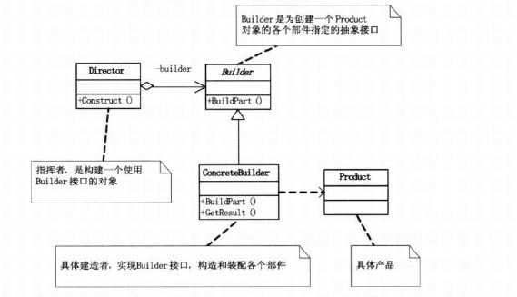

## 生成器模式

#### 目的

相同的一系列流程来实现不同的对象。



#### 特点

1.强调建造**顺序**或者**建造部件的完整性**
2.零件的**生产**(builder)和**装配**(director)分开
3.生产者负责**实现**生产过程，指导者保证**顺序**。

#### 比较

抽象工厂在于**直接创建对象**，而生成器模式在于**强调建造的顺序**

#### 实现

```java
public class Test {
    public static void main(String[] args){
        Director hmc = new Director(new ConcreteBuilder());
        People one = hmc.Construct();
        one.show();
    }
}

class People{
    public String head;
    public String body;

    public People(String head,String body){
        this.head = head;
        this.body = body;
    }

    public void show(){
        System.out.println("头："+head+"身体"+body);
    }
}

// Builder中有一系列装配函数以及最后获取对象函数。
interface Builder{
    void BuildHead();
    void BuildBody();
    People getResult();
}

class ConcreteBuilder implements Builder{
    private String head;
    private String body;

    @Override
    public void BuildHead() {
        //设置head的值，这里直接赋值了
        head = "smart";
    }

    @Override
    public void BuildBody() {
        body = "strong";
    }

    @Override
    public People getResult() {
        return new People(head,body);
    }
}

// 按照顺序调用函数并生成对象。
class Director{
    Builder builder;

    Director(Builder builder){
        this.builder = builder;
    }

    People Construct(){
        builder.BuildHead();
        builder.BuildBody();
        return builder.getResult();
    }
}
```

参考博客：
[java设计模式之建造者模式](https://www.cnblogs.com/kangsir/p/6653233.html)