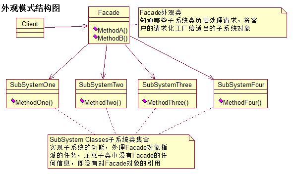

## 外观模式

#### 目标

封装一系列子系统接口，使之方便调用。



#### 特点

1. 为子系统中的**一组接口**提供一个一致的界面，外观模式定义了一个高层接口，这个接口使得这一子系统更加容易使用。
2. 用于简化复杂接口调用，但是违反了开闭原则，后期修改极为麻烦。

#### 实现

```java
public class Test {
    public static void main(String[] args){
        Facade hmc = new Facade();
        hmc.MethodA();
    }
}

// 子系统类
class SubSystemOne{
    public void MethodOne(){
        System.out.println("第一个方法");
    }
}

class SubSystemTwo{
    public void MethodTwo(){
        System.out.println("第二个方法");
    }
}

// 外观类，用于整合子系统方法
class Facade{
    SubSystemOne system1 = new SubSystemOne();
    SubSystemTwo system2 = new SubSystemTwo();

    public void MethodA(){
        System.out.println("调用第一个系统方法");
        system1.MethodOne();
    }

    public void MethodB(){
        System.out.println("调用第二个系统方法");
        system2.MethodTwo();
    }
}
```