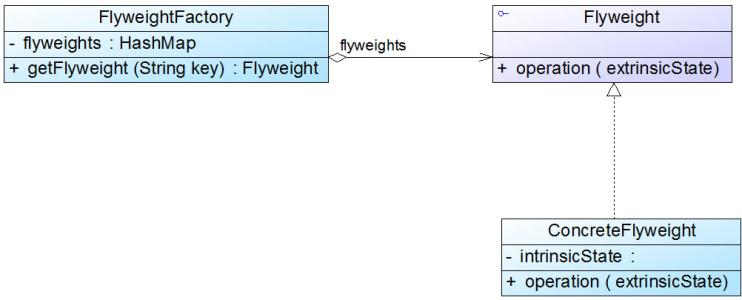
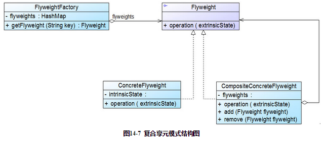

## 享元模式

#### 目标

它使用**共享物件**，用来尽可能减少内存使用量以及分享资讯给尽可能多的相似物件；它适合用于只是因重复而导致使用无法令人接受的大量内存的大量物件。



#### 特点

**类似于单件模式+工厂模式结合**

| 类似单件模式             | 类似工厂模式                |
| ------------------ | --------------------- |
| 工厂类中保留一个对象的存储(map) | 工厂模式提供函数检查是否已经存在需要的对象 |

#### 实现

```java
import java.util.HashMap;

public class Test {
    public static void main(String[] args){
        Web hmc = WebFactory.getWeb("博客");
        hmc.show();
		// 输出当前保存的对象个数
        WebFactory.showSize();
    }
}

// 以网页复用为例
interface Web{
    void show();
}

class SendMessage implements Web{
    @Override
    public void show() {
        System.out.println("信息发布");
    }
}

class Blog implements Web{
    @Override
    public void show() {
        System.out.println("博客");
    }
}

// 网页工厂
class WebFactory {
    public static final HashMap<String, Web> WebMap = new HashMap<>();

    public static Web getWeb(String type) {
        Web newWeb = (Web)WebMap.get(type);

        //如果空对象，则新建并加入map
        if(newWeb == null) {
            if (type == "信息发布") {
                newWeb = new SendMessage();
            }
            else if (type == "博客") {
                newWeb = new Blog();
            }
            else {
                System.out.println("选择类型错误");
            }
            WebMap.put(type, newWeb);
        }
        return newWeb;
    }

    public static void showSize(){
        System.out.println("当前保存的对象数:"+WebMap.size());
    }
}
```

#### 改进


##### 实现

①继承于原始类  
②拥有原始类的对象，可以调用原始方法。
③用于实现内部状态

**示例代码**

```java
import java.util.HashMap;

public class Test {
    public static void main(String[] args){
       // Customer实现Web接口但是保有非共享信息，j
        Web hmc = new Customer("hmc",WebFactory.getWeb("博客"));
        hmc.show();

        WebFactory.showSize();
    }
}

// 以网页复用为例
interface Web{
    void show();
}

class SendMessage implements Web{
    @Override
    public void show() {
        System.out.println("信息发布");
    }
}

class Blog implements Web{
    @Override
    public void show() {
        System.out.println("博客");
    }
}

// 客户类，用于保存非共享信息，例如客户名字
class Customer implements Web{
    String name;
    Web web;
    public Customer(String name,Web web){
        this.name = name;
        this.web = web;
    }

    @Override
    public void show() {
        System.out.println("客户姓名"+name);
        web.show();
    }
}

// 网页工厂
class WebFactory {
    public static final HashMap<String, Web> WebMap = new HashMap<>();

    public static Web getWeb(String type) {
        Web newWeb = (Web)WebMap.get(type);

        //如果空对象，则新建并加入map
        if(newWeb == null) {
            if (type == "信息发布") {
                newWeb = new SendMessage();
            }
            else if (type == "博客") {
                newWeb = new Blog();
            }
            else {
                System.out.println("选择类型错误");
            }
            WebMap.put(type, newWeb);
        }
        return newWeb;
    }

    public static void showSize(){
        System.out.println("当前保存的对象数:"+WebMap.size());
    }
}
```