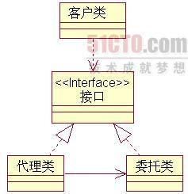

## 代理模式

#### 目标

控制访问，进行一些权限操作。



#### 特点

1. 适配器模式时为了解决**接口**不同,而上图可以看出代理类和被代理类实现了**同一个接口**
2. 代理类拥有被代理类的一个对象

#### 实现

```java
interface ISubject{
  void do();
}

class Subject implements ISubject{
  void do(){
    System.out.println("真正的对象");
  }
}

class Proxy implements ISubject{
  ISubject realSubject;
  void do(){
    // 可能的处理代码
    System.out.println("代理");
    readSubject.do();
  }
}

public class Test{
  public static void main(String[] args){
    Proxy hmc = new Proxy(new Subject());
    hmc.do();
  }
}
```
