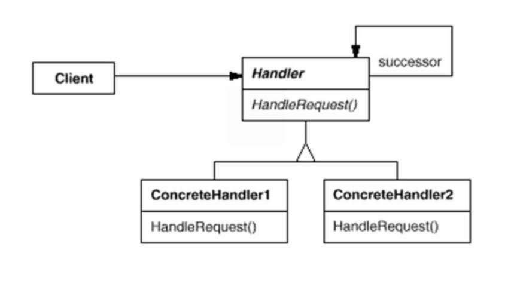

## 职责链模式

#### 目标

通常每个接收者都包含对另一个接收者的引用。如果一个对象不能处理该请求，那么它会把**相同的请求传给下一个接收者**，依此类推。



#### 特点

分离命令和其实现者。

#### 实现

如上图，每个接受者共同实现一个接口，并拥有向**下一个处理者的对象**。

**实例代码**

```java
// 人事部门总类
class HR{
  HR nextPeople;
  void RaiseWage(int money){};
  void setNextPeople(HR nextPeople){...};
}

// 主管类
class Manager extends HR{
  void RaiseWage(int money){
    if(money <= 1000){
      System.out.println("加薪成功");
    }
    else{
      System.out.println("请领导批示");
      nextPeople.RaiseWage(money);
    }
  }
}

// CEO类，职责链末尾，需要结束继续请求
class CEO extends HR{
  // 其余同上，额度为2000  void RaiseWage(int money){
    if(money <= 2000){
      System.out.println("加薪成功");
    }
    else{
      System.out.println("不通过");
    }
  }
}

public class Test{
  public static main(String[] args){
    HR manger = new Manger():
    HR ceo = new CEO();

    // 设置职责链
    manger.setNextPeople(ceo);

    manger.RaiseWage(700);
    manger.RaiseWage(1500);
    manger.RaiseWage(2400);
  }
}
```