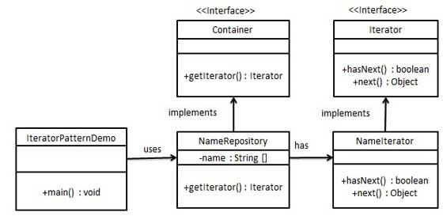

## 迭代器模式

#### 目标

这种模式用于顺序访问集合对象的元素，不需要知道集合对象的底层表示。



#### 特点

集合不需要暴露自身实现的前提下实现操作。

#### 实现

```java
// 迭代接口
interface Iterator {
    Node getNext();
    Node getPre();
    Node getFirst();
    Node getLast();
}

// 容器接口
interface Container {
    void addNode(Node n);
    Iterator getIterator();
}

public class Demo {
    public static void main(String[] args) {
        Container hmc = new ConcreteContainer();
        hmc.addNode(new Node(1, 1.1));
        hmc.addNode(new Node(2, 2.2));
        hmc.addNode(new Node(3, 3.3));

        Iterator spring = hmc.getIterator();

        Node temp;
        // 正向遍历
        while ((temp = spring.getNext()) != null) {
            System.out.println("该节点整数是" + temp.a);
            System.out.println("该节点浮点数为" + temp.b);
        }

        System.out.println("");

        //反向遍历
        while ((temp = spring.getPre()) != null) {
            System.out.println("该节点整数是" + temp.a);
            System.out.println("该节点浮点数为" + temp.b);
        }
    }
}

// 节点类，保存一个浮点数和一个整数
class Node {
    int a;
    double b;

    Node next = null;
    Node pre = null;

    Node() {
    }

    Node(int a, double b) {
        this.a = a;
        this.b = b;
    }

    public void setNext(Node next) {
        this.next = next;
    }

    public void setPre(Node pre) {
        this.pre = pre;
    }
}

// 实际容器类
class ConcreteContainer implements Container {
    Iterator iterator;

    ConcreteContainer() {
        iterator = new ConcreteIterator();
    }

    @Override
    public void addNode(Node n) {
        if (iterator.getFirst().next == null) {
            iterator.getFirst().setNext(n);
            iterator.getLast().setPre(n);
            n.setPre(iterator.getFirst());
            n.setNext(iterator.getLast());
        } else {
            iterator.getLast().pre.setNext(n);
            n.setPre(iterator.getLast().pre);
            n.setNext(iterator.getLast());
            iterator.getLast().setPre(n);
        }
    }

    @Override
    public Iterator getIterator() {
        return iterator;
    }
}

// 实际迭代器
class ConcreteIterator implements Iterator {
    Node first = new Node();
    Node last = new Node();
    Node current = first;

    ConcreteIterator() {
    }

    @Override
    public Node getNext() {
        current = current.next;
        if (current == last) {
            return null;
        }
        return current;
    }

    @Override
    public Node getPre() {
        current = current.pre;
        if (current == first) {
            return null;
        }
        return current;
    }

    @Override
    public Node getFirst() {
        return first;
    }

    @Override
    public Node getLast() {
        return last;
    }
}
```