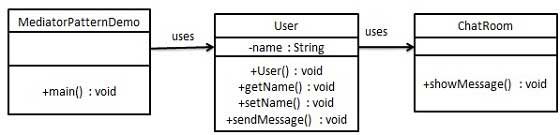

## 中介者模式

#### 目的

中介者模式（Mediator Pattern）是用来降低**多个对象和类**之间的通信复杂性。这种模式提供了一个中介类，该类通常处理不同类之间的通信，并支持松耦合，使代码易于维护。



#### 特点

在系统复杂的过程中，可能出现多个类相互联系的情况。利用中介者模式，能够减少关系的复杂度。

#### 实现

多个对象调用中介者类的函数

```java
// 用户，通过聊天室静态方法聊天
public class User {
   private String name;

   public String getName() {
      return name;
   }

   public void setName(String name) {
      this.name = name;
   }

   public User(String name){
      this.name  = name;
   }

   public void sendMessage(String message){
      ChatRoom.showMessage(this,message);
   }
}

// 聊天室
import java.util.Date;

public class ChatRoom {
   public static void showMessage(User user, String message){
      System.out.println(new Date().toString()
         + " [" + user.getName() +"] : " + message);
   }
}

// 测试类
public class Test{
   public static void main(String[] args) {
      User robert = new User("Robert");
      User john = new User("John");

      robert.sendMessage("Hi! John!");
      john.sendMessage("Hello! Robert!");
   }
}
```