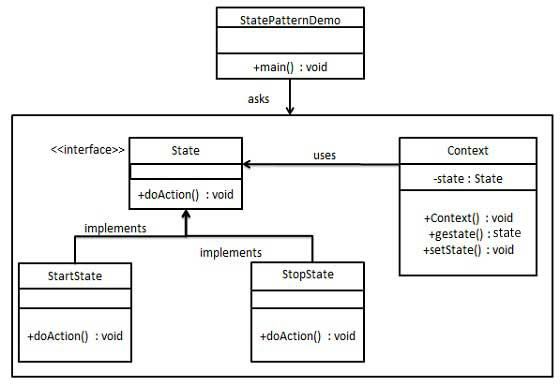

## 桥接模式 vs 状态模式

##### 桥接模式
通过分离数据和行为，在**数据对象中保存行为对象接口**，然后通过客户端绑定并运行。

##### 状态模式
分离出影响主体的状态，并因状态的改变而改变自身的行为。主体对象中**保存状态的接口**。

相同之处：
都实现了某种程度上的分离，通过组合方式来降低耦合。

不同之处：

1. 桥接模式中行为对象需要客户端生成并使用。而在状态模式中可以让状态自行改变。
2. 状态模式不是单纯为了分离数据和行为而使用的，可能是该主体需要适应不同的环境。
3. 状态模式影响的不仅仅是一个行为，而是**一系列行为**。