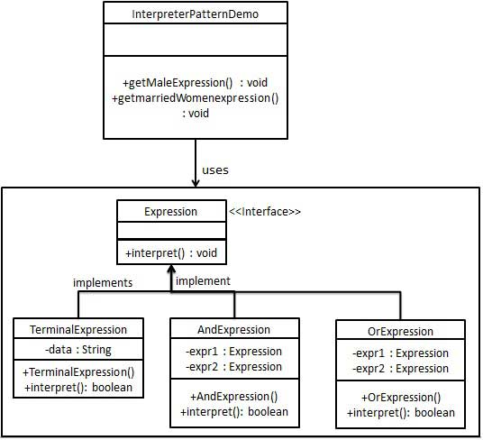

## 解释器模式

#### 目标

给定一个语言，定义它的文法表示，并定义一个解释器，这个解释器使用该标识来解释语言中的句子。



#### 特点

能够解析复杂句子

#### 实现

有点类似装饰器模式，通过一层一层递归来实现操作。

**示例代码**

可运行完整代码请见：
[解释器模式实验报告](https://github.com/springremember/labReportCurrent/tree/master/%E8%AE%BE%E8%AE%A1%E6%A8%A1%E5%BC%8F/%E5%AE%9E%E9%AA%8C%E5%85%AB:%E8%A7%A3%E9%87%8A%E5%99%A8%E6%A8%A1%E5%BC%8F)
```java
// 运算抽象主体
interface Expression {
    double Interpret(Expression in);
}

// 终结符类，此处为一个浮点数保存
public class DoubleExpression implements Expression{
    double result;

    DoubleExpression(double hmc){
        result = hmc;
    }

    @Override
    public double Interpret(Expression in) {
        System.out.print(result);
        return result;
    }
}

// 运算符的抽象类:定义了左右的符号
public class OpExpression extends Expression {
    Expression left;
    Expression right;

    @Override
    public double Interpret(Expression in) {
        return 0;
    }
}

// 加号实体类
public class AddExpression extends OpExpression{
    AddExpression(Expression left,Expression right){
        this.left = left;
        this.right = right;
    }

    AddExpression(){}

    @Override
    public double Interpret(Expression in) {
        double left = this.left.Interpret(in);
        System.out.print(" + ");
        double right = this.right.Interpret(in);
        double temp = left + right;
        if (this == in){
            System.out.print(" = ");
            System.out.print(temp);
    }
    return temp;
}
}

// 其余运算符号类同上

// 主函数
    public static void main(String[] args){
        Expression d1 = new DoubleExpression(3);
        Expression d2 = new DoubleExpression(4);
        Expression d3 = new DoubleExpression(6);
        Expression d4 = new DoubleExpression(7);
        Expression d5 = new DoubleExpression(2);


        Expression mul = new MulExpression(d2,d3);
        Expression b1 = new BracketExpression(mul);
        Expression div = new DivExpression(d4,d5);
        Expression b2 = new BracketExpression(div);
        Expression sub = new SubExpression(b1,b2);
        Expression b3 = new BracketExpression(sub);
        Expression add = new AddExpression(d1,b3);
        add.Interpret(add);

    }
```