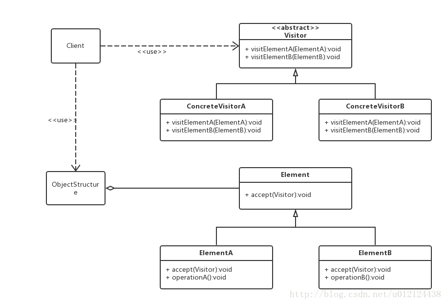

## 访问者模式

#### 目标

分离数据和实现方法，不同的访问者可以有不同的实现。



#### 特点

根据不同访问者，一系列行为不同。

实现:双重调用，客户端调用一次，函数中调用一次

#### 实现

```java
// 访问者
public interface Person {
    public void show(Action visitor);
}

// 男人类
class Man implements Person{
    String name = "男人";
    public void show(Action doIt){
        System.out.println(name+doIt.male());
    }
}

// 女人类
class Woman implements Person{
    String name = "女人";
    public void show(Action doIt){
        System.out.println(name+doIt.female());
    }
}

// 数据
public interface Action {
    public void getMan(Person p);
    public void getWoman(Person p);
    public String male();
    public  String female();
}

// 成功
public class Success implements Action {
  // 在函数中第二次调用，反调用
    public void getMan(Person p){
        p.show(this);
    }
    public String male(){
        return "背后有一个成功的女人。";
    }
    public void getWoman(Person p){
        p.show(this);
    }
    public String female(){
        return "不成功的男人。";
    }
}

// 失败
public class Failing implements Action {
    public void getMan(Person p){
        p.show(this);
    }
    public String male(){
        return "自喝自酒";
    }
    public void getWoman(Person p){
        p.show(this);
    }
    public String female(){
        return "无法劝";
    }
}

// 主函数
class Test {
    public static void main(String[] args) {
        Action success = new Success();
        Person hmc = new Man();
      // 数据被分派访问者，第一次调用
        success.getMan(hmc);
    }
}
```
