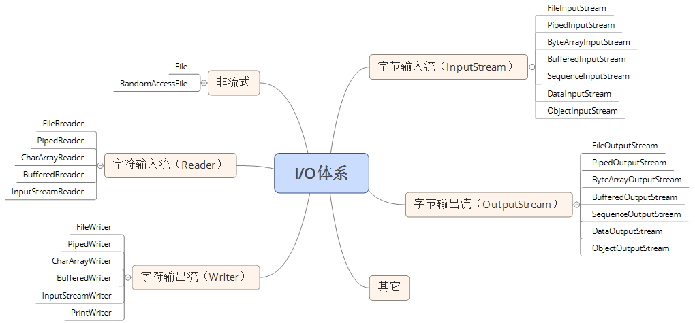
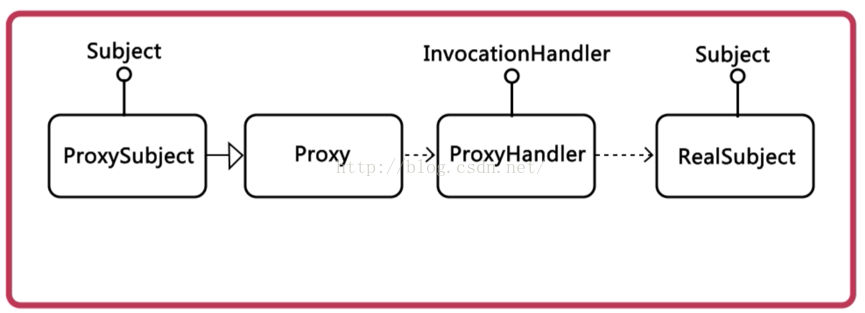
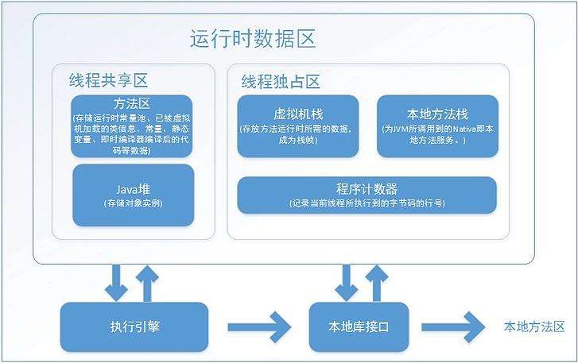

## Java核心语法

书籍：《Java核心技术卷一》《Java核心技术卷二》

java包结构：核心包，Java1一同出现

```bash
 applet：一种网页动态效果技术
 awt：用于创建用户界面和绘制图形图像，使用本地方法，显示效果平台不统一，swing以此为基础
 beans：Javabeans就是符合某种特定的规范的Java类
 io：io流操作，字符流和字节流
 lang：提供基础类，例如基本数据类型和一些接口，Object类是重点
 math：支持大数字的类
 net：scoket以及一些协议的支持类
 nio：新增的缓存流
 rmi：支持远程方法
 security:加密框架
 sql:数据库相关类，主要是驱动类、连接类、结果集类等
 text：格式化处理
 time：时间日期、时区等
 util：日期(Data)类、日历 (Calendar)类、随机数(Random)类、一些集合类、异常类
```

javax包结构：扩展包，后期特性和改进

```bash
 accessibility  
 annotation  
 imageio  
 lang/ model  
 management  
 naming  
 print  
 rmi  
 script  
 security  
 sound  
 sql  
 swing  
 tools  
 xml
```

org包结构：组织提供包，特殊处理类

```bash
 ietf/ jgss  
 omg  
 w3c/ dom：网页解析器
 xml/ sax：xml解析器
```

### 一.基本数据类型

> 六种数字类型(四个整数型，两个浮点型)：byte,short,int,long,float,doutle
>
> 一种字符类型：char
>
> 一种布尔型：boolean

常量修饰符：`final double PI = 3.1415927;`

强制类型转化：` int i1 = 123; byte b = (byte)i1;//强制类型转换为byte`

### 二.变量类型

> 类变量：独立于方法之外的变量，用 static 修饰。静态变量储存在静态存储区。静态变量在第一次被访问时创建，在程序结束时销毁。类变量具有默认值。
>
> 实例变量：独立于方法之外的变量，不过没有 static 修饰。实例变量具有默认值。
>
> 局部变量：类的方法中的变量。局部变量是在栈上分配的。局部变量没有默认值，所以局部变量被声明后，必须经过初始化，才可以使用。

```java
public class Variable{
    static int allClicks=0;    // 类变量
    String str="hello world";  // 实例变量
    public void method(){
        int i =0;  // 局部变量
    }
}
```

### 三.运算符

- 算术运算符
- 关系运算符
- 位运算符
- 逻辑运算符(&&、||、!)
- 赋值运算符
- 其他运算符

```java
// 条件运算符
variable x = (expression) ? value if true : value if false
// 如果 a 等于 1 成立，则设置 b 为 20，否则为 30
b = (a == 1) ? 20 : 30;

// 类型检查运算符
( Object reference variable ) instanceof  (class/interface type)
String name = "James";
boolean result = name instanceof String; // 由于 name 是 String 类型，所以返回真
```

### 四.流程控制

#### 循环

```java
while( 布尔表达式 ) {
  //循环内容
}

do {
       //代码语句
}while(布尔表达式);

for(初始化; 布尔表达式; 更新) {
    //代码语句
}

for(声明语句 : 表达式){
   //代码句子
}

break;continue;
```

#### 条件

```java
if(布尔表达式){
   //如果布尔表达式的值为true
}else{
   //如果布尔表达式的值为false
}

if(布尔表达式 1){
   //如果布尔表达式 1的值为true执行代码
}else if(布尔表达式 2){
   //如果布尔表达式 2的值为true执行代码
}else if(布尔表达式 3){
   //如果布尔表达式 3的值为true执行代码
}else {
   //如果以上布尔表达式都不为true执行代码
}
```

#### switch语句

```java
switch(expression){
    case value :
       //语句
       break; //可选
    case value :
       //语句
       break; //可选
    //你可以有任意数量的case语句
    default : //可选
       //语句
}
```

### 五.string类型(不可变)

创建字符串：`String greeting = "spring";`

字符串长度：`int len = site.length();`

> 连接字符串1：`"我的名字是 ".concat("Runoob");`
>
> 连接字符串2：`"Hello," + " runoob" + "!"`

> 按字典顺序比较两个字符串：`int compareTo(String anotherString) `

> 测试此字符串是否以指定的前缀开始：`boolean startsWith(String prefix) `
> 
> 测试此字符串是否以指定的后缀结束：`boolean endsWith(String suffix)`

> 返回字符在此字符串中第一次索引：`int indexOf(int ch)`
>
> 返回子字符串最后一次的索引，从指定的索引开始反向搜索：`int lastIndexOf(String str, int fromIndex)  `
>
> 返回子字符串第一次的索引：`int indexOf(String str)`

> 替换字符串中字符：`String replace(char oldChar, char newChar)`
>
> 替换正则表达式的子字符串：`String replaceAll(String regex, String replacement)`

> 正则表达式拆分此字符串`String[\] split(String regex)根据给定正则表达式的匹配拆分此字符串`

### 六.stringBuffer(可变)

创建：`StringBuffer sBuffer = new StringBuffer("菜鸟教程官网：");`

追加字符串：`public StringBuffer append(String s)`

字符串反转：` public StringBuffer reverse()`

移除字符：` public delete(int start, int end)`

插入字符：` public insert(int offset, int i)`

字符串替换：`replace(int start, int end, String str)`

**其余函数同string类型**

### 七.数组

> 声明数组：`dataType[] arrayRefVar;`
>
> 创建数组：`arrayRefVar = new dataType[arraySize];`
> 
> 作为参数：`public static void printArray(int[] array)`

> Array类方法：
>
> 二分查找算法在给定数组中搜索给定值的对象：`public static int binarySearch(Object[] a, Object key)`
>
> 指定的 int 值分配给指定数组指定范围中每个元素，同样适用于所有的其他基本数据类型：`public static void fill(int[] a, int val)`
>
> 指定对象数组根据其元素的自然顺序进行升序排列`public static void sort(Object[] a)`

### 八.面向对象之基本类

> 常类(不可继承、方法不可修改)：`final class SingleDog`
>
> 静态变量(类共享变量)：`public static String name = "Spring";`
>
> 静态方法(类共享方法)：`public static void sleep()`

> Object类：toString()、equals()、hashCode()

**继承类**

构造顺序、在子类中构造父类、在子类中使用父类函数

```java
public class Show {
    public static void main(String[] args){
        //构造B时，发现A先被构造
        B testB = new B();
        //使用super调用父类方法
        testB = new B("test");
    }
}

class A{
    public A(){
        System.out.println("classA");
    }
}

class B extends A{
    public B(String in){
        //父类构造函数必须放在第一行
        super(in+"A");
        System.out.println(in+"B");
        super.printA();
    }
}
```

### 九.面向对象之多态

> 接口：接口是隐式抽象的，接口中每一个方法也是隐式抽象的，接口中的方法都是公有的。

> 抽象类abstract class：不能实例化对象之外，类的其它功能依然存在。一个类只能继承一个抽象类，而一个类却可以实现多个接口。

> 父类引用指向子类对象，但只能使用父类出现过的方法。

### 十.面向对象之内部类

参考：[java提高篇(八)----详解内部类](https://www.cnblogs.com/chenssy/p/3388487.html)  

**接口只是解决了部分问题，而内部类使得多重继承的解决方案变得更加完整**

#### 成员内部类

*不能有任何static类和方法，只有静态内部类才能定义。静态内部类与静态类大致相同，但是能用外部类数据*

```java
public class InnerTest {
    public static void main(String[] args){
        Outer outer = new Outer();
        Outer.Inter inter = outer.new Inter();
        //内部类访问外部类数据
        inter.show();
    }
}

class Outer{
    public Outer(){}

    private int value = 11;
    public int getValue() {
        return value;
    }

    class Inter{
        public Inter(){}
        public void show(){
            System.out.println(getValue());
        }
    }
}
```

#### 局部内部类

*定义在方法内或作用域*

```java
public class Parcel5 {
    public Destionation destionation(String str){
        //局部内部类
        class PDestionation implements Destionation{
            private String label;
            private PDestionation(String whereTo){
                label = whereTo;
            }
            public String readLabel(){
                return label;
            }
        }
        //结束定义
        return new PDestionation(str);
    }
    
    public static void main(String[] args) {
        Parcel5 parcel5 = new Parcel5();
        Destionation d = parcel5.destionation("chenssy");
    }
}
```

#### 匿名内部类

*用于实现接口*

```java
button.addActionListener(  
                new ActionListener(){  
                    public void actionPerformed(ActionEvent e) {  
                        System.out.println("你按了按钮");  
                    }  
                });
```

### 十一.包装类

| 基本数据类型 | 对应的包装类 |
| ------------ | ------------ |
| byte         | Byte         |
| short        | Short        |
| int          | Integer      |
| long         | Long         |
| char         | Character    |
| float        | Float        |
| double       | Double       |
| boolean      | Boolean      |

装箱：` int m = 500; Integer iobj = new Integer(m);`

拆箱：`Integer x = 5;double d = x.doubleValue();`

字符串转指定类型：`int m = Integer.parseInt("123");`

指定类型转字符串：`int m = 500;String s = Integer.toString(m);`

自动装箱和拆箱：`Integer obj = m; int n = obj;`

获取类型信息：`Integer.MIN_VALUE;Integer.MAX_VALUE;`

### 十二.时间日期DATE

类库：java.util.Date

创建对象：

> 以当前时间创建：`new Date()`
>
> 指定毫秒数创建：`new Date(long millisec)`

比较时间先后：

> **boolean after(Date date)**
>
> **boolean before(Date date)**
>
> **int compareTo(Date date)**

设置和获取毫秒：

> **long getTime( )**
>
> **void setTime(long time)**

输出：` String toString( )`

### 十三.数学计算

Math类：类中仅有静态变量和静态方法

Math.PI：π

算数运算：

> 两数最小值：`T min(T,T)`
>
> 两数最大值：T max(T,T)
>
> 绝对值：`T abs(T)`
>
> 幂次方运算a^b：`Math.pow(a, b)`

进位：

> 向上取整：`double Math.ceil(float/double)`
>
> 向下取整：`double Math.floor(float/double)`
>
> 返回最接近的整数值：`double Math.rint(double d)`
>
> 四舍五入：`long round(double d);int round(float f)`

随机数[0, 1)范围：`double Math.random()`

### 十四.格式化

#### 抽象父类

父抽象类：`java.text.Format`

将对象格式化为字符串：`format(Object obj, StringBuffer toAppendTo, FieldPosition pos)`

将字符串反格式为对象：`parseObject(String source, ParsePosition pos)`

#### 时间日期

##### 抽象类：java.text.DateFormat

提供工厂方法以使用：

> 1.`getDateInstance()`输出样式：`2015-12-10`
>
> 2.`getDateTimeInstance()`输出样式：`2015-12-10 10:21:41` 
>
> 3.`getTimeInstance()`输出样式：`10:21:41` 
>
> 4.`getInstance()`输出样式：`15-12-10 上午10:21`
>
> ```java
> Date date = new Date();
> DateFormat df1 = DateFormat.getInstance();
> System.out.println(df1.format(date));
> ```

##### 具体类java.text.SimpleDateFormat

> | 字母 | 日期或时间元素           | 表示              | 示例                                        |
> | ---- | ------------------------ | ----------------- | ------------------------------------------- |
> | `G`  | Era 标志符               | Text              | `AD`                                        |
> | `y`  | 年                       | Year              | `1996`; `96`                                |
> | `M`  | 年中的月份               | Month             | `July`; `Jul`; `07`                         |
> | `w`  | 年中的周数               | Number            | `27`                                        |
> | `W`  | 月份中的周数             | Number            | `2`                                         |
> | `D`  | 年中的天数               | Number            | `189`                                       |
> | `d`  | 月份中的天数             | Number            | `10`                                        |
> | `F`  | 月份中的星期             | Number            | `2`                                         |
> | `E`  | 星期中的天数             | Text              | `Tuesday; Tue`                              |
> | `a`  | Am/pm                    | Text              | `PM`                                        |
> | `H`  | 一天中的小时数(0-23)     | Number            | `0`                                         |
> | `k`  | 一天中的小时数（1-24）   | Number            | `24`                                        |
> | `K`  | am/pm 中的小时数（0-11） | Number            | `0`                                         |
> | `h`  | am/pm 中的小时数（1-12） | Number            | `12`                                        |
> | `m`  | 小时中的分钟数           | Number            | `30`                                        |
> | `s`  | 分钟中的秒数             | Number            | `55`                                        |
> | `S`  | 毫秒数                   | Number            | `978`                                       |
> | `z`  | 时区                     | General time zone | `Pacific Standard Time`; `PST`; `GMT-08:00` |
> | `Z`  | 时区                     | RFC 822 time zone | `-0800`                                     |
>
> ```java
> Date d = new Date();
> /* h 1-12输出格式: 2017-04-16 01:01:22 */
> DateFormat format1 = new SimpleDateFormat("yyyy-MM-dd hh:mm:ss");
> System.out.println(format1.format(d));
> ```

#### 数值格式化

##### 抽象父类：java.text.NumberFormat

同样使用工厂方法构建对象：

> 1.`getCurrencyInstance()`方法，根据当前语言环境获取货币数值格式。传递Locale对象可以获取指定语言环境下的货币数值格式。
>
> 2.`getInstance()`和`getNumberInstance()`方法都会获取到常规数值格式
>
> 3.`getIntegerInstance()`方法获取常规整数值格式，如果需要格式化的数值为小数，则会将数值四舍五入为最接近的整数
>
> 4.`getPercentInstance()`方法获取百分比的数值格式

##### 具体子类：java.text.DecimalFormat

**可在创建对象时指定格式**：

> ` DecimalFormat format2 = new DecimalFormat("##.##");`
>
> | 符号   | 含义                                       |
> | ------ | ------------------------------------------ |
> | 0      | 表示一个数字，被格式化数值不够的位数会补0  |
> | #      | 表示一个数字，被格式化数值不够的位数会忽略 |
> | .      | 小数点分隔符的占位符                       |
> | ,      | 分组分隔符的占位符                         |
> | -      | 缺省负数前缀                               |
> | %      | 将数值乘以100并显示为百分数                |
> | \u2030 | 将数值乘以1000并显示为千分数               |

**也可创建对象后使用函数进行设置**：

>  `setMaximumFractionDigits(int newValue)`方法，设置小数部分中允许的**最大数字位数** 
>
> `setMinimumFractionDigits(int newValue)`方法，设置小数部分中允许的**最小数字位数**，如果原数小数
>
> 位数不够的话，会补零。 
>
> 对于数值的整数部分，默认3个数字为一组进行显示，同样对此我们也可以自定义，使用`setGroupingSize(int i)`方法，设置分组中一组的位数。
>
>  `setGroupingUsed(boolean value)`方法设置是否使用分组，true表示使用，false表示取消分组 
>
> `setMaximumIntegerDigits(int newValue)`方法设置整数部分允许的最大数字位数 
>
> `setMinimumIntegerDigits(int newValue)`方法设置整数部分允许的最小数字位数
>
> ```java
> DecimalFormat format3 = new DecimalFormat("0000.00");
> System.out.println(format3.format(12.345));//输出0012.35
> ```

##### 具体子类：java.text.ChoiceFormat

实例：数字与字符串数组对应，类似枚举

> ```java
> double[] limits = { 3, 4, 5, 6, 7, 8, 9 };
> String[] formats = { "星期一", "星期二", "星期三", "星期四", "星期五", "星期六", "星期日" };
> ChoiceFormat format = new ChoiceFormat(limits, formats);
> System.out.println(format.format(2.5));//将会输出"星期一"
> /**3.6介于3和4之间，所以会匹配3，又由于3在limits数组中的索引是0，所以会在formats数组徐照索引0的值，即输出"星期一"
> */
> System.out.println(format.format(3.6));
> ```

常用函数：主要为区间函数

> 1.`nextDouble(double d)`静态方法查找大于d的最小double值，用在limits数组中，从而使limits数组形成一个右开区间数组，例如 `limits = {0,1,ChoiceFormat.nextDouble(1)}`
>
>  2.`nextDouble(double d, boolean positive)`静态方法，如果positive参数为true，表示查找大于d的最小double值；如果positive参数为false，表示查找小于d的最大double值，这样就可以使limits形成一个左开区间数组。 
>
> 3.`previousDouble(double d)`静态方法，查找小于d的最大double值
>
> 同样可以在创建时指定格式：
>
> ```java
> ChoiceFormat cf = new ChoiceFormat("1#is 1 | 1<is more than 1");
> System.out.println(cf.format(1));//输出"is 1"
> System.out.println(cf.format(2));//输出"is more than 1"
> System.out.println(cf.format(0));//输出"is 1"
> ```

#### 消息格式化

具体类：java.text.MessageFormat

功能：将字符串按照指定格式拼接

条件：格式化字符串+对象数组

直接使用：` String value = MessageFormat.format("oh, {0} is 'a' pig", "Spring");`

> 两个单引号才表示一个单引号：` String value = MessageFormat.format("oh, {0} is ''a'' pig", "Spring");`
>
> 单引号会使其后面的占位符均失效：` MessageFormat.format("'{0}{1}", 1, 2); // 结果{0}{1}`
>
> 无论是有引号字符串还是无引号字符串，左花括号都是不支持的，应使用单引号包围：'{'

创建对象后使用：

> `MessageFormat temp = new MessageFormat(pattern);  `
>
> `temp.format(arrays);`

### 十五.格式化字符串

参考资料：[Java魔法堂：String.format详解](https://www.cnblogs.com/fsjohnhuang/p/4094777.html)

重载方法：

> 使用当前本地区域对象进行格式化：`String String.format(String fmt, Object... args);`
>
> 自定义本地区域对象格式化字符串：`String String.format(Locale locale, String fmt, Object... args);`

编写格式：`%[argument_index$][flags][width][.precision]conversion`

> argument_index$ 指定参数列表位置：`String.format("%2$s and %1$s", "A", "B");//B and A`
>
> flag 输出格式字符：`String.format("%,09d", -3872);//-0003,872`
>
> width 最小宽度：十进制整数
>
> .precision 限制字符数(精度)：十进制整数
>
> conversion 转化类型：%s,%d,%f

特殊转换符：

> b(布尔类型)、n(换行)、%(百分号)

#### 字符、字符串

格式化：`%[index$][标识][最小宽度]转换符`

> 转换符：字符串s、字符c
>
> 标识符：左对齐，右边以空格补充 -
>
> 例子：`String.format("%-7s", "hmc")`

#### 整数

格式化：`%[index$][标识]*[最小宽度]转换符 `

> 转换符：d(十进制整数)、x（十六进制整数)、o(八进制整数)
>
> 标识：
>
> -(在最小宽度内左对齐,不可以与0标识一起使用)、0(若内容长度不足最小宽度，则在左边用0来填充)
> #，对8进制和16进制，8进制前添加一个0,16进制前添加0x。
> +(结果总包含一个+或-号)、空格(正数前加空格，负数前加-号)
> ,，只用与十进制，每3位数字间用,分隔。
> (，若结果为负数，则用括号括住，且不显示符号。
>
> 例子：`String.format("%(,d",-1000)//(1,000)`

#### 浮点数

格式化：`%[index$][标识]*[最小宽度][.精度]转换符`

> 转换符：
>
> f，(十进制浮点数，显示9位有效数字，且会进行四舍五入。)
> a，浮点数型（十六进制）。
> e，指数类型。如9.38e+5。
> g，浮点数型（比%f，%a长度短些，显示6位有效数字，且会进行四舍五入）
>
> 标识符同整数

#### 时间日期

格式化：`%[index$]t转换符`

> 时间转化符：
>
> H, 24小时制的小时（不足两位补零）
> k, 24小时制的小时（不足两位不补零）
> I, 12小时制的小时（不足两位补零）
> i, 12小时制的小时（不足两位不补零）
> M, 分钟（不足两位补零）
> S, 秒（不足两位补零）
> L, 毫秒（不足三位补零）
> N, 毫秒（不足9位补零）
> p, 小写字母的上午或下午标记，如中文为“下午”，英文为pm
> z, 相对于GMT的时区偏移量，如+0800
> Z, 时区缩写，如CST
> s, 自1970-1-1 00:00:00起经过的秒数
> Q, 自1970-1-1 00:00:00起经过的豪秒

> 日期转化符：
>
> c，星期六 十月 27 14:21:20 CST 2007
> F，2007-10-27
> D，10/27/07
> r，02:25:51 下午
> T，14:28:16
> R，14:28
> b, 月份简称
> B, 月份全称
> a, 星期简称
> A, 星期全称
> C, 年前两位（不足两位补零）
> y, 年后两位（不足两位补零）
> j, 当年的第几天
> m, 月份（不足两位补零）
> d, 日期（不足两位补零）
> e, 日期（不足两位不补零）

### 十六.集合

#### 类结构

```bash
Collection(接口)/
	set(接口)/
		HashSet(具体类)
		LinkedHashSet(具体类)
		SortedSet(接口)/
			TreeSet(具体类)
	List(接口)/
		ArrayList(具体类)
		Vector(具体类)
		LinkedList(具体类)①
	Queue(接口)/
		LinkedList(具体类)①
		PriorityQueue(具体类)
```

```bash
Map(接口)/
	HashTable(具体类)
	LinkedHashMap(具体类)
	HashMap(具体类)
	SortedMap(接口)/
		TreeMap(具体类)
```

#### 集合工具类

**Collection**

| 方法     | 描述           |
| -------- | -------------- |
| copy     | 列表间复制     |
| max、mix | 最大、最小元素 |
| sort     | 排序           |

**Arrays**

| 方法         | 描述         |
| ------------ | ------------ |
| binarySearch | 二分查找     |
| copyOf       | 复制         |
| copyOfRange  | 指定范围复制 |
| sort         | 排序         |
| asList       | 参数转列表   |

> 视图

定义：具有限制的集合对象

```java
Test[] tests = new Test[10];
List<Test> testList = Arrays.asList(tests);
```

具有访问数组元素set，get的方法。但是如果调用**改变数组的方法就会抛出异常**。所以可以说视图对象可以说是具有限制的集合对象。

### 十七.异常

#### 类结构

```bash
Throwable/
	Error(错误，无法再程序中处理)
	Exception(意外)/
		IOException/
			EOFException
			FileNotFoundException
			MalformedURLException
			UnknownHostException
		ClassNotFoundException
		CloneNotSupportedException
		RuntimeException/
			ArithmeticException
			ClassCastException
			IllegalArgumentException
			IllegalStateException
			IndexOutOfBoundsException
			NoSuchElementException
			NullPointerException
```

####异常的操作

| 异常处理     | 自定义异常类            | 主动抛出异常                         | finaly语句   |
| ------------ | ----------------------- | ------------------------------------ | ------------ |
| catch语句    | 继承于Exception类       | 本函数不处理异常，抛出异常给外层函数 | 覆盖返回语句 |
| 依次匹配处理 | 实现方法：getMessage(); | 直接抛出异常：throw 对象             |              |

### 十八.IO流管理

#### 类结构图



#### 分类说明

| File类                       | RandomAccessFile | PrintStream                                       | 缓冲读与Scanner                           | 序列化                  |
| ---------------------------- | ---------------- | ------------------------------------------------- | ----------------------------------------- | ----------------------- |
| 提供文件相关信息，文件名属性 | 随机访问文件位置 | 包含System.in、System.out、System.err             | Scanner不需要显式的处理错误，而缓冲流需要 | implements Serializable |
| 查询操作、目录操作           |                  | *重定向*:①新建一个对象 ②setIn、setOut、setErr函数 | **不是继承关系**                          | 不需要实现函数          |

#### 文件类函数

| 复制、移动和删除            | 获取文件信息              | 文件加锁机制         |
| --------------------------- | ------------------------- | -------------------- |
| Files.copy(fromPath,toPath) | exists                    | FileLock lock()      |
| Files.move(fromPath,toPath) | isHidden                  | FileLock tryLock()   |
| Files.delete(path)          | isReadable、isWritable... | void close()：释放锁 |

**迭代目录中的文件：**

```java
try(DirectoryStream<Path> entries = Files.newDirectoryStream(dir)){
    for(Path entry:entries)
        Process entries
}
```

### 十九.反射

*参考： [Java基础之—反射（非常重要）](https://blog.csdn.net/sinat_38259539/article/details/71799078)*

前提：拥有字节码(.class)

定义：在运行过程中获取和使用类，例如构造出一个类、提取类成员变量、运行成员函数。

*Java中实现反射的类：*

```java
java.lang.Class;                
java.lang.reflect.Constructor;  
java.lang.reflect.Field;        
java.lang.reflect.Method;
java.lang.reflect.Modifier;
```

#### 获取class对象

```java
①Object.getClass()  
②对象.class //属性
③class.forName()
```

#### 构造方法

```java
// 获取批量的方法：
public Constructor[] getConstructors()
所有"公有的"构造方法
public Constructor[] getDeclaredConstructors()
获取所有的构造方法(包括私有、受保护、默认、公有)

//获取单个的方法：
public Constructor getConstructor(Class... parameterTypes
获取单个的"公有的"构造方法：
public Constructor getDeclaredConstructor(Class... parameterTypes)
获取"某个构造方法"可以是私有的，或受保护、默认、公有

//调用构造方法：
Constructor-->newInstance(Object... initargs)
```

#### 获取类成员变量

```java
// 批量的
Field[] getFields()
获取所有的"公有字段"
Field[] getDeclaredFields()
获取所有字段，包括：私有、受保护、默认、公有；

// 获取单个的：
public Field getField(String fieldName)
获取某个"公有的"字段；
public Field getDeclaredField(String fieldName)
获取某个字段(可以是私有的)

// 设置字段的值：
Field --> public void set(Object obj,Object value):
// 参数说明：
// 1.obj:要设置的字段所在的对象；
// 2.value:要为字段设置的值；
// 3.本身是要修改的成员变量
```

#### 成员方法

```java
// 批量的：
public Method[] getMethods()
获取所有"公有方法"；（包含了父类的方法也包含Object类）
public Method[] getDeclaredMethods()
获取所有的成员方法，包括私有的(不包括继承的)
// 获取单个的：
public Method getMethod(String name,Class<?>... parameterTypes)
// 参数：
// name : 方法名；
// Class ... : 形参的Class类型对象

public Method getDeclaredMethod(String name,Class<?>... parameterTypes)

// 调用方法：
Method --> public Object invoke(Object obj,Object... args)
// 参数说明：
// obj : 要调用方法的对象；
// args:调用方式时所传递的实参；
```

### 二十.枚举

#### 本质

```java
class MyEnum {
    public static final int 变量名 = 0；
    public static final int 变量名 = 1;
    ......
    初始化所有对象,并加入列表
}
```

#### 使用枚举组织接口

```java
public interface Food {  
    enum Coffee implements Food{  
        BLACK_COFFEE,DECAF_COFFEE,LATTE,CAPPUCCINO  
    }  
    enum Dessert implements Food{  
        FRUIT, CAKE, GELATO  
    }  
}  
```

### 二十一.泛型

参考： [Java 泛型，你了解类型擦除吗？](https://blog.csdn.net/briblue/article/details/76736356)

#### 泛型类

```java
public class MultiType <E,T>{
    E value1;
    T value2;

    public E getValue1(){
        return value1;
    }

    public T getValue2(){
        return value2;
    }
}

MultiType<int,String> hmc = new MultiType<>();
```

#### 泛型方法

```java
public class Test1<T>{

    public  void testMethod(T t){
        System.out.println(t.getClass().getName());
    }
    public  <E> E testMethod1(E e){
        return e;
    }
}

// 测试方法
Test1<String> t = new Test1();
t.testMethod("generic");
Integer i = t.testMethod1(new Integer(1));
```

#### 泛型接口

##### 同“类”

```java
public interface Iterable<T> {
}
```

#### 通配符

##### <?>无限定通配符

只能调用 Collection 中与**类型无关**的方法

###### <?> 提供了**只读**的功能，也就是它删减了增加具体类型元素的能力，只保留与**具体类型无关**的功能。它不管装载在这个容器内的元素是什么类型，它只关心元素的数量、容器是否为空

##### <? extends T>有上限的通配符

```java
public void testSub(Collection<? extends Base> para){
}

// 以下不通过
para.add(new Sub());
para.add(new Base());
```

① 接受Base和其子类  
② 依旧**只读**  
③ 明确了范围

##### <? super T>有下限的通配符

```java
public void testSuper(Collection<? super Sub> para){
}
1
2
// <? super T> 神奇的地方在于，它拥有一定程度的写操作的能力。

public void testSuper(Collection<? super Sub> para){
    para.add(new Sub());//编译通过
    para.add(new Base());//编译不通过
}
```

#### 类型擦除

定义：**泛型信息只存在于代码编译阶段**，在进入 JVM 之前，与泛型相关的信息会被擦除掉，专业术语叫做类型擦除

① 一般情况下，泛型在jvm中被转换为Object。  
② 在使用<? extends xxx>的情况下，转换成xxx。

#### 与反射结合

**无法通过编译的操作**

```java
List<Integer> ls = new ArrayList<>();
ls.add(23);
ls.add("text");		//错误
```

显然list被指定为int,无法添加字符串。

**但是，通过类型擦除，能在运行阶段添加到Object中。**

```java
public class ToolTest {


    public static void main(String[] args) {
        List<Integer> ls = new ArrayList<>();
        ls.add(23);
//      ls.add("text");
        try {
            Method method = ls.getClass().getDeclaredMethod("add",Object.class);

            // 通过反射，强行添加
            method.invoke(ls,"test");
            method.invoke(ls,42.9f);
        } catch Exception e{
        }
    }
}
```

### 二十二.线程

*参考：[Java多线程学习（吐血超详细总结）](https://blog.csdn.net/gf771115/article/details/51682561)*

| 实现         | 同步                                 | 阻塞队列      | 线程安全集合             |
| ------------ | ------------------------------------ | ------------- | ------------------------ |
| 继承Thread   | 锁：Rentrantluh类+synchronized关键字 | BlockingQueue | 包：java.util.concurrent |
| Runnable接口 | 监视器                               |               |                          |
|              | volatliet域                          |               |                          |

### 二十三.网络编程

#### Socket客户端

```java
import java.net.*;
import java.io.*;
public class GreetingClient{
	public static void main(String [] args){
		String serverName = args[0];
		int port = Integer.parseInt(args[1]);
		try{
			System.out.println("连接到主机：" + serverName + " ，端口号：" + port);
			Socket client = new Socket(serverName, port);
			System.out.println("远程主机地址：" + client.getRemoteSocketAddress());
			OutputStream outToServer = client.getOutputStream();
			DataOutputStream out = new DataOutputStream(outToServer);
			out.writeUTF("Hello from " + client.getLocalSocketAddress());
			InputStream inFromServer = client.getInputStream();
			DataInputStream in = new DataInputStream(inFromServer);
			System.out.println("服务器响应： " + in.readUTF());
			client.close();
		}
        catch(IOException e){
				e.printStackTrace();
        }
	}
}
```

#### Socket服务器

```java
import java.net.*;
import java.io.*;
public class GreetingServer extends Thread {
    private ServerSocket serverSocket;
    public GreetingServer(int port) throws IOException {
        serverSocket = new ServerSocket(port);
        serverSocket.setSoTimeout(10000);
    }
    public void run() {
        while(true) {
            try {
                System.out.println("等待远程连接，端口号为：" + serverSocket.getLocalPort() + "...");
                Socket server = serverSocket.accept();
                System.out.println("远程主机地址：" + server.getRemoteSocketAddress());
                DataInputStream in = new DataInputStream(server.getInputStream());
                System.out.println(in.readUTF());
                DataOutputStream out = new DataOutputStream(server.getOutputStream());
                out.writeUTF("谢谢连接我：" + server.getLocalSocketAddress() + "\nGoodbye!");
                server.close();
            }catch(SocketTimeoutException s) {
                System.out.println("Socket timed out!");
                break;
            }catch(IOException e) {
                e.printStackTrace();
                break;
            }
        }
    }
    public static void main(String [] args) {
        int port = Integer.parseInt(args[0]);
        try {
            Thread t = new GreetingServer(port);
            t.run();
        }catch(IOException e) {
            e.printStackTrace();
        }
    }
}
```

#### 连接特征

| 多连接               | 半关闭                                  | 获取Web资源                  |
| -------------------- | --------------------------------------- | ---------------------------- |
| 多线程技术vo         | void shutdownOutput()                   | URL类：web信息               |
| 原始线程一直接收请求 | void shuwdownInput()                    | URLConnection类,获取网页资源 |
| 不断新建线程处理请求 | boolean isOutputShutdown() //另有对应的 |                              |

*URL类例子*

```java
import java.net.*;
import java.io.*;
public class URLDemo{
	public static void main(String [] args){
		try{
			URL url = new URL("http://www.runoob.com/index.html?language=cn#j2se");
			System.out.println("URL 为：" + url.toString());
            System.out.println("协议为：" + url.getProtocol());
            System.out.println("验证信息：" + url.getAuthority());
            System.out.println("文件名及请求参数：" + url.getFile());
            System.out.println("主机名：" + url.getHost());
            System.out.println("路径：" + url.getPath());
            System.out.println("端口：" + url.getPort());
            System.out.println("默认端口：" + url.getDefaultPort());
            System.out.println("请求参数：" + url.getQuery());
            System.out.println("定位位置：" + url.getRef());
		}catch(IOException e){
                e.printStackTrace();
			}
		}
	}
```

#### 发送表单和发送E-Mail

*[发送表单](https://www.cnblogs.com/bobc/p/8809761.html)*

*[发送邮件](http://www.runoob.com/java/java-sending-email.html)*

### 二十四.数据库编程

#### 一个简单应用

```java
import java.sql.*;
 
public class MySQLDemo {
 
    // JDBC 驱动名及数据库 URL
    static final String JDBC_DRIVER = "com.mysql.jdbc.Driver";  
    static final String DB_URL = "jdbc:mysql://localhost:3306/RUNOOB";
 
    // 数据库的用户名与密码，需要根据自己的设置
    static final String USER = "root";
    static final String PASS = "123456";
 
    public static void main(String[] args) {
        Connection conn = null;
        Statement stmt = null;
        try{
            // 注册 JDBC 驱动
            Class.forName("com.mysql.jdbc.Driver");
        
            // 打开链接
            System.out.println("连接数据库...");
            conn = DriverManager.getConnection(DB_URL,USER,PASS);
        
            // 执行查询
            System.out.println(" 实例化Statement对象...");
            stmt = conn.createStatement();
            String sql;
            sql = "SELECT id, name, url FROM websites";
            ResultSet rs = stmt.executeQuery(sql);
        
            // 展开结果集数据库
            while(rs.next()){
                // 通过字段检索
                int id  = rs.getInt("id");
                String name = rs.getString("name");
                String url = rs.getString("url");
    
                // 输出数据
                System.out.print("ID: " + id);
                System.out.print(", 站点名称: " + name);
                System.out.print(", 站点 URL: " + url);
                System.out.print("\n");
            }
            // 完成后关闭
            rs.close();
            stmt.close();
            conn.close();
        }catch(SQLException se){
            // 处理 JDBC 错误
            se.printStackTrace();
        }catch(Exception e){
            // 处理 Class.forName 错误
            e.printStackTrace();
        }finally{
            // 关闭资源
            try{
                if(stmt!=null) stmt.close();
            }catch(SQLException se2){
            }// 什么都不做
            try{
                if(conn!=null) conn.close();
            }catch(SQLException se){
                se.printStackTrace();
            }
        }
        System.out.println("Goodbye!");
    }
}
```

#### JDBC特性

| 预备语句(语句拼接)                                           | 读写大对象                                   | 转义功能                        |
| ------------------------------------------------------------ | -------------------------------------------- | ------------------------------- |
| String sql=“...”,中间变量以？号表示                          | 二进制大对象：BLOB、字符型：CLOB             | 时间日期：d/t/ts                |
| PreparedStatement stat = conn.prepareStatement(sql);         | 获取：getBlob/Clob                           | 标量函数：{fn user()}           |
| stat.setString(1,publisher) //1表示第几个位置,publisher为变量 | 生成新对象再写入：connection.createBlob/Clob | like子句中‘\_’需要使用‘!\_’转义 |

#### 结果集

| 多结果集                                  | 可滚动和可更新                                              |
| ----------------------------------------- | ----------------------------------------------------------- |
| 使用stat.execute(command)查询             | Statement stat = conn.createStatement(type,concurrency)     |
| getResultSet(),获取第一个结果集           | TYPE值：TYPE_SCROLL_INSENSITIVE(可滚动不敏感)、去掉IN即敏感 |
| 重复调用getMoreResults(),isResult判断条件 | Concurrentcy值：CONCUR_UPDATABLE,结果集用于更新数据库       |

#### 行集和元数据(数据库结构)

##### 行集

| 行集分类                                    | 新建和填充crs                                                | crs操作                              |
| ------------------------------------------- | ------------------------------------------------------------ | ------------------------------------ |
| CachedRowset：缓存行集                      | 新建：RowSetFactory factory = RowSetProvider.newFactory();CachedRowSet crs = factory.createCachedRowSet(); | 设置大小：crs.setPageSize(int);      |
| WebRowset：可以移动到Web应用的其它层中      | 从结果集填充：crs.populate(result);                          | 下一页：crs.nextPage()               |
| JdbcRowset：一个瘦包装器,能将结果转化为bean | 自动查询：crs.set数据库信息和查询语句,crs.execute()查询      | 写回数据库：crs.acceptChanges(conn); |

##### 元数据

| 数据库结构                            | 结果集结构                                      |
| ------------------------------------- | ----------------------------------------------- |
| ResultSet getTables()：获取所有表信息 | ResultSetMetaDate getMetaDate()：获取结果集信息 |

#### 事务

将一组语句组成一个事物，便于保护数据完整性

##### 简单事务

```java
conn.setAutoCommit(false);		//取消一句一提交
Statement stat = conn.createStatement();
stat.executeUpdate(command1);
...
stat.executeUpdate(commandn);
conn.commit();		
conn.rollback();		//出现错误则自动撤销
```

##### 保存点(不撤销到事务开头)

```java
Savepoint svpt = conn.setSavepoint();	//新建中断点
conn.releaseSavepoint(svpt);			//释放中断点
```

##### 批量更新

```java
Statment stat = conn.createStatement();
String command = "xxx";
stat.addBatch(command);					//添加命令
int[] counts = stat.executeBatch();　	//批量提交
```

### 二十五.函数接口(lambda)

###### 要求：

函数式接口，接口里**抽象方法只能有一个**。

###### 匿名类：

```java
new Thread(new Runnable() {
    @Override
    public void run() {
    System.out.println("Before Java8, too much code for too little to do");
    }
}).start();
```

###### 使用lambda:

```java
new Thread( () -> System.out.println("In Java8, Lambda expression rocks !!") ).start();
```

### 二十六.代理类

 *参考： [代理模式及JDK动态代理(InvocationHandler)的简单实现与分析](https://blog.csdn.net/hello2mao/article/details/52346205)*

结构图：



原理：Interface InvocationHandler (阻碍器)

该接口中仅定义了一个方法：  
public Object invoke(Object obj, Method method, Object[] args)，在使用时，第一个参数obj一般是指代理类，method是被代理的方法，args为该方法的参数数组。这个抽象方法在代理类中动态实现。

Proxy  
该类即为动态代理类  
static Object newProxyInstance(ClassLoader loader, Class[] interfaces, InvocationHandler h)，返回代理类的一个实例，返回后的代理类可以当作被代理类使用。

### 二十七.日志(输出控制)

*参考：[Java日志 (zhuan)](https://www.cnblogs.com/zhao1949/p/5952385.html)*

#### 最简单的等级控制

```java
public class Test {
    public static void main(String[] args) {
        // 获取对象
        Logger logger = Logger.getLogger("logger");
        // 发送消息
        logger.info("hello world");
        // 设置日志输出等级
        logger.setLevel(Level.INFO);
        // 测试两个等级
        logger.log(Level.WARNING, "hello world1");
        logger.log(Level.FINE,"hello world2");
        // 再次发送消息
        logger.info("hello world3");
    }
}
```

#### 输出对象控制

**Handle**

```java
Handler handler = new Handler() {
    @Override
    public void publish(LogRecord record) {
    }
    @Override
    public void flush() {
    }
    @Override
    public void close() throws SecurityException {
    }
}
```

#### 控制输出格式

**setFormatter**

```java
handler.setFormatter(new Formatter() {
    @Override
    public String format(LogRecord record) {
        return null;
    }
});
```

### 二十八.本地化

#### 语系管理

```java
//构造一个系统默认的Locale
Locale defaultLocale = Locale.getDefault();

//获取当前Java虚拟机线程默认的国家和语言信息
String country = defaultLocale.getCountry();//返回国家地区代码
String language = defaultLocale.getLanguage();//返回国家的语言
String displayCountry = defaultLocale.getDisplayCountry();//返回适合向用户显示的国家信息
String displayLanaguage = defaultLocale.getDisplayLanaguage();//返回适合向用户展示的语言信息
String displayName = defaultLocale.getDisplayName();//返回适合向用户展示的语言环境名

//根据国家地区和语言构造一个Locale（语言环境）
Locale currentLocale = new Locale(“zh”, ”CN”);
```

#### 数字格式

```java
Locale loc = new Locale("de","DE");
NumberFormat currFmt = NumberFormat.getCurrencyInstance(loc);
double amt = 123456.78;
String result = currFmt.format(amt);
```

#### 日期和时间

```java
 3 import java.text.DateFormat;
 4 import java.text.ParseException;
 5 import java.text.SimpleDateFormat;
 6 import java.util.Date;
 7 import java.util.Locale;
 8 
 9 public class TestSimpleDateFormat {
10     public static void main(String args[]) throws ParseException {
11         TestSimpleDateFormat test = new TestSimpleDateFormat();
12         test.testDateFormat();
13 
14     } 
15     
16     public void testDateFormat() throws ParseException {
17         //创建日期
18         Date date = new Date();
19         //创建不同的日期格式
20         DateFormat df1 = DateFormat.getInstance();
21         DateFormat df2 = new SimpleDateFormat("yyyy-MM-dd hh:mm:ss EE");
22         DateFormat df3 = DateFormat.getDateInstance(DateFormat.FULL, Locale.CHINA);     //产生一个指定国家指定长度的日期格式，长度不同，显示的日期完整性也不同
23         DateFormat df4 = new SimpleDateFormat("yyyy年MM月dd日 hh时mm分ss秒 EE", Locale.CHINA);
24         DateFormat df5 = new SimpleDateFormat("yyyy-MM-dd hh:mm:ss EEEEEE", Locale.US);
25         DateFormat df6 = new SimpleDateFormat("yyyy-MM-dd");
26         DateFormat df7 = new SimpleDateFormat("yyyy年MM月dd日");
27 
28         //将日期按照不同格式进行输出
29         System.out.println("-------将日期按照不同格式进行输出------");
30         System.out.println("按照Java默认的日期格式，默认的区域                      : " + df1.format(date));
31         System.out.println("按照指定格式 yyyy-MM-dd hh:mm:ss EE ，系统默认区域      :" + df2.format(date));
32         System.out.println("按照日期的FULL模式，区域设置为中文                      : " + df3.format(date));
33         System.out.println("按照指定格式 yyyy年MM月dd日 hh时mm分ss秒 EE ，区域为中文 : " + df4.format(date));
34         System.out.println("按照指定格式 yyyy-MM-dd hh:mm:ss EE ，区域为美国        : " + df5.format(date));
35         System.out.println("按照指定格式 yyyy-MM-dd ，系统默认区域                  : " + df6.format(date));
36 
37         //将符合该格式的字符串转换为日期，若格式不相配，则会出错
38         Date date1 = df1.parse("07-11-30 下午2:32");
39         Date date2 = df2.parse("2007-11-30 02:51:07 星期五");
40         Date date3 = df3.parse("2007年11月30日 星期五");
41         Date date4 = df4.parse("2007年11月30日 02时51分18秒 星期五");
42         Date date5 = df5.parse("2007-11-30 02:51:18 Friday");
43         Date date6 = df6.parse("2007-11-30");
44 
45         System.out.println("-------输出将字符串转换为日期的结果------");
46         System.out.println(date1);
47         System.out.println(date2);
48         System.out.println(date3);
49         System.out.println(date4);
50         System.out.println(date5);
51         System.out.println(date6);
52     } 
53 }
```

#### 资源包

```java
ResourceBundle currentResources = ResourceBundle.getBundle(bundleName,currentLocale);
```

属性文件(MyProgramStrings.properties)：

computeButton=Rechnen

```java
ResourceBundle bundle = ResourceBundle.getBundle("MyProgramStrings",locale);
String computeButtonLabel = bundle.getString("computeButton");
```

### 二十九.java虚拟机原理



##### 栈和堆的对比

1. 栈解决程序的运行问题，即程序如何运行。
2. 堆解决的是数据存储问题，即数据怎么放。
3. 堆中存的是对象的成员变量值，**栈中存的是基本数据类型和堆中对象的引用。**