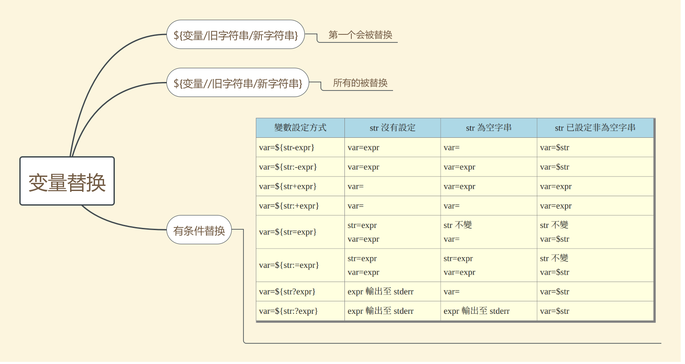
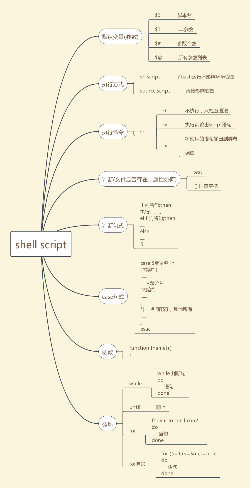

## bash编程

### 一.查看命令信息(type)

### 二.变量

| 变量操作       | 变量定义和增加               | 变量内容删除                                          |
| -------------- | ---------------------------- | ----------------------------------------------------- |
| 显示：echo     | 一个变量(同编程语言)         | ${变量#关键字}： 从头到尾，符合关键字最短的删除       |
| 取消：unset    | 变量数组                     | ${变量##关键字}： 从头到尾，符合关键字最长的删除      |
| 要求输入：read | 例如：PATH=${PATH}:/home/bin | ${变量%/%%关键字}： 从尾到头，符合关键字最短/长的删除 |

变量替换：

### 三.环境变量

| 基础指令                                          | 登录和欢迎信息文件 | 系统配置文件(开机)            |
| ------------------------------------------------- | ------------------ | ----------------------------- |
| declare 直接显示环境变量 -x(化某一变量为全局变量) | /etc/issue         | 系统配置文件：/etc/profile    |
| locale 查看语系                                   | /etc/issue.net     | 个人配置文件：~/.bash_profile |
| ulimit(user limit)用户使用限制                    | /etc/motd(公告)    | 无登录配置文件：~/.bashrc     |
| alias/ualias：别名设置                            |                    | sourch：读取配置              |

### 四.通配符

| *                 | ?            | []             | [ - ]        | [ ^ ]        |
| ----------------- | ------------ | -------------- | ------------ | ------------ |
| 0或无穷个任意字符 | 绝对一个字符 | 集合内任一字符 | 某一范围字符 | 不在某集合内 |

### 五.条件和管道

| 命令回传码           | &&   | \|\| | \|(管道) | -(使用前面的输出)              |
| -------------------- | ---- | ---- | -------- | ------------------------------ |
| 前一条命令的执行结果 | 和   | 或   | 不解释   | tar -cvf - /home \| tar -xvf - |

### 六.信息处理

| 选取                                | 排序           | 统计 | 字符删除和替换 | tab和空格转化 | 行合并                           | 传递参数                              |
| ----------------------------------- | -------------- | ---- | -------------- | ------------- | -------------------------------- | ------------------------------------- |
| cut：每一行进行处理，类似字符串操作 | sort           | wc   | tr             | expand        | join：相同两行合并               | xargs：将输入的信息作为参数给后面命令 |
| grep：查找包含特定字符的行          | uniq(去除重复) |      |                | unexpand      | paste：直接合并两行并中间tab隔开 |                                       |

### 七.正则表达式

| 特殊区间                | 基本正则字符    | 基本正则集合               | 常用工具             | 扩展的正则公式               |
| ----------------------- | --------------- | -------------------------- | -------------------- | ---------------------------- |
| [:alnum:]英文字母和数字 | ^word 行首查找  | [list] 集合                | grep                 | + 重复一个或一个以上前面字符 |
| [:alpha:]英文字母       | word$ 行尾查找  | [n1-n2] 范围集合           | egrep=grep -E        | ? 零个或一个前面字符         |
| [:upper:]               | .  一个任意字符 | [^list] 反向选择           | sed工具              | \| or                        |
| [:lower:]               | \  转义字符     | \\{n,m\\} 指定数量重复字符 | awk 用于将行分段处理 | () 组字符                    |
| [:diger:]               | *  任意多个字符 |                            |                      | ()+ 重复组字符               |

### 八.语法和执行

