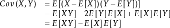

## 概率论

| 随机事件和概率   | 随机变量及分布 | 多维随机变量及分布   | 随机变量的数字特征 | 大数定理和中心极限定理 | 数理统计和假设检验     |
| ---------------- | -------------- | -------------------- | ------------------ | ---------------------- | ---------------------- |
| 事件关系运算     | 常用分布函数   | 分布表               | 期望               | 切比雪夫大数定理       | 一个样本总体的随机抽样 |
| 乘法公式和贝叶斯 | 分布函数F(x)   | 从联合分布到条件分布 | 方差               | 中心极限               | 三大抽样函数           |
| 放回不放回       | 概率密度f(x)   | 二维随机变量函数     | 类比常用分布       |                        | 置信区间(2018卷题8)    |
| 伯努利实验       | 变量函数       |                      | 协方差和相关系数   |                        | 假设检验               |

#### 1.常用分布函数
$$
泊松分布：P\{x=k\}=\frac{\lambda^k}{k!}e^{-\lambda} \qquad  E(x)=D(x)=\lambda\\
指数分布：\begin{equation}
f(x)=\left\{
\begin{aligned}
\lambda e^{-\lambda x}  && x>0 \\
0  && x≤0  \\
\end{aligned}
\right.,(\lambda>0)
\quad
F(x)=\left\{
\begin{aligned}
1-e^{-\lambda x}  && x>0 \\
0  && x≤0  \\
\end{aligned}
\right.
\end{equation},(\lambda>0)\\
E(x)=\frac1{\lambda}  \qquad D(x)=\frac1{\lambda^2} \\
正态分布：f(x)=\frac1{\sqrt{2π}\sigma}e^{-\frac{(x-μ)^2}{2\sigma^2}},-\infty<x<+\infty \qquad E(x)=μ,D(x)=\sigma^2\\
$$

#### 2.协方差和相关系数

#### 3.三大抽样函数(注意图像)
$$
X^2=X_1^2+X_2^2+...X_n^2\\
T=\frac{N(0,1)}{\sqrt{X^2/n}},F=\frac{X/n1}{Y/n2}=F(n1,n2)
$$

#### 4.置信区间

见置信区间表

#### 5.假设检验

#### 6.期望和方差本质题

$$
设随机变量X的分布函数F(x)=0.2F_1(x)+0.8F_1(2x),其中F_1(x)是服从参数为1的指数分布函数,那么D(x)=?\\
E(X)=0.2\int_{-\infty}^{+\infty}xf_1(x)dx+0.8×2(分布函数求导)\int_{-\infty}^{+\infty}xf_2(2x)dx=0.2E(X_1)+0.4E(X_2)=0.6\\
E(x^2)=0.2\int_{-\infty}^{+\infty}x^2f_1(x)dx+0.8×2\int_{-\infty}^{+\infty}x^2f_1(2x)dx=0.2E(X_1^2)+0.2E(X_1^2)=0.8\\
D(X)=E(X^2)-[E(x)]^2=0.44
$$

