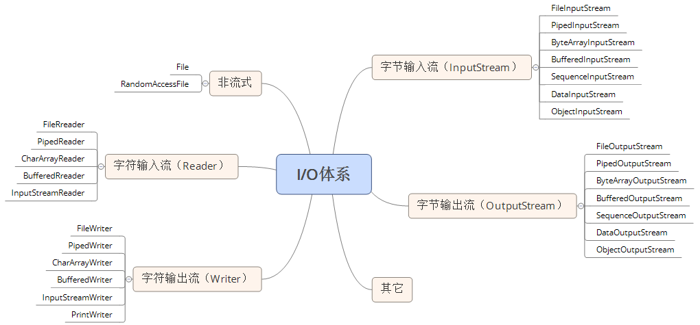

## Java基础总结

### 一.基本程序

```java
//一个文件有且仅有一个public类,并与文件名相同
public class Test {
    //main函数作为运行起点
    public static void main(String[] args){
        //最基本输出函数
        System.out.println("hello");

        //四大基本类型
        int a = 33;
        float b = 33.33f;   //单纯33.33被认为是double,需要后缀f
        double c = 33.33;
        char d = 'h';
        boolean e = true;

        //常量
        final int spring = 33;

        //(不变)字符串,所有操作生成新的字符串
        String f = "33";
        String fCopy = "33";    //利用已存在的字符串地址
        String fNew = new String("33");  //强制生成新的字符串
        //比较地址
        System.out.println(f==fCopy);       //true
        System.out.println(f==fNew);        //false
        //比较内容
        System.out.println(f.equals(fCopy));
        System.out.println(f.equals(fNew));

        //可变字符串,所有操作在原始串上实现
        StringBuffer bf = new StringBuffer("33");   //线程安全
        StringBuilder bd = new StringBuilder("33"); //线程不安全，但是执行快

        //类型转化
        int g = (int)b;
        int h = Integer.parseInt(f);		//类型装箱的概念
    }
}
```

### 二.类

#### 2.1 单纯类

```java
public class Single {
    public static void main(String[] args){
        SingleDog sd = new SingleDog();
        SingleDog.sleep();
    }
}

//final修饰符，表示该类不可继承，方法不可修改
final class SingleDog{
    public SingleDog(){
        System.out.println("Single dog,single dog,why not be a guy?");
    }
    //静态变量和方法被类共享
    public static String name = "Spring";
    public static void sleep(){
        System.out.println(SingleDog.name+" hit the airplane!");
    }
}
```

#### 2.2 继承类

```java
public class Show {
    public static void main(String[] args){
        //构造B时，发现A先被构造
        B testB = new B();
        //使用super调用父类方法
        testB = new B("test");
    }
}

class A{
    public A(){
        System.out.println("classA");
    }
    public A(String in){
        System.out.println(in);
    }
    public void printA(){
        System.out.println("classA");
    }
}

class B extends A{
    public B(){
        System.out.println("classB");
    }

    public B(String in){
        //父类构造函数必须放在第一行
        super(in+"A");
        System.out.println(in+"B");
        super.printA();
    }
}
```

#### 2.3 Object类

```Java
public class ObjectFunction {
    public static void main(String[] args){
        Spring test = new Spring();
        System.out.println(test);
        //获取类信息
        System.out.println("类名:"+test.getClass());
    }
}

class Spring{
    private int age = 21;
    public Spring(){}

    @Override
    public int hashCode() {
        return age;
    }

    @Override
    public boolean equals(Object obj) {
        Spring temp = (Spring)obj;
        if (this.age==temp.age)
            return true;
        else
            return false;
    }

    @Override
    public String toString() {
        return String.valueOf(age);
    }
}
```

#### 2.4 内部类

参考：[java提高篇(八)----详解内部类](https://www.cnblogs.com/chenssy/p/3388487.html)  

**接口只是解决了部分问题，而内部类使得多重继承的解决方案变得更加完整**

##### 2.4.1 成员内部类

*不能有任何static类和方法，只有静态内部类才能定义。静态内部类与静态类大致相同，但是能用外部类数据*

```java
public class InnerTest {
    public static void main(String[] args){
        Outer outer = new Outer();
        Outer.Inter inter = outer.new Inter();
        //内部类访问外部类数据
        inter.show();
    }
}

class Outer{
    public Outer(){}

    private int value = 11;
    public int getValue() {
        return value;
    }

    class Inter{
        public Inter(){}
        public void show(){
            System.out.println(getValue());
        }
    }
}
```

##### 2.4.2 局部内部类

*定义在方法内或作用域*

```java
public class Parcel5 {
    public Destionation destionation(String str){
        //局部内部类
        class PDestionation implements Destionation{
            private String label;
            private PDestionation(String whereTo){
                label = whereTo;
            }
            public String readLabel(){
                return label;
            }
        }
        //结束定义
        return new PDestionation(str);
    }
    
    public static void main(String[] args) {
        Parcel5 parcel5 = new Parcel5();
        Destionation d = parcel5.destionation("chenssy");
    }
}
```

##### 2.4.3 匿名内部类

*用于实现接口*

```java
button.addActionListener(  
                new ActionListener(){  
                    public void actionPerformed(ActionEvent e) {  
                        System.out.println("你按了按钮");  
                    }  
                });
```

### 三.接口(public + abstract)

#### 3.1 函数接口的实现(lambda)

###### 要求：

函数式接口，接口里**抽象方法只能有一个**。

###### 匿名类：

```java
new Thread(new Runnable() {
    @Override
    public void run() {
    System.out.println("Before Java8, too much code for too little to do");
    }
}).start();
```

###### 使用lambda:

```java
new Thread( () -> System.out.println("In Java8, Lambda expression rocks !!") ).start();
```

### 四.类高级应用

#### 4.1 枚举

##### 4.1.1 本质

```java
class MyEnum {
    public static final int 变量名 = 0；
    public static final int 变量名 = 1;
    ......
    初始化所有对象,并加入列表
}
```

##### 4.2.1 使用枚举组织接口

```java
public interface Food {  
    enum Coffee implements Food{  
        BLACK_COFFEE,DECAF_COFFEE,LATTE,CAPPUCCINO  
    }  
    enum Dessert implements Food{  
        FRUIT, CAKE, GELATO  
    }  
}  
```

#### 4.2 反射

*参考： [Java基础之—反射（非常重要）](https://blog.csdn.net/sinat_38259539/article/details/71799078)*

前提：拥有字节码(.class)

定义：在运行过程中获取和使用类，例如构造出一个类、提取类成员变量、运行成员函数。

*Java中实现反射的类：*

```java
java.lang.Class;                
java.lang.reflect.Constructor;  
java.lang.reflect.Field;        
java.lang.reflect.Method;
java.lang.reflect.Modifier;
```

##### 4.2.1 获取class对象

```java
①Object.getClass()  
②对象.class //属性
③class.forName()
```

##### 4.2.2 构造方法

```java
// 获取批量的方法：
public Constructor[] getConstructors()
所有"公有的"构造方法
public Constructor[] getDeclaredConstructors()
获取所有的构造方法(包括私有、受保护、默认、公有)

//获取单个的方法：
public Constructor getConstructor(Class... parameterTypes
获取单个的"公有的"构造方法：
public Constructor getDeclaredConstructor(Class... parameterTypes)
获取"某个构造方法"可以是私有的，或受保护、默认、公有

//调用构造方法：
Constructor-->newInstance(Object... initargs)
```

##### 4.2.3 获取类成员变量

```java
// 批量的
Field[] getFields()
获取所有的"公有字段"
Field[] getDeclaredFields()
获取所有字段，包括：私有、受保护、默认、公有；

// 获取单个的：
public Field getField(String fieldName)
获取某个"公有的"字段；
public Field getDeclaredField(String fieldName)
获取某个字段(可以是私有的)

// 设置字段的值：
Field --> public void set(Object obj,Object value):
// 参数说明：
// 1.obj:要设置的字段所在的对象；
// 2.value:要为字段设置的值；
// 3.本身是要修改的成员变量
```

##### 4.2.4 成员方法

```java
// 批量的：
public Method[] getMethods()
获取所有"公有方法"；（包含了父类的方法也包含Object类）
public Method[] getDeclaredMethods()
获取所有的成员方法，包括私有的(不包括继承的)
// 获取单个的：
public Method getMethod(String name,Class<?>... parameterTypes)
// 参数：
// name : 方法名；
// Class ... : 形参的Class类型对象

public Method getDeclaredMethod(String name,Class<?>... parameterTypes)

// 调用方法：
Method --> public Object invoke(Object obj,Object... args)
// 参数说明：
// obj : 要调用方法的对象；
// args:调用方式时所传递的实参；
```

#### 4.3 代理类

 *参考： [代理模式及JDK动态代理(InvocationHandler)的简单实现与分析](https://blog.csdn.net/hello2mao/article/details/52346205)*

结构图：


原理：Interface InvocationHandler (阻碍器)

该接口中仅定义了一个方法：  
public Object invoke(Object obj, Method method, Object[] args)，在使用时，第一个参数obj一般是指代理类，method是被代理的方法，args为该方法的参数数组。这个抽象方法在代理类中动态实现。

Proxy  
该类即为动态代理类  
static Object newProxyInstance(ClassLoader loader, Class[] interfaces, InvocationHandler h)，返回代理类的一个实例，返回后的代理类可以当作被代理类使用。

#### 4.4 日志(输出控制)

*参考：[Java日志 (zhuan)](https://www.cnblogs.com/zhao1949/p/5952385.html)*

##### 4.4.1 最简单的等级控制

```java
public class Test {
    public static void main(String[] args) {
        // 获取对象
        Logger logger = Logger.getLogger("logger");
        // 发送消息
        logger.info("hello world");
        // 设置日志输出等级
        logger.setLevel(Level.INFO);
        // 测试两个等级
        logger.log(Level.WARNING, "hello world1");
        logger.log(Level.FINE,"hello world2");
        // 再次发送消息
        logger.info("hello world3");
    }
}
```

##### 4.4.2 输出对象控制

**Handle**

```java
Handler handler = new Handler() {
    @Override
    public void publish(LogRecord record) {
    }
    @Override
    public void flush() {
    }
    @Override
    public void close() throws SecurityException {
    }
}
```

##### 4.4.3 控制输出格式

**setFormatter**

```java
handler.setFormatter(new Formatter() {
    @Override
    public String format(LogRecord record) {
        return null;
    }
});
```

### 五.IO管理

#### 5.1 结构图



#### 5.2 分类说明

| File类                       | RandomAccessFile | PrintStream                                       | 缓冲读与Scanner                           | 序列化                  |
| ---------------------------- | ---------------- | ------------------------------------------------- | ----------------------------------------- | ----------------------- |
| 提供文件相关信息，文件名属性 | 随机访问文件位置 | 包含System.in、System.out、System.err             | Scanner不需要显式的处理错误，而缓冲流需要 | implements Serializable |
| 查询操作、目录操作           |                  | *重定向*:①新建一个对象 ②setIn、setOut、setErr函数 | **不是继承关系**                          | 不需要实现函数          |

#### 5.4 文件类

| 复制、移动和删除            | 获取文件信息              | 文件加锁机制         |
| --------------------------- | ------------------------- | -------------------- |
| Files.copy(fromPath,toPath) | exists                    | FileLock lock()      |
| Files.move(fromPath,toPath) | isHidden                  | FileLock tryLock()   |
| Files.delete(path)          | isReadable、isWritable... | void close()：释放锁 |

**迭代目录中的文件：**

```java
try(DirectoryStream<Path> entries = Files.newDirectoryStream(dir)){
    for(Path entry:entries)
        Process entries
}
```

### 六.异常处理

#### 6.1 异常的分类


#### 6.2 异常的操作

| 异常处理     | 自定义异常类            | 主动抛出异常                         | finaly语句   |
| ------------ | ----------------------- | ------------------------------------ | ------------ |
| catch语句    | 继承于Exception类       | 本函数不处理异常，抛出异常给外层函数 | 覆盖返回语句 |
| 依次匹配处理 | 实现方法：getMessage(); | 直接抛出异常：throw 对象             |              |

### 七.集合

#### 7.1 类结构图


#### 7.2 集合工具类

**Collection**

| 方法     | 描述           |
| -------- | -------------- |
| copy     | 列表间复制     |
| max、mix | 最大、最小元素 |
| sort     | 排序           |

**Arrays**

| 方法         | 描述         |
| ------------ | ------------ |
| binarySearch | 二分查找     |
| copyOf       | 复制         |
| copyOfRange  | 指定范围复制 |
| sort         | 排序         |
| asList       | 参数转列表   |

#### 7.3 视图

定义：具有限制的集合对象

```java
Test[] tests = new Test[10];
List<Test> testList = Arrays.asList(tests);
```

具有访问数组元素set，get的方法。但是如果调用**改变数组的方法就会抛出异常**。所以可以说视图对象可以说是具有限制的集合对象。

### 八.泛型

参考： [Java 泛型，你了解类型擦除吗？](https://blog.csdn.net/briblue/article/details/76736356)

#### 8.1 泛型类

```java
public class MultiType <E,T>{
    E value1;
    T value2;

    public E getValue1(){
        return value1;
    }

    public T getValue2(){
        return value2;
    }
}

MultiType<int,String> hmc = new MultiType<>();
```

#### 8.2 泛型方法

```java
public class Test1<T>{

    public  void testMethod(T t){
        System.out.println(t.getClass().getName());
    }
    public  <E> E testMethod1(E e){
        return e;
    }
}

// 测试方法
Test1<String> t = new Test1();
t.testMethod("generic");
Integer i = t.testMethod1(new Integer(1));
```

#### 8.3 泛型接口

##### 同“类”

```java
public interface Iterable<T> {
}
```

####  8.4 通配符

##### 8.4.1 <?>无限定通配符

/images/6_1.png)
只能调用 Collection 中与**类型无关**的方法

###### <?> 提供了**只读**的功能，也就是它删减了增加具体类型元素的能力，只保留与**具体类型无关**的功能。它不管装载在这个容器内的元素是什么类型，它只关心元素的数量、容器是否为空

##### 8.4.2 <? extends T>有上限的通配符

```java
public void testSub(Collection<? extends Base> para){
}

// 以下不通过
para.add(new Sub());
para.add(new Base());
```

① 接受Base和其子类  
② 依旧**只读**  
③ 明确了范围

##### 8.4.3 <? super T>有下限的通配符

```java
public void testSuper(Collection<? super Sub> para){
}
1
2
// <? super T> 神奇的地方在于，它拥有一定程度的写操作的能力。

public void testSuper(Collection<? super Sub> para){
    para.add(new Sub());//编译通过
    para.add(new Base());//编译不通过
}
```

#### 8.5 类型擦除

定义：**泛型信息只存在于代码编译阶段**，在进入 JVM 之前，与泛型相关的信息会被擦除掉，专业术语叫做类型擦除

① 一般情况下，泛型在jvm中被转换为Object。  
② 在使用<? extends xxx>的情况下，转换成xxx。

#### 8.6 与反射结合

**无法通过编译的操作**


显然list被指定为int,无法添加字符串。

**但是，通过类型擦除，能在运行阶段添加到Object中。**

```java
public class ToolTest {


    public static void main(String[] args) {
        List<Integer> ls = new ArrayList<>();
        ls.add(23);
//      ls.add("text");
        try {
            Method method = ls.getClass().getDeclaredMethod("add",Object.class);

            // 通过反射，强行添加
            method.invoke(ls,"test");
            method.invoke(ls,42.9f);
        } catch Exception e{
        }
    }
}
```

### 九.线程

*参考：[Java多线程学习（吐血超详细总结）](https://blog.csdn.net/gf771115/article/details/51682561)*

| 实现         | 同步                                 | 阻塞队列      | 线程安全集合             |
| ------------ | ------------------------------------ | ------------- | ------------------------ |
| 继承Thread   | 锁：Rentrantluh类+synchronized关键字 | BlockingQueue | 包：java.util.concurrent |
| Runnable接口 | 监视器                               |               |                          |
|              | volatliet域                          |               |                          |

### 十.XML

#### 10.1 解析器(解析、查询、修改、创建、生成)

| DOM解析器          | SAX解析器    | JDOM                | StAX                   | XPath          |
| ------------------ | ------------ | ------------------- | ---------------------- | -------------- |
| 同JavaScript的方式 | 一种流解析器 | 基于Java库,利用列表 | 同SAX,但是采用pull模式 | 利用路径名操作 |

#### 10.2 XML验证(编译原理)

①编写DTD文件：类似编译原理文件

②将DTD文件添加到XML

<!DOCTYPE configuartion SYSTEM “地址、链接”>

#### 10.3 命名空间

需要通过工厂函数来启用命名空间

#### 10.4 XSL

通过设定的规则将XML转化为其他格式文件(文本、HTML等)

### 十一.网络

#### 11.1 Socket客户端

```java
import java.net.*;
import java.io.*;
public class GreetingClient{
	public static void main(String [] args){
		String serverName = args[0];
		int port = Integer.parseInt(args[1]);
		try{
			System.out.println("连接到主机：" + serverName + " ，端口号：" + port);
			Socket client = new Socket(serverName, port);
			System.out.println("远程主机地址：" + client.getRemoteSocketAddress());
			OutputStream outToServer = client.getOutputStream();
			DataOutputStream out = new DataOutputStream(outToServer);
			out.writeUTF("Hello from " + client.getLocalSocketAddress());
			InputStream inFromServer = client.getInputStream();
			DataInputStream in = new DataInputStream(inFromServer);
			System.out.println("服务器响应： " + in.readUTF());
			client.close();
		}
        catch(IOException e){
				e.printStackTrace();
        }
	}
}
```

#### 11.2 Socket服务器

```java
import java.net.*;
import java.io.*;
public class GreetingServer extends Thread {
    private ServerSocket serverSocket;
    public GreetingServer(int port) throws IOException {
        serverSocket = new ServerSocket(port);
        serverSocket.setSoTimeout(10000);
    }
    public void run() {
        while(true) {
            try {
                System.out.println("等待远程连接，端口号为：" + serverSocket.getLocalPort() + "...");
                Socket server = serverSocket.accept();
                System.out.println("远程主机地址：" + server.getRemoteSocketAddress());
                DataInputStream in = new DataInputStream(server.getInputStream());
                System.out.println(in.readUTF());
                DataOutputStream out = new DataOutputStream(server.getOutputStream());
                out.writeUTF("谢谢连接我：" + server.getLocalSocketAddress() + "\nGoodbye!");
                server.close();
            }catch(SocketTimeoutException s) {
                System.out.println("Socket timed out!");
                break;
            }catch(IOException e) {
                e.printStackTrace();
                break;
            }
        }
    }
    public static void main(String [] args) {
        int port = Integer.parseInt(args[0]);
        try {
            Thread t = new GreetingServer(port);
            t.run();
        }catch(IOException e) {
            e.printStackTrace();
        }
    }
}
```

#### 11.3 连接特征

| 多连接               | 半关闭                                  | 获取Web资源                  |
| -------------------- | --------------------------------------- | ---------------------------- |
| 多线程技术vo         | void shutdownOutput()                   | URL类：web信息               |
| 原始线程一直接收请求 | void shuwdownInput()                    | URLConnection类,获取网页资源 |
| 不断新建线程处理请求 | boolean isOutputShutdown() //另有对应的 |                              |

*URL类例子*

```java
import java.net.*;
import java.io.*;
public class URLDemo{
	public static void main(String [] args){
		try{
			URL url = new URL("http://www.runoob.com/index.html?language=cn#j2se");
			System.out.println("URL 为：" + url.toString());
            System.out.println("协议为：" + url.getProtocol());
            System.out.println("验证信息：" + url.getAuthority());
            System.out.println("文件名及请求参数：" + url.getFile());
            System.out.println("主机名：" + url.getHost());
            System.out.println("路径：" + url.getPath());
            System.out.println("端口：" + url.getPort());
            System.out.println("默认端口：" + url.getDefaultPort());
            System.out.println("请求参数：" + url.getQuery());
            System.out.println("定位位置：" + url.getRef());
		}catch(IOException e){
                e.printStackTrace();
			}
		}
	}
```

#### 11.4 发送表单和发送E-Mail

*[发送表单](https://www.cnblogs.com/bobc/p/8809761.html)*

*[发送邮件](http://www.runoob.com/java/java-sending-email.html)*

### 十二.数据库编程

#### 12.1 一个简单应用

```java
import java.sql.*;
 
public class MySQLDemo {
 
    // JDBC 驱动名及数据库 URL
    static final String JDBC_DRIVER = "com.mysql.jdbc.Driver";  
    static final String DB_URL = "jdbc:mysql://localhost:3306/RUNOOB";
 
    // 数据库的用户名与密码，需要根据自己的设置
    static final String USER = "root";
    static final String PASS = "123456";
 
    public static void main(String[] args) {
        Connection conn = null;
        Statement stmt = null;
        try{
            // 注册 JDBC 驱动
            Class.forName("com.mysql.jdbc.Driver");
        
            // 打开链接
            System.out.println("连接数据库...");
            conn = DriverManager.getConnection(DB_URL,USER,PASS);
        
            // 执行查询
            System.out.println(" 实例化Statement对象...");
            stmt = conn.createStatement();
            String sql;
            sql = "SELECT id, name, url FROM websites";
            ResultSet rs = stmt.executeQuery(sql);
        
            // 展开结果集数据库
            while(rs.next()){
                // 通过字段检索
                int id  = rs.getInt("id");
                String name = rs.getString("name");
                String url = rs.getString("url");
    
                // 输出数据
                System.out.print("ID: " + id);
                System.out.print(", 站点名称: " + name);
                System.out.print(", 站点 URL: " + url);
                System.out.print("\n");
            }
            // 完成后关闭
            rs.close();
            stmt.close();
            conn.close();
        }catch(SQLException se){
            // 处理 JDBC 错误
            se.printStackTrace();
        }catch(Exception e){
            // 处理 Class.forName 错误
            e.printStackTrace();
        }finally{
            // 关闭资源
            try{
                if(stmt!=null) stmt.close();
            }catch(SQLException se2){
            }// 什么都不做
            try{
                if(conn!=null) conn.close();
            }catch(SQLException se){
                se.printStackTrace();
            }
        }
        System.out.println("Goodbye!");
    }
}
```

#### 12.2 JDBC特性

| 预备语句(语句拼接)                                           | 读写大对象                                   | 转义功能                        |
| ------------------------------------------------------------ | -------------------------------------------- | ------------------------------- |
| String sql=“...”,中间变量以？号表示                          | 二进制大对象：BLOB、字符型：CLOB             | 时间日期：d/t/ts                |
| PreparedStatement stat = conn.prepareStatement(sql);         | 获取：getBlob/Clob                           | 标量函数：{fn user()}           |
| stat.setString(1,publisher) //1表示第几个位置,publisher为变量 | 生成新对象再写入：connection.createBlob/Clob | like子句中‘\_’需要使用‘!\_’转义 |

#### 12.3 结果集

| 多结果集                                  | 可滚动和可更新                                              |
| ----------------------------------------- | ----------------------------------------------------------- |
| 使用stat.execute(command)查询             | Statement stat = conn.createStatement(type,concurrency)     |
| getResultSet(),获取第一个结果集           | TYPE值：TYPE_SCROLL_INSENSITIVE(可滚动不敏感)、去掉IN即敏感 |
| 重复调用getMoreResults(),isResult判断条件 | Concurrentcy值：CONCUR_UPDATABLE,结果集用于更新数据库       |

#### 12.4 行集和元数据(数据库结构)

##### 12.4.1 行集

| 行集分类                                    | 新建和填充crs                                                | crs操作                              |
| ------------------------------------------- | ------------------------------------------------------------ | ------------------------------------ |
| CachedRowset：缓存行集                      | 新建：RowSetFactory factory = RowSetProvider.newFactory();CachedRowSet crs = factory.createCachedRowSet(); | 设置大小：crs.setPageSize(int);      |
| WebRowset：可以移动到Web应用的其它层中      | 从结果集填充：crs.populate(result);                          | 下一页：crs.nextPage()               |
| JdbcRowset：一个瘦包装器,能将结果转化为bean | 自动查询：crs.set数据库信息和查询语句,crs.execute()查询      | 写回数据库：crs.acceptChanges(conn); |

##### 12.4.2 元数据

| 数据库结构                            | 结果集结构                                      |
| ------------------------------------- | ----------------------------------------------- |
| ResultSet getTables()：获取所有表信息 | ResultSetMetaDate getMetaDate()：获取结果集信息 |

#### 12.5 事务

将一组语句组成一个事物，便于保护数据完整性

##### 12.5.1 简单事务

```java
conn.setAutoCommit(false);		//取消一句一提交
Statement stat = conn.createStatement();
stat.executeUpdate(command1);
...
stat.executeUpdate(commandn);
conn.commit();		
conn.rollback();		//出现错误则自动撤销
```

##### 12.5.2 保存点(不撤销到事务开头)

```java
Savepoint svpt = conn.setSavepoint();	//新建中断点
conn.releaseSavepoint(svpt);			//释放中断点
```

##### 12.5.3 批量更新

```java
Statment stat = conn.createStatement();
String command = "xxx";
stat.addBatch(command);					//添加命令
int[] counts = stat.executeBatch();　	//批量提交
```

### 十三.本地化

#### 13.1 语系管理

```java
//构造一个系统默认的Locale
Locale defaultLocale = Locale.getDefault();

//获取当前Java虚拟机线程默认的国家和语言信息
String country = defaultLocale.getCountry();//返回国家地区代码
String language = defaultLocale.getLanguage();//返回国家的语言
String displayCountry = defaultLocale.getDisplayCountry();//返回适合向用户显示的国家信息
String displayLanaguage = defaultLocale.getDisplayLanaguage();//返回适合向用户展示的语言信息
String displayName = defaultLocale.getDisplayName();//返回适合向用户展示的语言环境名

//根据国家地区和语言构造一个Locale（语言环境）
Locale currentLocale = new Locale(“zh”, ”CN”);
```

#### 13.2 数字格式

```java
Locale loc = new Locale("de","DE");
NumberFormat currFmt = NumberFormat.getCurrencyInstance(loc);
double amt = 123456.78;
String result = currFmt.format(amt);
```

#### 13.3 日期和时间

```java
 3 import java.text.DateFormat;
 4 import java.text.ParseException;
 5 import java.text.SimpleDateFormat;
 6 import java.util.Date;
 7 import java.util.Locale;
 8 
 9 public class TestSimpleDateFormat {
10     public static void main(String args[]) throws ParseException {
11         TestSimpleDateFormat test = new TestSimpleDateFormat();
12         test.testDateFormat();
13 
14     } 
15     
16     public void testDateFormat() throws ParseException {
17         //创建日期
18         Date date = new Date();
19         //创建不同的日期格式
20         DateFormat df1 = DateFormat.getInstance();
21         DateFormat df2 = new SimpleDateFormat("yyyy-MM-dd hh:mm:ss EE");
22         DateFormat df3 = DateFormat.getDateInstance(DateFormat.FULL, Locale.CHINA);     //产生一个指定国家指定长度的日期格式，长度不同，显示的日期完整性也不同
23         DateFormat df4 = new SimpleDateFormat("yyyy年MM月dd日 hh时mm分ss秒 EE", Locale.CHINA);
24         DateFormat df5 = new SimpleDateFormat("yyyy-MM-dd hh:mm:ss EEEEEE", Locale.US);
25         DateFormat df6 = new SimpleDateFormat("yyyy-MM-dd");
26         DateFormat df7 = new SimpleDateFormat("yyyy年MM月dd日");
27 
28         //将日期按照不同格式进行输出
29         System.out.println("-------将日期按照不同格式进行输出------");
30         System.out.println("按照Java默认的日期格式，默认的区域                      : " + df1.format(date));
31         System.out.println("按照指定格式 yyyy-MM-dd hh:mm:ss EE ，系统默认区域      :" + df2.format(date));
32         System.out.println("按照日期的FULL模式，区域设置为中文                      : " + df3.format(date));
33         System.out.println("按照指定格式 yyyy年MM月dd日 hh时mm分ss秒 EE ，区域为中文 : " + df4.format(date));
34         System.out.println("按照指定格式 yyyy-MM-dd hh:mm:ss EE ，区域为美国        : " + df5.format(date));
35         System.out.println("按照指定格式 yyyy-MM-dd ，系统默认区域                  : " + df6.format(date));
36 
37         //将符合该格式的字符串转换为日期，若格式不相配，则会出错
38         Date date1 = df1.parse("07-11-30 下午2:32");
39         Date date2 = df2.parse("2007-11-30 02:51:07 星期五");
40         Date date3 = df3.parse("2007年11月30日 星期五");
41         Date date4 = df4.parse("2007年11月30日 02时51分18秒 星期五");
42         Date date5 = df5.parse("2007-11-30 02:51:18 Friday");
43         Date date6 = df6.parse("2007-11-30");
44 
45         System.out.println("-------输出将字符串转换为日期的结果------");
46         System.out.println(date1);
47         System.out.println(date2);
48         System.out.println(date3);
49         System.out.println(date4);
50         System.out.println(date5);
51         System.out.println(date6);
52     } 
53 }
```

#### 13.4 消息格式化

```java
//1.23->1.2
double num = 1.23;
String str = MessageFormat.format("{0,number,#.#}", num);

//两个单引号才表示一个单引号，仅写一个单引号将被忽略。
//单引号会使其后面的占位符均失效，导致直接输出占位符。
MessageFormat.format("{0}{1}", 1, 2); // 结果12
MessageFormat.format("'{0}{1}", 1, 2); // 结果{0}{1}
MessageFormat.format("'{0}'{1}", 1, 2); // 结果{0}
```

#### 13.5 资源包

```java
ResourceBundle currentResources = ResourceBundle.getBundle(bundleName,currentLocale);
```

属性文件(MyProgramStrings.properties)：

computeButton=Rechnen

```java
ResourceBundle bundle = ResourceBundle.getBundle("MyProgramStrings",locale);
String computeButtonLabel = bundle.getString("computeButton");
```

### 十四.java虚拟机原理


##### 栈和堆的对比

1. 栈解决程序的运行问题，即程序如何运行。
2. 堆解决的是数据存储问题，即数据怎么放。
3. 堆中存的是对象的成员变量值，**栈中存的是基本数据类型和堆中对象的引用。**