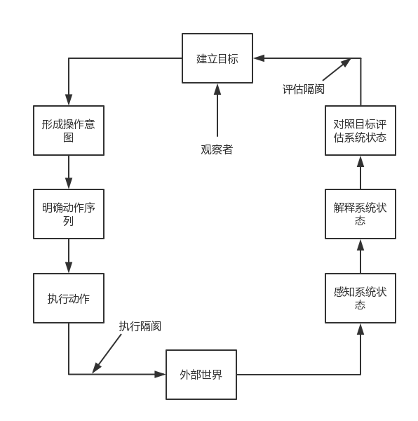

##  

##基础知识

#### 交互框架

**执行/评估活动周期EEC**

执行隔阂：用户为达目标而制定的动作与系统允许动作之间的差别。

评估隔阂：系统状态的实际表现与用户预期之间的差别。

**扩展EEC框架**

#### 交互形式

1. 命令行
2. 菜单
3. 表格
4. 直接操纵
5. 问答界面
6. 隐喻界面
7. 自然语言交互

#### 心理学原则

1. 相近性原则
2. 相似性原则
3. 连续性原则
4. 完整性和闭合性原则
5. 对称性原则