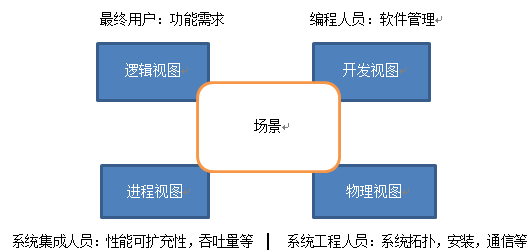

## 软件体系结构建模

#### 1.4+1模型

4+1的含义:
从5个不同视角，来描述软件体系结构。
P31

#### 视图含义

**逻辑视图**

主要支持系统的功能需求，即系统提供给最终用户的服务。在逻辑视图中，系统分解成一系列的功能抽象，这些抽象主要来自问题领域。

在面向对象开发中，使用类图用作逻辑视图。

**开发视图**

也称模块视图，主要侧重于软件模块的组织和管理。软件可通过程序库或子系统进行组织，这样，对于一个软件系统，就可以由不同的人进行开发。

通过系统输入输出关系的模型图和子系统图来描述。

**进程视图**

进程视图侧重于系统的运行特性，主要关注一些非功能性的需求，例如系统的性能和可用性。

使用ACS系统中的进程视图。

**物理视图**

物理视图主要考虑如何把软件映射到硬件上，它通常要考虑系统性能、规模、可靠性等。

主要由构件(硬件)和连接件(通信)组成。

**场景**

场景可以看作是那些重要系统活动的抽象，它使四个视图有机联系起来。

也就是构建剧本流程，串联起四个视图。