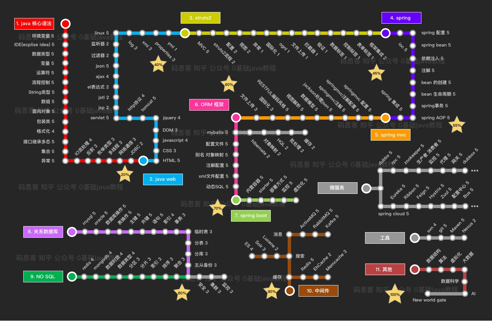

## 笔记整合

### 一.计算机原理

1. 数据结构

   - [x] 《数据结构》(严蔚敏)

   - [x] 《 数据结构与算法分析—C语言描述》

2. 数据库

   - [x] 《数据库系统概论》(第五版)

3. 机组

   - [x] 《计算机组成原理》(唐朔飞)

4. 汇编语言

   - [x] 《汇编语言》(王爽)

5. 操作系统
   - [x] 《计算机操作系统》(西安电子科技大学出版社)
   - [ ] 《深入理解计算机系统》

6. 网络原理
   - [x] 《计算机网络》(第6版)
   - [ ] 《计算机网络自顶向下方法》

7. 设计模式
   - [x] 《设计模式—可复用面向对象软件的基础》

8. 简单算法
   - [x] 《算法图解》

9. 软件工程
   - [ ] 《软件工程导论》(第6版)

10. 软件测试

### 二.学校知识

1. 人机交互
2. 软件体系结构

### 三.嵌入式linux

1. git应用
   - [x] 《GitHub入门与实践》
2. 基础操作
   - [x] 《鸟哥的linux私房菜(基础)》
3. C系列原理编程
   - [x] 《谭浩强C语言》
   - [ ] 《C++ Primer》
   - [ ] 《一站式学C编程》
4. 系统编程
5. 内核学习
6. 驱动编程
7. 嵌入式编程

### 四.移动平台(java)

1. java基础
   - [x] 《Java核心技术卷一》
   - [ ] 《Java核心技术卷二》
2. 安卓基本
   - [ ] 《第一行代码 Android》
   - [ ] 《Android开发艺术》
3. web基础
   - [ ] 《JavaScript高级程序设计》
4. java高级
5. javaweb
6. java框架
7. java部署

### 五.数理基础

1. MATLAB
2. 离散数学
   - [ ] 《离散数学》(方世昌)
   - [ ] 《离散数学及其应用》
3. 高等数学
   - [ ] 《数学桥》
4. 概率论
   - [ ] 《概率论与数理统计》
5. 线性代数
   - [x] 《线性代数图解》
6. 数学漫谈
   - [x] 《数学之美》

### 六.大数据

1. DOCKER

### 七.机器学习

1. 机器学习原理
   - [ ] 《深度学习》
2. python基础
   - [ ] 《HeadFirst Python》
3. tensor框架
   - [ ] 《实战Google深度学习框架》