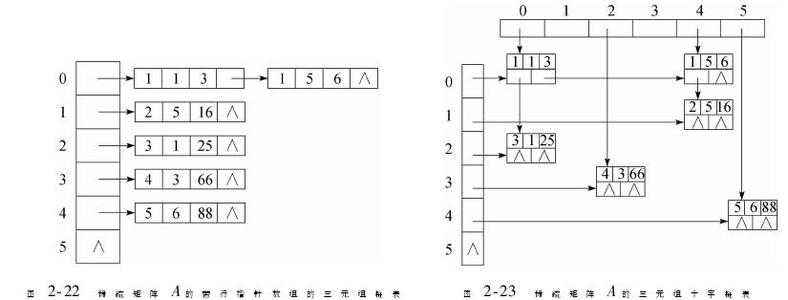

## 严蔚敏总结

### 一.线性表

#### 数组形式

```c
#define LIST_INIT_SIZE 100
#define LISTINCREMENT 10
typedef struct {
    ElemType *elem;
    int length;
    int listsize;
}SqList;

int InitList_Sq(SqList &L){
    L.elem = (ElemType *) malloc(LIST_INIT_SIZE * sizeof(ElemType));
    //初始化length和listsize;
    return 1;
}
```

#### 链表形式

```c
typedef struct LNode{
    ElemType data;
    struct LNode *next;
}LNode,*LinkList;
```

### 二.栈和队列

#### 1.顺序栈

```c
//定义
typedef struct{
    int data[maxSize];
    int top;
}SqStack;
//栈的状态
//若top=-1为空，那么top=maxSize-1为栈满。若top=0,类比。

//链栈定义
typedef struct LNode{
    int data;
    struct LNode *next;
}LNode;
```

#### 2.栈的应用

①数制转换	②括号匹配	③行编辑程序		④迷宫求解	⑤表达式求值

#### 3.循环队列

```c
typedef struct{
    int data[maxSize];
    int front;
    int rear;
}SqQueue;

//队列状态：空(qu.rear==qu.front)，满(qu.rear+1)%maxSize==qu.front。
//显然队列在满状态时，必须空一个位置。
```

### 三.串

#### 串定义

```c
typedef struct{
    char str[maxSize+1];	//最后一个位置是'\0'
    int length;
}Str;
```

#### KMP算法

思想：利用已经部分匹配这个有效信息，保持i指针不回溯，通过修改j指针，让模式串尽量地移动到有效的位置

算法：[关键在于next[n+1]](https://www.cnblogs.com/yjiyjige/p/3263858.html)

```c
public static int[] getNext(String ps) {
    char[] p = ps.toCharArray();
    int[] next = new int[p.length];
    next[0] = -1;
    int j = 0;
    int k = -1;
    while (j < p.length - 1) {
       if (k == -1 || p[j] == p[k]) {
           next[++j] = ++k;
       } else {
           k = next[k];
       }
    }
    return next;
}
```

### 四.数组和广义表



### 五.树

#### 5.1 定义

```c
typedef struct BTNode{
    char data;
    struct BTNode *lchild;
    struct BTNode *rchild;
}BTNode;
```

#### 5.2 遍历算法

```c
//先序遍历
void preOrder(BTNode *p){
    if(p!=null){
        visit(p);
        preOrder(p->lchild);
        preOrder(p->rchild);
    }
}

//中序，基本相同
//后序，基本相同

//层次遍历
//利用循环列表，不断将结点加入，然后访问
void level(BTNode *p){
    int front,rear;
    BTNode *que[maxSize];
    front = rear;
    
    BTNode *q;
    if(p!=null){
        //根结点入队
        rear=(rear+1)%maxSize;
        que[rear]=p;
        //当队不空时
        while(front!=near){
            front=(front+1)%maxSize;
            q=que[front];
            visit(q);
            //加入左孩子
            if(q->lchild!=null){
                rear=(rear+1)%maxSize;
                que[rear]=q->lchild;
            }
            //同理，对于右孩子进行处理
        }
    }
}
```

#### 5.3 树的深度算法

```c
int getDepth(BTNode *p){
    int LD,RD;
    if(p==null)
        return 0;
    else{
        LD = getDepth(p->lchild);
        RD = getDepth(p->rchild);
        return (LD>RD?LD:RD)+1;
    }
}
```

#### 5.4 线索二叉树

```c
// 定义
typedef struct TBTNode{
    char data;
    int ltag,rtag;
    struct TBTNode *lchild;
    struct TBTNode *rchild;
}TBTNode;

//中序方式的线索二叉树
void InThread(TBTNode *p,TBTNode *&pre){
    if(p!=null){
        InThread(p->lchild,pre);
        //建立当前结点的前驱线索
        if(p->lchild==null){
            p->lchild=pre;
            p->ltag=1;
        }
        //建立前驱结点和后驱结点
        if(pre!=null && pre->rchild==null){
            pre->rchild=p;
            pre->rtag=1;
        }
        //继续遍历
        pre=p;
        InThread(p->rchild,pre);
    }
}
```

### 六.图

#### 6.1 图的邻接表

```c
//边结构
typedef struct ArcNode{
    int adjvex;		//该边指向的的结点位置
    struct ArcNode *nextarc;		//下一条边的指针
    int info;		//可能的权值
}ArcNode;

//顶点信息
typedef struct VNode{
    char data;
    ArcNode *firstarc;		//该顶点第一条边
}VNode;

//图定义
typedef struct{
    VNode adjlist[maxSize];		//邻接表
    int n,e;
}AGraph;
```

#### 6.2 图的遍历

##### 6.2.1 深度优先遍历

类似二叉树的先序遍历

```c
void DFS(AGraph *G,int v){  	//v是起点编号
    ArcNode *p;
    visit[v]=1;		//设置访问标记
    visit(v);
    p=G->adjlist[v].firstarc;	//该顶点的第一条边
    while(p!=null){
        //如果边的终点没有被访问
        if(visit[p->adjvex]==0)
            DFS(G,p->adjvex);
        p=p->nextarc;
    }
}
```

##### 6.2.2广度优先

类似层次遍历算法

```c
void BFS(AGraph *G,int v,int visit[maxSize]){
    //初始化v[n]为0
    ArcNode *p;
    int que[maxSize],front=0,rear=0;
    int j;
    Visit(v);
    visit[v]=1;
    rear=(rear+1)%maxSize;		//v进队
    while(front!=rear){
        front=(front+1)%maxSize;		//顶点出队
        j=que[front];
        p=G->adjlist[j].firstarc;		//取得边
        while(p!){
            if(visit[p->adjvex]==0){
                Visit(p->adjvex);
                visit[p->adjvex]=1;
                rear=(rear+1)%maxSize;		//进队
                que[rear]=p->adjvex;
            }
            p=p->nextarc;		//循环下一条边
        }
    }
}
```

##### 6.2.3非连通图遍历

通过循环每个顶点来实现遍历。

```c
void dfs/bfs(AGraph *g,int visit[]){
    int i;
    for(i=1;i<=g->n;++i){
        if(visit[i]==0)
            DFS/BFS(g,i);
    }
}
```

#### 6.3 图的最小生成树

(针对点)普里姆算法n^2：任取一点，不断找已选择点集最小权值边且终点为是未被选择的点。

(针对边)克鲁斯卡尔算法O(eloge)

**生成树唯一的条件：权值相同的边都被包括或每条边权值不唯一**

#### 6.4 最短路径

迪杰斯特拉算法O(n^2)

弗洛伊德算法O(n^3)：矩阵算法

#### 6.5 拓扑排序和关键路径

### 七.排序

| 类型     | 名称                 | 特点                       | 时间                                      | 空间  |
| -------- | -------------------- | -------------------------- | ----------------------------------------- | ----- |
| 插入类   | 直接插入             | 不断是前面序列有序         | n^2                                       | 1     |
|          | 折半插入             | 在已经有序序列中插入       | n^2                                       | 1     |
|          | 希尔排序(最小增量)   | 不断缩小排序间隔，逐步有序 | nlog2n                                    | 1     |
| 交换类   | 冒泡排序             | 不断让大数沉底             | n^2                                       | 1     |
|          | 快速排序             | 选定后交换                 | nlog2n～n^2                               | log2n |
| 选择     | 简单选择             | 不断选择最大或最小的       | n^2                                       | 1     |
|          | 堆排序(堆建立过程)   | 建立完全二叉树             | nlog2n                                    | 1     |
| 特殊     | 二路归并             | nlog2n                     | n                                         | n     |
| 特殊     | 基数排序(2013卷11题) | 不断选取合适的分类方式     | d(n+rd)，d为关键字个数,rd为关键字取值范围 | rd    |
| 外部排序 | 归并排序             |                            | nlog2n                                    | 外存  |

### 八.查找树

| 二叉排序树(B树/中序树) | 平衡二叉树             | B-树                    | B+树                 |
| ---------------------- | ---------------------- | ----------------------- | -------------------- |
| 通过中序建立           | 利用平衡因子来建立平衡 | m(由最大分支定)阶查找树 | 叶子结点保存所有信息 |
|                        |                        | 根结点分支≥2            | 叶子结点形成一个链表 |
|                        |                        | 其余结点关键字≥ ⌈m/2⌉-1 |                      |