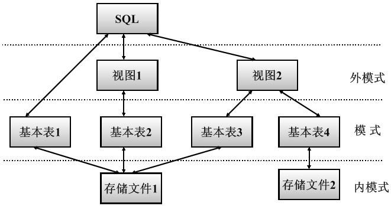

## 数据库系统概论

### 一.数据库结构

### 二.关系的完整性

| 实体完整性                 | 参照完整性     | 用户定义完整性 |
| -------------------------- | -------------- | -------------- |
| 存在主属性、且主属性不为空 | 主键之间的关系 | 约束条件       |

### 三.关系运算

| 选择                         | 投影                           | 连接                                               | 除运算                         |
| ---------------------------- | ------------------------------ | -------------------------------------------------- | ------------------------------ |
| σ~F~(R)={t\|t∈R^F(t)=‘真’}   | Π~A~(R)={t[A]\|t∈R}            | R(⋈)S                                              | R÷S                            |
| 在关系R中选择满足F条件的元组 | 选出若干属性列组成新的关系(表) | 从两个关系的笛卡尔积中选取属性间满足一定条件的元组 | 即找出所有在R但不在S的元组组合 |

### 四.表级SQL

| 操作对象 | 创建          | 删除        | 修改        |
| -------- | ------------- | ----------- | ----------- |
| 模式     | CREATE SCHEMA | DROP SCHEMA | 无          |
| 表       | ～ TABLE      | ～ TABLE    | ALTER TABLE |
| 视图     | ～ VIEW       | ～ ～       | 无          |
| 索引     | ～ INDEX      | ～ ～       | ～ INDEX    |

#### 4.1 基本表定义

| CREATE TABLE <表名> | (<列名><数据类型>         | [列级完整性约束条件]  |
| ------------------- | ------------------------- | --------------------- |
|                     | [,<列名><数据类型>        | [列级完整性约束条件]] |
|                     | ......                    | ......                |
|                     | [,<表级完整性约束条件>]); |                       |

注意：后面定义全部包围在小括号中，并且最后无逗号

#### 4.2 修改

| ALTER TABLE <表名>                                  |
| --------------------------------------------------- |
| [ADD [COLUMN] <新列名> <数据类型> [完整性约束]]     |
| [ADD <表级完整性约束>]                              |
| [DROP [COLUMN] <列名> [CASCDE\|RESTRICT]]           |
| [DROP CONSTRAINT <完整性约束名> [RESTRICT\|CASCDE]] |
| [ALTER COLUMN <列名><数据类型>];                    |

#### 4.3 删除

DROP TABLE <表名> [RESTRICT|CASCADE];

### 五.基本表SQL(略)

### 六.用户授权

#### 6.1 授权

| 基本格式                                                     | 例子1                                 | 栗子2                                             |
| ------------------------------------------------------------ | ------------------------------------- | ------------------------------------------------- |
| GRANT <权限>[,<权限>]...  ON <对象类型><对象名>[,<对象类型><对象名>]...  TO <用户>[,<用户>]... [WITH GRANT OPTION] | GRANT SELECT ON TABLE Student  TO U1; | GRANT INSERT ON TABLE SC TO U5 WITH GRANT OPTION; |

#### 6.2 收回

| 基本格式                                                     | 栗子1                                                        | 栗子2                                      |
| ------------------------------------------------------------ | ------------------------------------------------------------ | ------------------------------------------ |
| REVOKE <权限>[,<权限>]... ON <对象类型><对象名>[,<对象类型><对象名>]... FROM <用户>[,<用户>]... [CASCADE\|RESTRICT] | REVOKE SELECT ON TABLE SC FROM PUBLIC;    收回所有用户对表SC的查询权限 | REVOKE INSERT ON TABLE SC FROM US CASCADE; |

### 七.规范化

| 2NF                                        | 3NF            | BCNF                       |
| ------------------------------------------ | -------------- | -------------------------- |
| 每一个非主属性完全函数依赖于任何一个候选码 | 不存在传递依赖 | 每一个决定因素必然包含主键 |

### 八.数据库设计

1. 数据字典
2. ER图

### 九.数据库并发

| 一级封锁协议                             | 二级封锁协议               | 三级封锁协议 |
| ---------------------------------------- | -------------------------- | ------------ |
| 修改前加X锁                              | 读取前R锁，修改前X锁       | 读取也加S锁  |
| 防止丢弃，但不保证可重复读和不读“脏”数据 | 解决“脏”数据，不保证重复读 | 所有优点     |