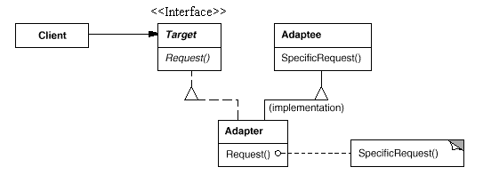
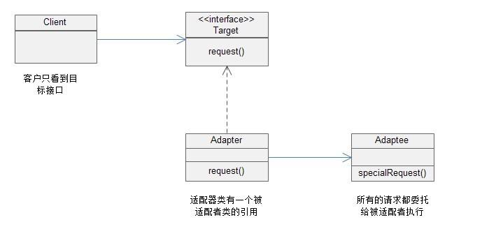
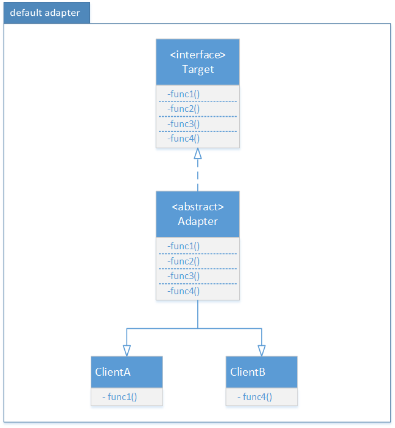

## 适配器模式

#### 目的

用于将某个类的接口转换成另一个接口表示。

### *类适配器*



#### 特点

实现目标接口，继承旧类。

#### 实现

```java
public class Test {
    public static void main(String[] args){
        Target hmc = new Adapter();
        hmc.Request();
    }
}

// 我们所需要的接口
interface Target{
    void Request();
}

// 老类
class Adaptee{
    void SpecificRequest(){
        System.out.println("老的接口");
    }
}

// 适配器
class Adapter extends Adaptee implements Target {
    @Override
    public void Request() {
        SpecificRequest();
        System.out.println("适配器");
    }
}
```

### *对象适配器*



#### 特点

改继承旧类为拥有旧类对象。

#### 实现

```java
public class Test {
    public static void main(String[] args){
        Target hmc = new Adapter();
        hmc.Request();
    }
}

// 我们所需要的接口
interface Target{
    void Request();
}

// 老类
class Adaptee{
    void SpecificRequest(){
        System.out.println("老的接口");
    }
}

// 适配器
class Adapter implements Target {
    // 此处保存老类的对象，正规需要在构造函数中写或单独set。
    Adaptee old = new Adaptee();
    @Override
    public void Request() {
        old.SpecificRequest();
        System.out.println("适配器");
    }
}
```

### *缺省适配器*


#### 特点

选择想要实现的部分功能。

#### 比较

|      | 类适配器               | 对象适配器           | 接口适配器(缺省适配器)    |
| ---- | ------------------ | --------------- | --------------- |
| 实现   | 继承src类实验dst接口      | 持有src类实现dst接口   | 不想实现接口所有方法      |
| 优点   | 使用时，和原本接口使用方式基本上不变 | 改继承为关联,降低了耦合    | 客户端只需要实现自己需要的方法 |
| 缺点   | 暴露了src类            | 多new一次src对象给适配器 | 多增加一个接口和一个类     |

#### 参考资料

1. 设计模式(二) 三种适配器模式 总结和使用场景
  https://blog.csdn.net/zxt0601/article/details/52848004

2. 《JAVA与模式》之适配器模式
  https://www.cnblogs.com/java-my-life/archive/2012/04/13/2442795.html

3. Java设计模式--缺省适配器模式
  https://www.cnblogs.com/LUA123/p/7824791.html
