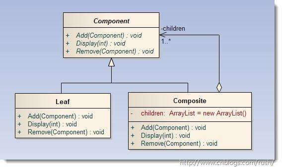

## 组合模式

#### 目标

将对象组合成树形结构以表示“**部分-整体**”的层次结构，组合模式使得用户对单个对象和组合对象的使用具有一致性。可以使得简单图形组合成复杂图形。



#### 特点

关注**部分-整体**的联系。

#### 实现

接口定义add(),remove(),以及具体行为函数。而具体树保留一个叶子列表，具体实现以上函数。而叶子节点空实现add()等列表相关函数。

**实例代码**
```java
// 总类
public abstract class Company {
    protected String name;
    public Company(String name){
        this.name = name;
    }

    public abstract void add(Company company);//add
    public abstract void remove(Company company);//remove
    public abstract void display(int depth);//display
    public abstract void lineofDuty();//line of duty
}
```

```java
// 具体公司类
import java.util.ArrayList;
import java.util.List;

public class ConcreteCompany extends Company {

    private List<Company> childrenCompany = new ArrayList<Company>();

    public ConcreteCompany(String name) {
        super(name);
    }

    @Override
    public void add(Company company) {
        childrenCompany.add(company);
    }

    @Override
    public void display(int depth) {
        System.out.println("第 " + depth + " 层的机构名为： " + name);
        for (Company c : childrenCompany) {
            c.display(depth + 1);
        }
    }

    @Override
    public void lineofDuty() {
        for (Company c : childrenCompany) {
            c.lineofDuty();
        }
    }

    @Override
    public void remove(Company company) {
        childrenCompany.remove(company);
    }
}
```

```java
// 部门
public class HRDepartment extends Company {
    public HRDepartment(String name) {
        super(name);
    }

    @Override
    public void add(Company company) {}

    @Override
    public void display(int depth) {
        System.out.println("第 " + depth + " 层的机构名为： " + name);
    }

    @Override
    public void lineofDuty() {
        System.out.println(name + "    负责员工招聘管理培训");
    }

    @Override
    public void remove(Company company) {}
}


// 其余相同
```

主函数：
```java
    public static void main(String[] args) {
        //一个总公司
        ConcreteCompany root = new ConcreteCompany("北京总公司");
        root.add(new HRDepartment("总公司人力资源部"));
        root.add(new FinanceDepartment("总公司财务部"));

        //三个子公司
        ConcreteCompany com1 = new ConcreteCompany("广州分公司");
        com1.add(new HRDepartment("广州分公司人力资源部"));
        com1.add(new FinanceDepartment("广州分公司财务部"));
        root.add(com1);

        ConcreteCompany com2 = new ConcreteCompany("杭州分公司");
        com2.add(new HRDepartment("杭州分公司人力资源部"));
        com2.add(new FinanceDepartment("杭州分公司财务部"));
        root.add(com2);

        ConcreteCompany com3 = new ConcreteCompany("深圳分公司");
        com3.add(new HRDepartment("深圳分公司人力资源部"));
        com3.add(new FinanceDepartment("深圳分公司财务部"));
        root.add(com3);

        System.out.println("-------公司结构图--------");
        root.display(1);
        System.out.println("----------各部门职责----------");
        root.lineofDuty();
    }
```