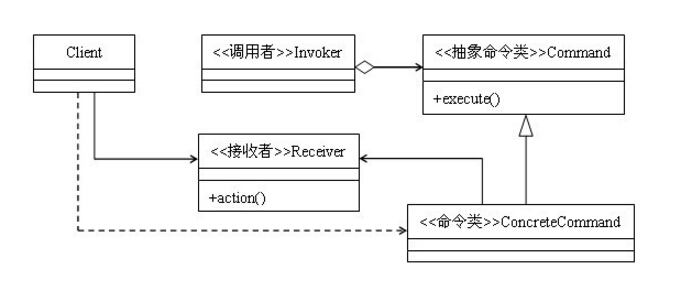

## 命令模式

#### 目标

请求以命令的形式包裹在对象中，并传给**调用对象**。**调用对象** 寻找可以处理该命令的合适的对象，并把该命令传给相应的对象，该对象执行命令。



#### 特点

分离调用者和命令以及命令接受者。

#### 实现

前台类保留一个命令列表，用于添加命令和删除命令。接受者类作为命令的实现者出现。为了使用这个接受者，**命令者中有接受者的对象**。

**实例代码**

```java
// 抽象类:
public abstract class Command {
    public Receiver aReceiver;

    public void Commend(Receiver receiver){
        this.aReceiver = receiver;
    }

    public Command(){}

    abstract public void Execute();
}

// 两个具体类:
// 烤面筋
public class Gluten extends Command {
    public Gluten(Receiver receiver){
        aReceiver = receiver;
    }
    @Override
    public void Execute(){
        aReceiver.bakeGluten();
    }
}

// 烤腰子
public class Kitney extends Command {
    public Kitney(Receiver receiver){
        aReceiver = receiver;
    }

    @Override
    public void Execute(){
        aReceiver.bakeKidney();
    }
}
​````

​```java
// 接收者
public class Receiver {
    public void bakeGluten(){
        System.out.println("烤面筋啊，烤面筋啊");
    }

    public void bakeKidney(){
        System.out.println("烤肾脏啊，换肾机啊");
    }
}

// 调用者
public class Invoker {
    private Command command;

    public void SetCommand(Command command){
        this.command = command;
    }

    public void ExecuteCommand(){
        command.Execute();
    }
}

// 主函数
public class Test{
    public static void main(String[] args) {
        Receiver hmc = new Receiver();
        Command c = new Gluten(hmc);
        Invoker i = new Invoker();
        i.SetCommand(c);
        i.ExecuteCommand();

        Command temp = new Kitney(hmc);
        i.SetCommand(temp);
        i.ExecuteCommand();
    }
}
```