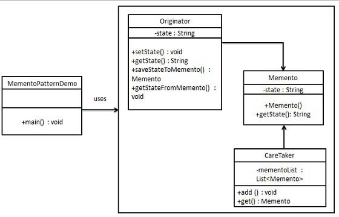

## 备忘录模式

#### 目标

保存一个对象的某个状态，以便在适当的时候恢复对象。



#### 特点

既保存了状态，又不暴露状态的数据。

#### 实现

备忘录类+管理类

```java
// 原本操作对象
public class Originator {
   private String state;

   public void setState(String state){
      this.state = state;
   }

   public String getState(){
      return state;
   }

   public Memento saveStateToMemento(){
      return new Memento(state);
   }

   public void getStateFromMemento(Memento Memento){
      state = Memento.getState();
   }
}

// 备忘录类:
public class Memento {
   private String state;

   public Memento(String state){
      this.state = state;
   }

   public String getState(){
      return state;
   }
}

// 保存备忘录的care
import java.util.ArrayList;
import java.util.List;

public class CareTaker {
   private List<Memento> mementoList = new ArrayList<Memento>();

   public void add(Memento state){
      mementoList.add(state);
   }

   public Memento get(int index){
      return mementoList.get(index);
   }
}

// 主函数
public class MementoPatternDemo {
   public static void main(String[] args) {
      Originator originator = new Originator();
      CareTaker careTaker = new CareTaker();
      originator.setState("State #1");
      originator.setState("State #2");
      careTaker.add(originator.saveStateToMemento());
      originator.setState("State #3");
      careTaker.add(originator.saveStateToMemento());
      originator.setState("State #4");

      System.out.println("Current State: " + originator.getState());
      originator.getStateFromMemento(careTaker.get(0));
      System.out.println("First saved State: " + originator.getState());
      originator.getStateFromMemento(careTaker.get(1));
      System.out.println("Second saved State: " + originator.getState());
   }
}
```
#### 改进

使用**命令模式**+**备忘录模式**=点餐