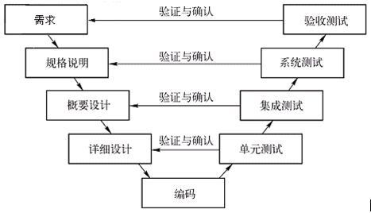
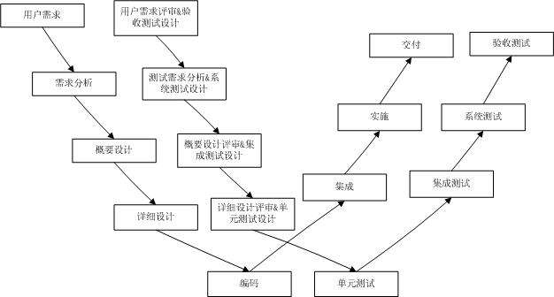
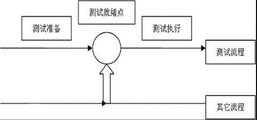
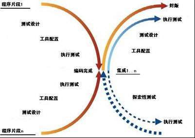

## 软件测试概述

#### 软件测试模型

##### V模型

只适用于瀑布模型

##### W模型

强调开发和测试同步进行

##### H模型

测试过程完全独立，贯穿于整个生命周期

##### X模型

弥补V模型一些缺陷，例如交接、经常性集成

#### 软件测试原则

1. 缺陷是测试出来的
2. 穷尽测试是不可能的
3. 测试越早越好
4. 缺陷的集群效应
5. 测试活动依赖于测试内容
6. 没有失效不代表系统可用
7. 测试必须遵守需求
8. 测试贯穿整个生命周期