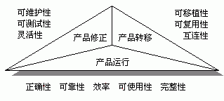
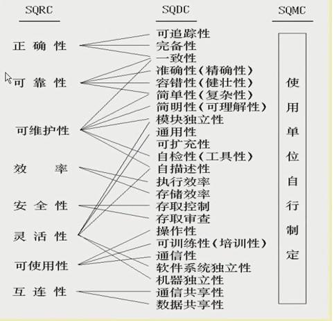
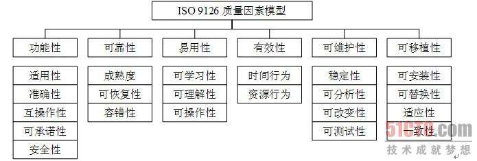

## 软件质量和质量保证

#### 软件质量

系统、部件或过程满足顾客或用户需要或期望的程度以及系统、部件或过程满足规定需求的程度。

##### 三大模型

1. McCall模型

   McCall中11个软件外部质量特性

   

2. Boehm模型

   一种分层模型

   

3. ISO9126质量模型

   六个质量特性及其子特性

   

#### 软件度量

软件度量是**对软件开发项目、过程及其产品进行数据定义、收集以及分析的持续性量化**过程，目的在于对项目质量、过程质量及产品质量进行理解、预测、评估、控制和改善。

人话：这个项目进展怎么样、写了多少行代码、完成了多少功能。

##### 目标

| 对于管理者而言                  | 对于软件工程师而言                   |
| ------------------------ | --------------------------- |
| 度量开发工厂不同阶段的费用            | 监视不断演化的系统(记录变更)             |
| 决定付给不同开发小组的费用            | 严格的度量术语制定要求(平均错误时间小于15个时间片) |
| 不同项目进行比较并制定软件开发基线，设立改进目标 | 合格地度量属性(每个模块代码行不超过100行)     |
| 决定项目度量目标，测试能达到多少覆盖率      | 度量已经存在的产品来预测将来的产品           |
| 找出影响费用和生产率的因素            |                             |
| 度量不同软件工厂方法和工具的效用         |                             |

##### 维度(综合度量数据来判定表现)

例如人的身体数据是度量，维度是具体运动项目中的发挥。

**度量维度表**

| 度量维度 | 侧重点                     | 具体内容                         |
| ---- | ----------------------- | ---------------------------- |
| 项目度量 | 理解和控制当期项目的情况和状态         | 规模、成本、工作量、进度、生产力、风险、顾客满意度    |
| 产品度量 | 理解和控制当前产品的质量            | 产品的功能性、可靠性、易实用性、效率、可维护性、可移植性 |
| 过程度量 | 理解和控制当前情况和状态，对过程进行改进和预测 | 能力成熟度、管理、生命周期、生产率、缺陷植入率      |

##### 度量的方法

1. 项目度量

   项目规模、项目成本、项目进度、顾客满意度

2. 规模度量

   由开发现场的项目成员进行估算；灵活运行实际开发作业数据；杜绝盲目迎合顾客需求的"交期逆推法"。

3. 成本度量

   类比估算法：通过比较已完成类似项目系统估算成本

   细分估算法：将整个项目系统分解成若干个小系统，逐个估算成本

   周期估算法：按软件开发周期进行划分，估算每个阶段的成本

4. 顾客满意度度量

   **客户满意度要素表**

   | 顾客满意度要素 | 顾客满意度要素的内容               |
   | ------- | ------------------------ |
   | 技术解决方案  | 质量、可靠性、有效性、易用性、价格、安装、新技术 |
   | 支付与维护   | 灵活性、易达性、产品知识             |
   | 市场营销    | 解决方案、接触点、信息              |
   | 管理      | 购买流程、请求手段、保证期限、注意事项      |
   | 交付      | 准时、准确、交付后过程              |
   | 企业形象    | 技术领导、财务稳定性、执行印象          |

   **客户满意度细分表**

   | 顾客满意度项目  | 顾客满意度度量要素                 |
   | -------- | ------------------------- |
   | 软件产品     | 功能性、可靠性、易用性、效率性、可维护性、可移植性 |
   | 开发文档     | 文档的构成、质量、外观、图表以及索引、用语     |
   | 项目进度以及交期 | 交期的根据、进度延迟情况下的应对、进度报告     |
   | 技术水平     | 项目组的技术水平、提案能力及解决问题的能力     |
   | 沟通能力     | 事件记录、式样确认、Q&A             |
   | 运行维护     | 支持能力、问题发生时的应对速度、解决问题的能力   |

   ​

#### 软件能力成熟度(CMM)模型

CMM实施核心不在于软件的开发技术层面，而在于**工程过程层面和工程管理层面**。

CMM既可用于**描述软件机构实际具备的能力成熟度水平**，也**指明了软件企业改进的着力之处**，说明了前进的方向，并允许企业选择恰当的方式去达到这一目的。

**CMM等级划分**

| 等级   | 描述      | 关键过程域(目标、共性、职责、实践)                       |
| ---- | ------- | ---------------------------------------- |
| 初始级  | 无序、随意   |                                          |
| 可重复级 | 基本的项目管理 | 需求管理,项目计划,项目跟踪和监控,软件子合同管理,软件配置管理,软件质量保障  |
| 定义级  | 标准化、文档化 | 组织过程定义,组织过程焦点,培训大纲,软件集成管理,软件产品工程,组织协调,专家审评 |
| 管理级  | 可预测软件质量 | 定量的软件过程管理和产品质量管理                         |
| 优化级  | 优化执行步骤  | 缺陷预防,过程变更管理和技术变更管理                       |

#### 软件质量保证

软件质量保证指建立一套有计划、有系统的方法，来向管理层保证拟定出的标准、步骤、实践和方法能够正确地被所有项目所采用。

软件质量保证是在软件开发过程中对软件质量计划的管理的系列活动。

#####  QA(质量保证)与QC(质量控制)

QA只要检查项目按照过程是否进行了某项活动，产出了某个产品。

QC来检查产品是否符合质量要求。

##### SQA活动

- 一种质量管理方法
- 有效地软件工程技术
- 在整个软件过程中采用的正式技术评审
- 一种多层次的测试策略
- 对软件文档及其修改的控制
- 保证软件遵从软件开发标准
- 度量和报告机制

##### SQA工作

1. 准备SQA计划
2. 参与开发项目过程，确保过程与计划相符
3. 评审各项软件工厂活动，记录偏差
4. 审计指定的软件产品，按照定义好的需求进行核实
5. 确保软件工作及产品的偏差已记录，并处理
6. 将记录中不符合标准的报告给高级领导

##### SQA与测试

- 分属不同层面，测试只是软件质量保证的一个重要环节。
- 测试控制范围是工厂内部，防止不合格品出现，确保产品满足要求才能交付。
- 质量保证为满足顾客要求提供信任