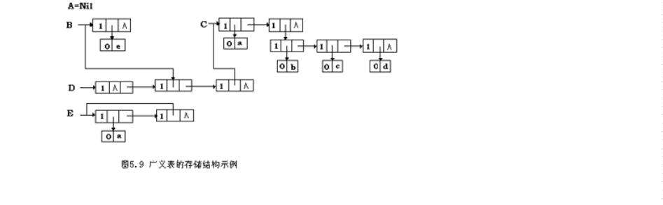
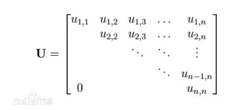
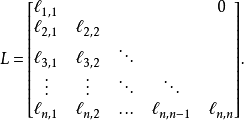

## 数组、稀疏矩阵、广义表

### 1.矩阵及其运算

矩阵使用二维数组保存

运算：①转置 	②相加		③相乘

### 2.顺序表式稀疏矩阵

```c
//三元组方式
typedef struct{
    int val;
    int i,j;
}Trimat;

Trimat trimat[maxterms];
```

### 3.链表式稀疏矩阵

分为邻接表法和十字链表表示法


如图，邻接表法是一行一行存储节点的。

而十字链表法模拟了一个表格。

### 4.广义表



广义表的长度：最上层元素的个数。例如D是3，C是2。

广义表的深度：括号数。例如：D=(空,B,C)，显然D的深度是C+1。

### 5.三角矩阵和一维数组

**上三角矩阵**



**下三角矩阵**



**三对角矩阵**


注意：最后要求的结点的那一行的位置