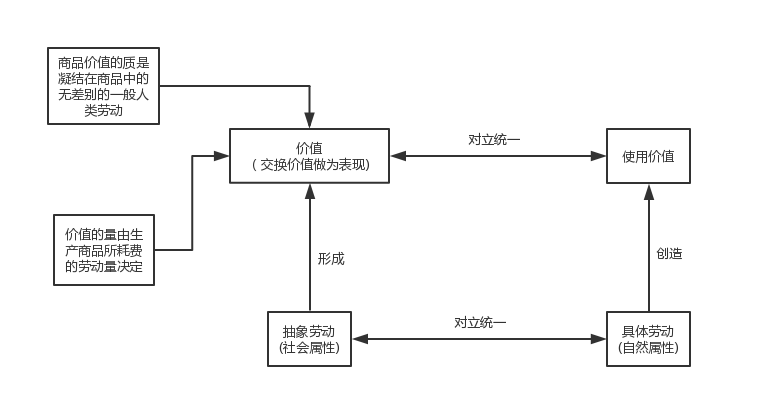

## 马克思主义基本原理

### 1.马克思主义概论

| 包括         | 产生                                                         | 特征                 | 当代价值 |
| ------------ | ------------------------------------------------------------ | -------------------- | -------- |
| 哲学         | 资本发展(经济、历史条件)                                     | 科学性               | 认识工具 |
| 政治经济     | 无产阶级(渴望科学理论)                                       | 革命性               | 行动指南 |
| 科学社会主义 | 人类文明成果(继承与创新)(德国哲学、英国政治经济、英法空想社会主义)(唯物史观、剩余价值学说) | 实践性(显著特征)     | 科学真理 |
|              |                                                              | 人民性(最鲜明的品格) |          |
|              |                                                              | 发展性               |          |

### 2.物质

| 本质规定   | 根本属性 | 静止                     | 存在形式 |
| ---------- | -------- | ------------------------ | -------- |
| 客观实在性 | 运动     | 衡量尺度、运动的有条件性 | 时空     |

### 3.意识

| 起源                 | 本质             | 能动作用                     |
| -------------------- | ---------------- | ---------------------------- |
| 自然界长期发展的产物 | 人脑的机能和属性 | 目的性和计划性               |
| 社会历史的产物       |                  | 创造性                       |
|                      |                  | 指导实践改造客观世界         |
|                      |                  | 指导、控制人的行为和生理活动 |

### 4.实践

| 与社会生活关系     | 人与自然关系                                     | 主观能动性与客观规律性                 |
| ------------------ | ------------------------------------------------ | -------------------------------------- |
| 社会关系形成的基础 | 马克思认为，应当合理地调节人与自然之间的物质变换 | 尊重客观规律的发挥主观能动性的前提     |
| 社会生活的基本领域 | 生态环境已日益成为人类反思自身活动的重要前提     | 充分发挥主观能动性                     |
| 社会发展的动力     | 遵循自然规律                                     | 实践是客观规律性与主动能动性统一的基础 |

### 5.联系与发展

| 联系的特点                                                   | 发展实质     |
| ------------------------------------------------------------ | ------------ |
| 客观性                                                       | 新事物的产生 |
| **普遍性**①事物内部相互联系②任何事物不能孤立存在③整个世界是相互联系的统一整体 | 旧事物的灭亡 |
| 多样性                                                       |              |
| 条件性                                                       |              |

| 内容和形式                           | 本质和现象                     | 原因和结果   | 必然和偶然                                                   | 现实与可能                       |
| ------------------------------------ | ------------------------------ | ------------ | ------------------------------------------------------------ | -------------------------------- |
| 内容是构成事物一切要素的总和         | 本质是事物的根本性质           | 相互作用     | 必然产生于事物的内部根本矛盾                                 | 现实是当下的客观存在             |
| 形式是要素的相互结合的结构和表现方式 | 现象是事物的外部联系和表面特征 | 互相渗透     | 偶然产生于非根本矛盾                                         | 可能是潜在趋势                   |
| 内容决定形式，形式反作用与内容       | 本质决定现象、现象表现本质     | 关系复杂多样 | 必然存在于偶然之中，通过偶然表现出来。偶然背后隐藏着必然，是必然表现形式的补充 | 可能不等于现实，现实已经是不可能 |

### 6.辩证法(矛盾论)(具体问题具体分析)

#### 6.1 基本属性(同一、斗争)

| 基本属性                   | 辩证关系                                           | 同一性作用                               | 斗争性作用                             |
| -------------------------- | -------------------------------------------------- | ---------------------------------------- | -------------------------------------- |
| 同一性：相互依存、相互贯通 | 同一性不能脱离斗争性而存在，没有斗争性就没有同一性 | 矛盾的一方能够利用另一方的发展使自己发展 | 斗争推动矛盾双方力量发生变化，造成量变 |
| 斗争性：相互排斥、相互分离 | 斗争性也.....，斗争性寓于同一性之中                | 相互吸取有利于自身的因素                 | 促使双方地位或性质转化，造成质变       |
|                            | 斗争性是无条件的绝对性的，同一性是有条件的相对的   | 向着自己的对立面发展，规定着发展的方向   |                                        |

#### 6.2 普遍性和特殊性

| 含义                                                 | 根本矛盾和主要矛盾         | 辩证关系                                       |
| ---------------------------------------------------- | -------------------------- | ---------------------------------------------- |
| 普遍性：矛盾存在于一切事物中                         | 根本矛盾：规定着事物的性质 | 共性：无条件的、绝对的。个性：有条件的、相对的 |
| 特殊性：其运动中的矛盾及每一矛盾的各个方面都有其特点 | 主要矛盾：起决定作用       | 任何事物都是共性和个性的有机统一               |

#### 6.3 量变质变关系

| 质、量、度                           | 辩证关系             |
| ------------------------------------ | -------------------- |
| 质：区别事物的内在规定性             | 量变是质变的必要准备 |
| 量：与质相统一                       | 质变是量变的必然结果 |
| 度：保持事物**质的稳定性**的数量界限 | 量变和质变相互渗透   |
|                                      | 相互依存、相互贯通   |

#### 6.4 伟大的认识工具

1. 根本的认识方法
2. 具体地分析具体情况
3. 具体问题具体分析

### 7.实践与认识

#### 7.1 实践(人类能动地改造世界的客观物质性活动)

| 特性         | 类型           | 对认识的决定作用 |
| ------------ | -------------- | ---------------- |
| 直接现实性   | 物质生产实践   | 来源             |
| 自觉的能动性 | 社会的政治实践 | 动力             |
| 社会历史性   | 科学文化实践   | 目的             |
|              |                | 唯一标准         |

#### 7.2 认识(对客体的能动反映)

| 感性认识与理性认识           | 辩证关系                             | 巨大飞跃条件                     | 从认识到实践                               |
| ---------------------------- | ------------------------------------ | -------------------------------- | ------------------------------------------ |
| 感性认识是认识的起点         | 感性认识有待于发展和深化为理性认识   | 获取十分丰富且合乎实际的感性材料 | 更为重要的一次飞跃                         |
| 理性认识是认识的高级阶段     | 理性认识依赖于感性认识               | 理性思考对感性材料的在加工       | 认识世界目的为改造世界                     |
| 从感性到理性是第一次巨大飞跃 | 感性认识与理性认识相互渗透、相互包含 |                                  | 认识的真理性只有在实践中才能得到检验和发展 |

#### 7.3 辩证关系

认识与实践得辩证运动是一个循环往复的辩证发展过程，决定了认识和实践的统一是具体的和历史的。

具体的：主观认识要同一定时间、地点、条件下客观实践相结合

历史的：主观认识要同特定历史发展阶段相适应

### 8.真理与价值

#### 8.1 真理的客观性

①内容是客观的		②标准是客观的

决定了真理的一元性

#### 8.2 绝对性与相对性

| 绝对性                                       | 相对性                           | 辩证统一                     |
| -------------------------------------------- | -------------------------------- | ---------------------------- |
| 包含客观内容，同谬论有原则的界限             | 真理反映的对象是有条件的、有限的 | 相互依存                     |
| 每前进一步，都是对无限发展着的物质世界的接近 | 正确程度也是有条件的、有限的     | 相互包含                     |
|                                              |                                  | 必须以科学的态度对待一切真理 |

#### 8.3 真理与谬论

真理和谬论决定于认识的内容是否**如实地反映了客观事物**。

#### 8.4 真理与实践

| 实践是检验真理的唯一标准(真理的本性和实践的特点) | 实践标准的确定性     | 实践标准的不确定性               |
| ------------------------------------------------ | -------------------- | -------------------------------- |
| 实践沟通主观和客观，具有普遍性和直接现实性       | 唯一标准             | 历史阶段的具体实践具有局限性     |
| 只有实践才能把主观同客观联结起来并加以对照       | 实践证明的是客观真理 | 实践检验是一个过程               |
| 实践是唯一标准                                   | 能够检验一切认识     | 已经检验过还要继续经受实践的检验 |

#### 8.5 价值

| 价值构成             | 价值的特性                                                   | 价值尺度和真理尺度                                 |
| -------------------- | ------------------------------------------------------------ | -------------------------------------------------- |
| 主体的需要和利益     | 客观性                                                       | 真理尺度：遵循正确反映客观事物本质和规律的真理     |
| 客体的某种属性或性能 | 主体性①以人的需要为基准 ②带有主体的个性特征 ③实践中创造性关系 | 价值尺度：人们按照自己的尺度和需要去认识和改造世界 |
|                      | 社会历史性                                                   | 价值尺度必须以真理尺度为前提                       |
|                      | 多维性                                                       | 人类自身需要内在尺度                               |

### 9.认识世界和改造世界

| 基本矛盾         | 从必然走向自由               | 一切从实际出发                 | 创新                         |
| ---------------- | ---------------------------- | ------------------------------ | ---------------------------- |
| 主观和客观的矛盾 | 根本目标：认识必然，争取自由 | 马克思主义认识论的根本要求     | 理论创新不竭的动力源泉       |
|                  | 从必然王国到自由王国         | 从客观事物的存在和发展规律出发 | 实践创新的行动指南           |
|                  | 自由是有条件的               | 党的思想路线的核心             | 理论创新和实践创新的良性互动 |
|                  | 人类存在和发展的永恒动力     |                                |                              |

### 10.社会存在与社会意识

| 社会存在与社会意识                               | 辩证关系                             | 社会意识的相对独立性               |
| ------------------------------------------------ | ------------------------------------ | ---------------------------------- |
| 社会存在包括物质生产方式、自然地理环境、人口因素 | 社会存在是客观来源                   | 不完全同步性和不平衡性             |
| 社会意识是社会精神生活的总和，是社会存在的反映   | 社会意识是人们进行社会物质交往的产物 | 社会意识各因素具有各自的历史继承性 |
|                                                  | 随着社会存在发展，社会意识也发生变化 | 社会意识对社会存在的能动的反作用   |

### 11.生产力和生产关系

| 概念                                                         | 基本要素             | 重要因素(科学技术)                                   |
| ------------------------------------------------------------ | -------------------- | ---------------------------------------------------- |
| 生产力是人类改造自然的物质力量                               | 劳动资料             | 能够引起深刻变革和巨大进步                           |
| 生产关系是人们在物质生产过程中形成的不易人的意识转移的经济关系 | 劳动对象             | 能够大幅度提高管理效率                               |
| 生产资料所有制是最基本的生产关系                             | 劳动者：最活跃的因素 | 极大地提高劳动生产率                                 |
| 生产力决定生产关系，生产关系反作用生产力                     |                      | 科学技术是第一生产力，先进生产力的集中体现和主要标志 |

### 12.经济基础和上层建筑

#### 12.1 概念

经济基础：生产关系的总和

上层建筑：建立在一定经济基础之上的意识形态以及相应的制度、组织、设施

#### 12.2 观念上层建筑和政治上层建筑

意识形态(观念上层建筑)：包括政治法律思想、道德、艺术、宗教、哲学

政治上层建筑：国家政治制度、立法司法制度和行政制度、国家政权机构

关系是：①政治上层建筑是在一定意识形态指导下建立起来的，是统治阶级意识的体现

②政治上层建筑一旦形成，影响并制约者人们的思想理论观点

③在整个上层建筑中，政治上层建筑居主导地位，国家政权的它的核心 

#### 12.3 社会形态

社会形态是**经济基础和上层建筑的统一体**

客观必然性：社会基本矛盾运动的结果

历史选择性：

1. 社会发展客观必然性为人们历史选择提供了基础、范围和可能性空间
2. 社会形态更替的过程是一个合目的性与合规律性相统一的过程
3. 归根结底是人民群众的选择性

### 13.社会矛盾

| 概念                                                     | 社会基本矛盾定义                           | 社会基本矛盾作用                 |
| -------------------------------------------------------- | ------------------------------------------ | -------------------------------- |
| 生产力和生产关系、经济基础和上层建筑的矛盾是社会基本矛盾 | 贯穿人类社会历史始终，规定了社会的基本性质 | 最基本的动力因素，最终决定力量   |
| 其中起主导作用的矛盾是社会主要矛盾                       | 制约着其他矛盾的存在和发展                 | 决定着社会中其他矛盾的存在和发展 |
|                                                          | 规定并反映了社会基本结构和性质和基本面貌   | 从根本上影响和促进社会形态变化   |

### 14.社会发展力量

|      | 阶级斗争                   | 社会革命                                                     | 改革                             | 科学革命               |
| ---- | -------------------------- | ------------------------------------------------------------ | -------------------------------- | ---------------------- |
| 本质 | 阶级之间物质利益的根本对立 | 革命接近推翻反动阶级的统治                                   | 发展过程中量变和部分质变         | 历史的有力杠杆         |
| 作用 | 阶级社会发展的直接动力     | ①重要手段和决定性环节 ②发挥人民群众的积极性和伟大作用 ③促进社会全面进步 | 社会主义制度的自我完善和自我发展 | 改变了生产力的构成要素 |

### 15.人民群众历史观

#### 15.1 定义

始终是从事物质资料生产的劳动群众

#### 15.2 群众观点

①坚信人民群众自己解放自己	②全心全意为人民服务		③一切向群众负责		④虚心向群众学习

### 16.商品

#### 16.1 商品经济的条件

①社会分工的出现		②生产资料和劳动产品属于不同的所有者

#### 16.2 商品

### 17.货币

| 价值尺度       | 流通手段           | 贮藏手段         | 支付手段                                                     |
| -------------- | ------------------ | ---------------- | ------------------------------------------------------------ |
| 衡量价值量大小 | 充当商品交换的媒介 | 货币退出流通领域 | 即用延期支付的方式买卖商品的情况下，货币用于清偿债务时执行的职能 |

将商品的使用价值与价值的矛盾转化为商品与货币的矛盾

### 18.价值规律

| 作用                   | 消极作用         |
| ---------------------- | ---------------- |
| 自发配置社会经济资源   | 导致社会资源浪费 |
| 自发地刺激生产力发展   | 导致收入两级分化 |
| 自发地调节社会收入分配 | 阻碍技术的进步   |

### 19.劳动力成为商品

| 条件           | 价值的三个部分               | 特点                                           |
| -------------- | ---------------------------- | ---------------------------------------------- |
| 劳动者人身自由 | 本人生存所需的生活资料的价值 | 劳动力商品的使用价值就是劳动，并且大于自身价值 |
| 劳动者一无所有 | 家属的生存......             | 资本家购买的是劳动力                           |
|                | 接受教育和训练               |                                                |

### 20.剩余价值

| 绝对剩余价值 | 相对剩余价值   | 超额剩余价值       |
| ------------ | -------------- | ------------------ |
| 工作日延长   | 工作日长度不变 | 劳动生产率提高获得 |

### 21.资本的构成

| 不变资本                 | 可变资本               | 技术构成                   | 价值构成                     | 有机构成                             |
| ------------------------ | ---------------------- | -------------------------- | ---------------------------- | ------------------------------------ |
| 以生产资料形式存在的资本 | 购买劳动力的那部分资本 | 生产资料和劳动力之间的比值 | 不变资本和可变资本之间的比例 | 反映资本技术构成变化的资本的价值构成 |

### 22.资本循环中的职能

| 货币资本的职能       | 生产资本的职能         | 商品资本的职能       |
| -------------------- | ---------------------- | -------------------- |
| 购买生产资料和劳动力 | 使生产资料和劳动力结合 | 商品的出售以收回资本 |

### 23.资本基本矛盾和经济危机

| 基本矛盾                             | 本质特征     | 周期性特点             |
| ------------------------------------ | ------------ | ---------------------- |
| 生产资料私有制和生产社会化之间的矛盾 | 生产相对过剩 | 危机、萧条、复苏和高涨 |

### 24.资本集中和垄断

| 金融资本 | 金融寡头                     | 国家垄断资本主义主要形式                             | 垄断资本国际化形式                       |
| -------- | ---------------------------- | ---------------------------------------------------- | ---------------------------------------- |
| 金融联系 | 政治上“个人联合”             | 宏观调节：总供求进行调节                             | 早期形式：国际卡特尔                     |
| 资本参与 | 建立政策咨询机构             | 微观规制：a.反托拉斯法 b.公共事业规制 c.社会经济规制 | 当前形式：跨国公式和国家垄断资本主义     |
| 人事参与 | 掌握新闻科教文化左右社会生活 |                                                      | 国际货币基金组织、世界银行、世界贸易组织 |

### 25.经济全球化

| 表现               | 因素               | 积极作用                     | 负面作用                       |
| ------------------ | ------------------ | ---------------------------- | ------------------------------ |
| 国际分工进一步深化 | 科学技术的迅猛发展 | 提供先进技术和管理经验       | 发达国家和发展中国家收益不平等 |
| 贸易全球化         | 适宜的企业组织形式 | 更多就业机会                 | 发展中国家资源短缺和环境污染   |
| 金融全球化         | 经济体制变革       | 推动发展中国家国际贸易发展   | 增加经济风险                   |
| 企业生产经营全球化 |                    | 促进发展中国家跨国公司的发展 |                                |

### 26.当代资本主义变化

| 原因                             | 实质                 | 次贷危机           |
| -------------------------------- | -------------------- | ------------------ |
| 科学技术发展是根本推动力量       | 人类社会一般发展规律 | 经济发展“失调”     |
| 工人阶级的斗争是重要力量         | 资本主义框架下变化   | 政治体制“失灵”     |
| 社会主义制度优越性产生了重要影响 |                      | 社会融合机制“失效” |
| 主张改良主义发挥了重要作用       |                      |                    |

### 27.社会主义发展过程

1. 空想社会主义
2. 科学社会主义
3. 巴黎公社和第一国际
4. 十月革命
5. 苏联和东欧

### 28.社会主义道路多样化

| 多样化原因                               | 探索合适本国国情的社会主义道路 | 社会主义开拓前进             | 当代人的使命                                   |
| ---------------------------------------- | ------------------------------ | ---------------------------- | ---------------------------------------------- |
| 各个国家生产力发展状况和社会发展阶段不同 | 坚持以马克思主义为指导         | 亿万人民群众的伟大实践       | 正确认识21世纪社会主义国际形式                 |
| 历史文化传统的差异性                     | 坚持走自己的路                 | 一个不断探索的过程           | 充分估计中国成功实践对世界的意义               |
| 时代和实践的不断发展                     | 充分吸收人类一切文明成果       | 曲折不改变社会主义的前进趋势 | 坚定信心，以开拓奋进的姿态走向社会主义光明未来 |
|                                          |                                | 必须有开拓奋进的精神状态     |                                                |

### 29.共产主义

| 基本特征                                                   | 实现的必然性           | 坚持中国社会主义                             |
| ---------------------------------------------------------- | ---------------------- | -------------------------------------------- |
| 物质财富极大丰富，消费资料按需分配                         | 由人类社会发展规律决定 | 坚持远大理想和共同理想的辩证统一             |
| 社会关系高度和谐，人的精神境界极大提高                     | 资本主义基本矛盾决定   | 坚定理想信念，投身新时代中共特色社会主义事业 |
| 实现每个人自由而全面的发展，人类从必然王国向自由王国的飞跃 | 社会主义的实践正在证明 |                                              |

#### 30.补充

社会再生产：社会总产品的价值补偿和实物补偿问题

四个自信：说到底就是要坚定**文化自信**

