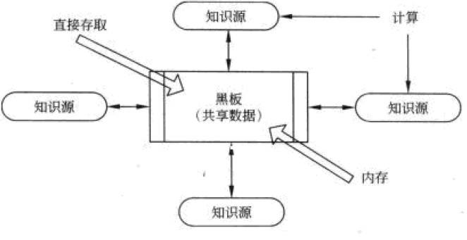
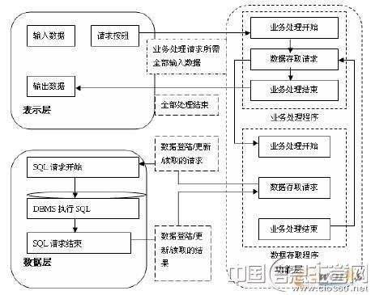
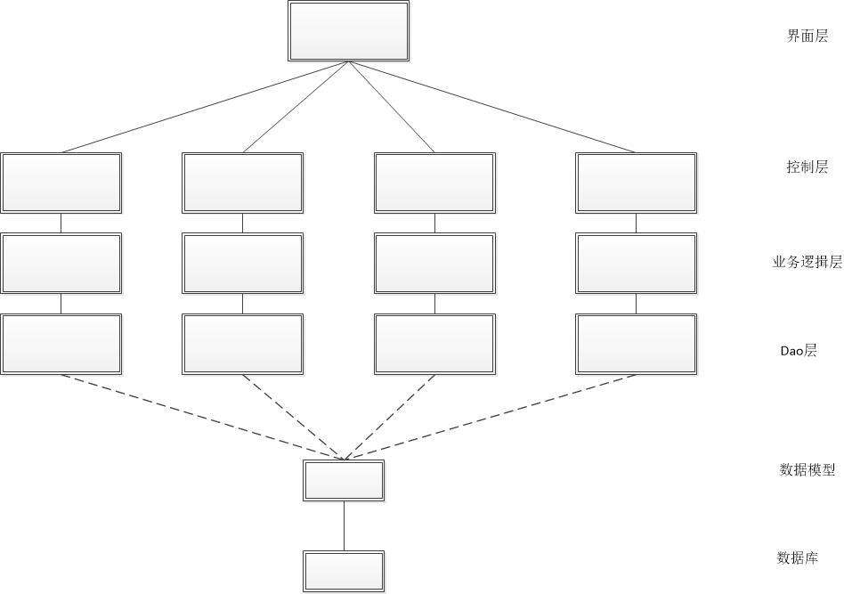
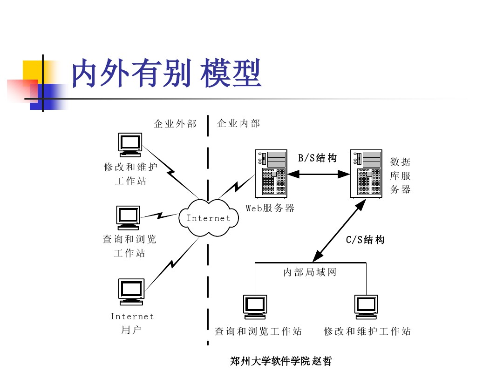
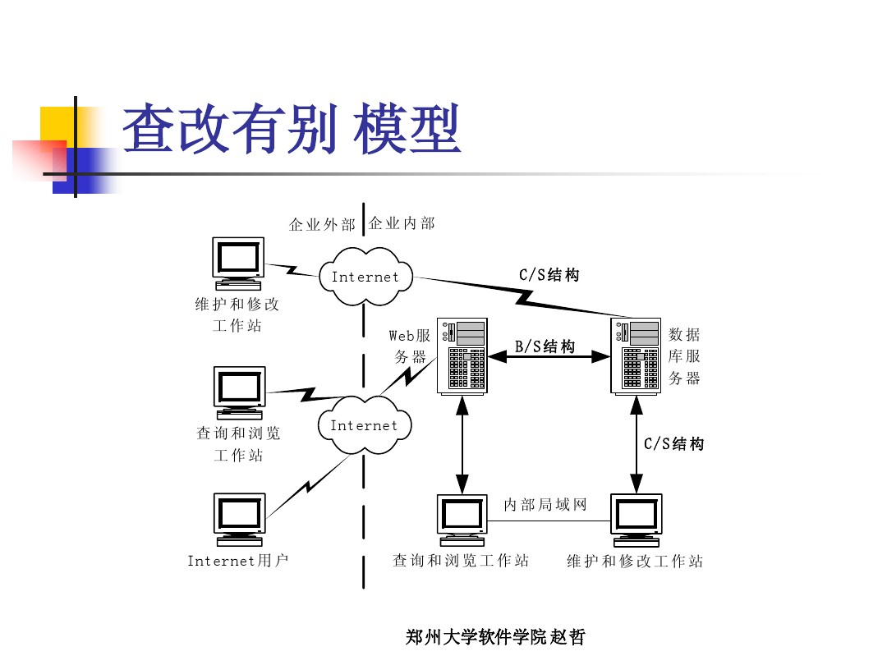

## 软件体系结构风格

#### 1.软件体系结构风格
P49
软件体系结构风格是描述某一特定应用领域中系统组织方式的惯用模式。
体系结构风格定义一个系统家族，即一个体系结构定义一个**词汇表**和**一组约束**。
词汇表包括一些构件和连接件类型，而这组约束指出系统是如何将这些构件和连接件组合起来的。
体系结构风格反映了领域中众多系统所共有的结构和语义特性，并指导如何将各个模块和子系统有效地组织成一个完整的系统。

人话：**一堆积木**和**搭建图纸**

#### 2.基于事件的隐式调用(观察者模式?)
P52
基于事件的隐式调用风格的思想是构件不直接调用一个过程，而是触发或广播一个或多个事件。系统中的**其他构件中的过程在一个或多个事件中注册**，当一个事件被触发，系统就自动调用在这个事件中注册的所有过程，这样,一个事件的触发器就导致了另一个模块中的过程的调用。

**主要优点：**
1. 为软件重用提供了强大支持，当需要将构件加入现存系统中时，只需要将它注册到系统的事件中。
2. 为改进系统带来了方便。当用一个构件代替另一个构件时，不会影响到其他构件的接口。

**主要缺点：**
1. 构件放弃了对**系统计算的控制**。一个构件触发一个事件时，不能确定其他构件是否会响应它。而且即使它知道了事件注册了那些构件的构成，它也不能保证这些过程被调用的顺序。
2. **数据交换**的问题。有时数据可被一个事件传递，但另一些情况下，基于事件的系统必须依靠一个共享的仓库进行交互。在这些情况下，全局性能和资源管理便成了问题。
3. 既然过程的语义必须依赖于被触发事件的上下文约束，关于**正确性的推理存在问题**。

#### 3.仓库系统及知识库
P53

黑板系统：

**组成成分**
1. 知识源。知识源中包含独立的、与应用软件相关的知识，知识源之间不直接进行通行，它们之间的交互只通过黑板来完成。(**负责不同的运算**)
2. 黑板数据结构。黑板数据是按照与应用程序相关的层次来组织的解决问题的数据，知识源通过不断地改变黑板数据来解决问题。(**提供共享数据**)
3. 控制。控制完全由黑板的状态驱动，黑板状态的改变决定使用的特定知识。(**根据黑板变化来调用知识源**)

**应用领域**
传统应用：信号处理领域，如语音和模式识别。
另一应用是松耦合代理数据共享存取。
计算器应该也是应用。

#### 4.三层CS结构
P57

**那三层？**
**①表现层**
表示层是应用的用户接口部分，担负着用于与应用间对话功能。
用于检查用户输入的数据，显示应用输出的数据。
变更时也只需要改写显示控制和数据检查程序，而不影响其他两层。
**②功能层**
相当于应用的本体，将具体的业务处理逻辑编入程序中。
**③数据层**
数据层就是数据库管理系统，负责管理对数据库数据的读写。

**优点**
①允许更合理地划分三层结构和功能，使之在**逻辑上保持相对的独立性**，从而使整个系统逻辑结构更为清晰，能提高系统和软件的可维护性和可扩展性。
②允许更灵活有效地选用**相应的平台的硬件系统**。
③各层能够**并行开发**，并各自选用合适的语言进行开发。
④有效**隔离**表示层和数据层，提高安全性，并使得管理更有层次性。

#### 5.正交软件体系结构
P69
**概念**
正交软件体系结构由组织层和线索的构件构成。层是由一组具有相同抽象级别的构件构成的。
线索是子系统的特例，它是由完成不同层次功能的构件组成的(相互调用)，每一条线索完成整个系统中相对独立的一部分功能。
每一条线索的实现与其他线索的实现无关或关联很少，同一层中的构件之间不存在互相调用。
人话：**划分功能层次，减少耦合**

**优点**
①结构清晰易于理解。
通过结构图中**构件的位置**就能知道构件实现的是那一层抽象，担负的是什么功能。
②易修改，可维护性强。
**线索间相互独立**，对一个线索修改不会影响到其他线索。
需求变化时，能够通过分解需求来实现对构件和线索的修改。
功能的改变不会影响到整个体系结构。
③可移植性强，重用粒度大。
正交结构能够为一个领域的所有应用程序共享，能够实现**体系结构级别的复用**。

#### 6.异构结构风格
P80
**6_1 内外有别**

| 优点                                       | 缺点               |
| ---------------------------------------- | ---------------- |
| 外部用户不能直接访问数据库，保证了安全。但是企业内部用户能够快捷修改和维护数据库 | 企业外部用户修改和维护较为麻烦。 |

**6_2 查改有别**

**与上面相反的优缺点**

#### 7.特定领域软件体系结构(DSSA)
P89
**定义**
DSSA就是专用于一类特定类型的任务(领域)的、在整个领域中能够有效地使用的、为成功构造应用系统限定了标准组合结构的软件构件的集合。