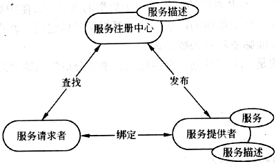

## Web服务体系结构

#### 1.Web服务模型

#### 2.Web服务栈
| 层次    | 协议                | 作用                         |
| ----- | ----------------- | -------------------------- |
| 发现服务  | UDDI、DISCO        | 使得服务能够被发现                  |
| 描述服务  | WSDL、XML、Schema   | 表达一个Web服务能做什么、它的位置在哪、如何调用它 |
| 消息格式层 | SOAP              | 保持客户端和服务器端格式一致             |
| 编码格式层 | XML               | 标准且独立的数据交换格式               |
| 传输协议层 | HTTP、TCP、IP、SMTP等 | 提供交互的通信协议格式                |

#### 3.SOAP(简单对象访问协议)
**四个部分**
①SOAP信封
②SOAP编码规则
③SOAP RPC
④SOAP 绑定

#### 4.WSDL服务描述语言
**描述**
WSDL是一种XML格式，用于将网络服务描述为一组端点，这些端点对包含面向文档或面向过程的消息进行操作。

#### 5.面向服务体系结构概念
**概念**
一种应用程序体系结构，在这种体系结构中，所有功能都定义为独立的服务，这些服务带有定义明确的可调用接口，可以以定义好的顺序调用这些服务来形成业务流程。
**服务**的概念
服务提供者完成一组工作，为服务使用者交付所需的最终结果。

